# API, Observability, dan Testing

Modul ini adalah kontrak operasional untuk statistik, pencarian dan retrieval, normalisasi, semantik HTTP dan hasil aplikasi, error, logging, metrics, security, testing, validation, production readiness, dan autonomous engineering.

## Cara Menggunakan Modul Ini

Modul ini dibaca setelah `blueprint.md` dan diterapkan bersama modul lain yang relevan. Penomoran bagian pada file ini bersifat lokal dan **HARUS** berurutan mulai dari 1. Modul ini berfokus pada kontrak API, bukti operasional, dan verifikasi sehingga tidak menggantikan aturan arsitektur, runtime, database, autentikasi, deployment, atau MCP.

## Konvensi Normatif

- **WAJIB** berarti persyaratan yang **HARUS** dipenuhi sebelum perubahan dianggap selesai.
- **DILARANG** berarti pola yang **DILARANG** digunakan, termasuk sebagai workaround sementara yang masuk ke branch atau deployment.
- **HARUS** menyatakan perilaku kontrak yang diperlukan agar modul lain dapat berintegrasi secara konsisten.
- Setiap perubahan yang menyentuh public contract, security boundary, data persistence, transport, atau observability **HARUS** menyertakan bukti validasi yang relevan.
- Technical identifier, nama environment variable, status HTTP, dan schema pada contoh **HARUS** dipertahankan persis kecuali ada keputusan migrasi yang terdokumentasi.

## Standar Bukti Implementasi

Untuk setiap perubahan, agen **HARUS** dapat menunjukkan:

1. Boundary input dan output yang sudah dinormalisasi.
2. Klasifikasi error dan perilaku retry yang terdefinisi.
3. Correlation context dan redaction pada telemetry.
4. Test pada layer yang sesuai, termasuk regression test untuk defect kritis.
5. Hasil typecheck, lint, test, build, dan validasi arsitektur yang relevan.
6. Status production readiness yang tidak bergantung pada visual correctness saja.

---

# 1. Pipeline Pencarian dan Retrieval

Pipeline pencarian **HARUS** memiliki tahapan yang eksplisit:

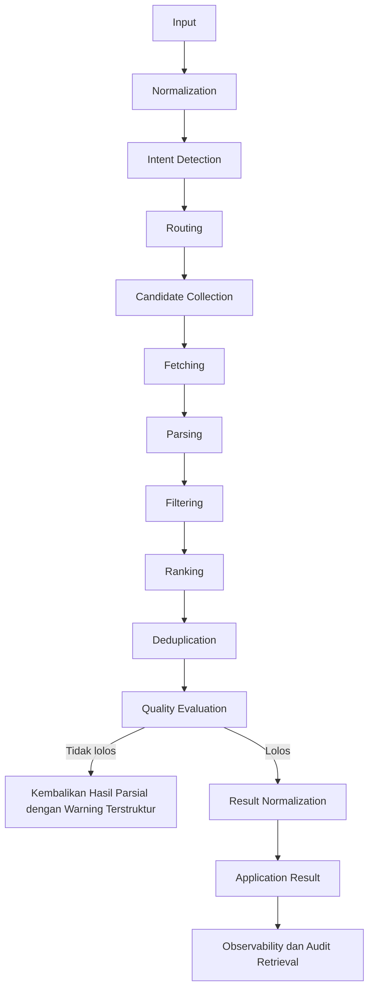

Kriteria gerbang kualitas minimum: deduplikasi valid, skor relevansi memenuhi ambang, tidak ada kebocoran provider-specific object, dan hasil ternormalisasi sebelum dikonsumsi frontend.

Pencarian **HARUS** dapat digunakan melalui:

```text
Dashboard
MCP
API
CLI
Background Jobs
```

## Aturan

- **WAJIB** memisahkan deteksi intent dari retrieval.
- **WAJIB** memisahkan retrieval dari proses ranking.
- **WAJIB** memisahkan ranking dari deduplication.
- **WAJIB** melakukan normalisasi hasil.
- **DILARANG** membuat tool MCP menjalankan seluruh pipeline pencarian secara inline.
- **DILARANG** membuat frontend memiliki implementasi pencarian yang terpisah.

---

# 2. Normalisasi dan Transformasi Data

Data eksternal **WAJIB** divalidasi, diurai, dan dinormalisasi sebelum digunakan sebagai application contract.

Alur:

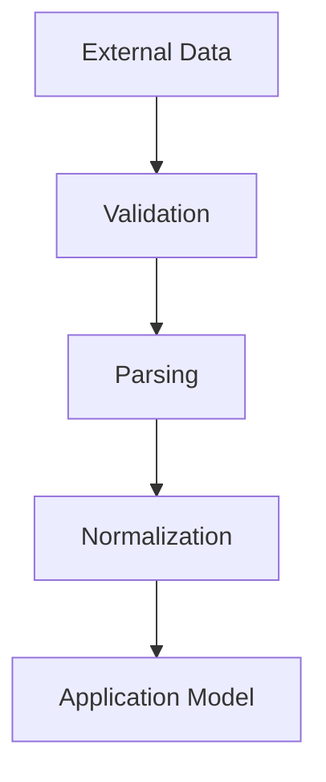

Output transformation:

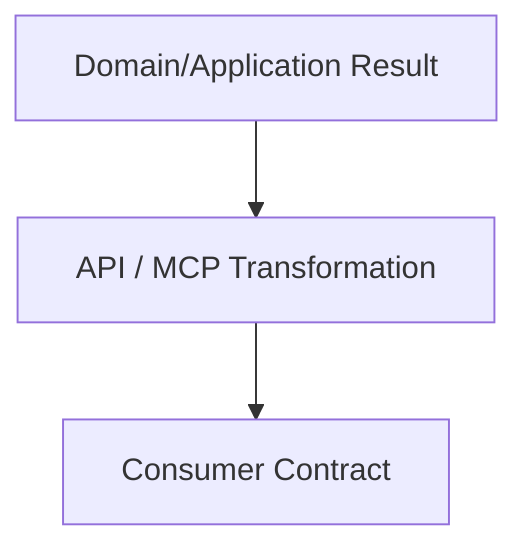

## Aturan

- **WAJIB** melakukan normalization pada external boundary.
- **WAJIB** melakukan transformation pada protocol boundary.
- **DILARANG** membocorkan provider-specific objects ke domain.
- **DILARANG** membocorkan database entities ke external consumer.
- **DILARANG** menjadikan protocol object sebagai internal domain representation.

---

# 3. Semantik Status HTTP dan Hasil Aplikasi

Kode status HTTP **HARUS** merepresentasikan hasil semantik pada layer transport HTTP. Status HTTP **DILARANG** diubah menjadi angka sembarang hanya untuk menggambarkan state bisnis.

Semantik umum:

```text
200 OK
    Request berhasil diproses dan response tersedia.

201 Created
    Request berhasil membuat resource baru.

202 Accepted
    Request diterima untuk diproses secara asynchronous dan belum selesai.

204 No Content
    Request berhasil, tetapi response tidak memiliki body.

400 Bad Request
    Request malformed atau tidak valid pada boundary protocol atau request.

401 Unauthorized
    Autentikasi diperlukan atau credential tidak valid.

403 Forbidden
    Identity dikenali tetapi tidak memiliki permission.

404 Not Found
    Resource yang diminta tidak ditemukan.

409 Conflict
    Operasi bertabrakan dengan state saat ini atau uniqueness constraint.

422 Unprocessable Content
    Input valid secara sintaksis tetapi gagal validasi semantik.

429 Too Many Requests
    Rate limit terlampaui.

500 Internal Server Error
    Kegagalan internal yang tidak terduga.

502 Bad Gateway
    Dependency atau provider upstream memberikan response tidak valid atau kegagalan yang relevan sebagai gateway.

503 Service Unavailable
    Service atau dependency sementara tidak tersedia.

504 Gateway Timeout
    Dependency upstream melewati batas waktu.
```

Jika operasi berhasil secara HTTP tetapi hasil datanya kosong, `200` tetap valid. Contoh:

```json
{
  "data": [],
  "meta": {
    "total": 0
  }
}
```

HTTP `200` tidak berarti setiap field data bisnis pasti berisi nilai.

Jika request berhasil diterima tetapi eksekusi belum selesai, gunakan `202`.

`201` hanya digunakan ketika resource benar-benar dibuat.

`207 Multi-Status` hanya digunakan untuk use case yang memiliki beberapa sub-operation dengan hasil independen dan memang membutuhkan semantik multi-status. **DILARANG** menggunakan `207` sebagai pengganti `200` akibat ketidakjelasan dalam menggambarkan hasil parsial.

Hasil tingkat aplikasi **HARUS** memiliki semantik terstruktur bila diperlukan:

```json
{
  "data": {},
  "error": null,
  "meta": {
    "requestId": "..."
  }
}
```

Untuk data parsial yang tetap valid:

```json
{
  "data": {},
  "error": null,
  "meta": {
    "status": "partial",
    "warnings": []
  }
}
```

Peringatan bisnis **DILARANG** dipalsukan menjadi kegagalan HTTP.

## Aturan

- **WAJIB** menggunakan status HTTP berdasarkan hasil semantik HTTP.
- **DILARANG** menggunakan `201` hanya karena response berisi data.
- **DILARANG** menggunakan `202` untuk operasi synchronous yang sudah selesai.
- **DILARANG** menggunakan `4xx` atau `5xx` hanya untuk peringatan bisnis yang bukan kegagalan request.
- **WAJIB** menggunakan `200` untuk hasil kosong yang berhasil jika request berhasil.
- **WAJIB** menggunakan metadata aplikasi terstruktur untuk warning atau hasil parsial bila diperlukan.
- **WAJIB** menggunakan `5xx` ketika eksekusi server benar-benar gagal.
- **WAJIB** menggunakan `4xx` ketika client atau request benar-benar menjadi penyebab kegagalan.

---

# 4. Model Error

Pendalaman otoritatif untuk retry, fallback, recovery, dan user messaging ada pada `error-handling-and-recovery.md`. Bagian ini menetapkan kontrak operasional yang kumulatif dengan modul tersebut.

Error **HARUS** memiliki kategori semantik:

```text
Validation Error
Authentication Error
Authorization Error
Domain Error
Not Found Error
Conflict Error
Rate Limit Error
External Provider Error
Database Error
Infrastructure Error
Unexpected Error
```

Pemetaan operasional minimum:

| Kategori | HTTP Umum | Retry |
|----------|-----------|-------|
| Validation, Authentication, Authorization, Domain, Not Found | 400, 401, 403, 404, 422 | Tidak, kecuali input diperbaiki |
| Conflict | 409 | Dapat diulang setelah state berubah |
| Rate Limit | 429 | Dapat diulang setelah backoff |
| External Provider, Database, Infrastructure | 502, 503, 504, 500 | Terbatas, hanya operasi idempoten dan aman |
| Unexpected | 500 | Tidak |

Error **HARUS** dipetakan ke boundary protocol.

Detail error internal **DILARANG** dikirim mentah kepada client yang tidak tepercaya.

## Aturan

- **WAJIB** menggunakan model error yang konsisten.
- **WAJIB** membedakan error yang dapat diulang dan yang tidak dapat diulang.
- **WAJIB** mempertahankan context correlation.
- **DILARANG** mengirim stack trace kepada consumer yang tidak tepercaya.
- **DILARANG** menelan error tanpa alasan yang valid dan terdokumentasi.
- **WAJIB** melakukan transformasi error yang aman pada boundary API dan MCP.

---

# 5. Arsitektur Logging

Logging **HARUS** terpusat, terstruktur, dan aman untuk production.

Context dapat mencakup:

```text
requestId
clientId
userId where permitted
transport
method
toolName
provider
database operation
duration
status
error
```

Aturan field minimum:

| Field | **WAJIB** | Larangan |
|-------|-------|----------|
| requestId, transport, method, status, duration | Ya untuk korelasi dan SLO | **DILARANG** memuat secret |
| userId | Hanya apabila diizinkan dan dibutuhkan audit | **WAJIB** masking pada log umum |
| error | Ya tanpa stack trace untuk consumer tidak tepercaya | **DILARANG** memuat password, token, dan raw authorization header |

## Aturan

- **WAJIB** menggunakan logger terpusat.
- **WAJIB** menggunakan field terstruktur.
- **WAJIB** menggunakan request identifier atau correlation identifier.
- **WAJIB** melakukan redaction sebelum event dicatat atau dikirim.
- **DILARANG** menggunakan `console.log` sebagai strategi logging aplikasi.
- **DILARANG** mencatat password.
- **DILARANG** mencatat access token.
- **DILARANG** mencatat raw authorization header.
- **DILARANG** mencatat nilai secret environment.

---

# 6. Metrics dan Observability

Observability **HARUS** mencakup setidaknya:

```text
Request count
Success rate
Error rate
Latency
P95
P99
Tool usage
Source usage
Database latency
Database error rate
Cache hit rate
Provider failure
Transport usage
Authentication failures
Authorization failures
```

Panduan SLO minimum: ukur latency pada boundary bermakna, pisahkan operational metrics, business analytics, dan security telemetry, serta tetapkan ambang alert berbasis error rate, P95 atau P99, dan kegagalan dependency sebelum insiden meluas.

Metrics **HARUS** dibedakan antara:

```text
Operational metrics
Business analytics
Security telemetry
```

## Aturan

- **WAJIB** menggunakan metrics terpusat.
- **WAJIB** menggunakan penamaan metric yang semantik dan konsisten.
- **WAJIB** mengukur latency pada boundary yang bermakna.
- **WAJIB** menyediakan metric error.
- **WAJIB** menyediakan telemetry yang cukup untuk analisis root cause.
- **WAJIB** mempertimbangkan privasi.
- **DILARANG** mengumpulkan data sensitif yang tidak diperlukan.

---

# 7. Arsitektur Keamanan

Pendalaman otoritatif untuk threat model, secret, privacy, SSRF, abuse prevention, audit, dan incident response ada pada `security-and-privacy.md`. Bagian ini menetapkan kontrak operasional yang kumulatif dengan modul tersebut.

Security boundary **HARUS** berada di server-side.

Semua input eksternal **HARUS** dianggap tidak tepercaya.

Sumber input dapat berupa:

```text
Browser
MCP Client
API Client
External API
URL
Filesystem
Environment
Database content
```

Kontrol keamanan:

```text
Authentication
Authorization
Input validation
SSRF protection
Path traversal protection
Secret management
Rate limiting
Origin validation
Host validation
Redaction
Audit logging
```

## Aturan

- **WAJIB** melakukan enforcement keamanan di server-side.
- **WAJIB** memvalidasi URL yang dikendalikan user.
- **WAJIB** menerapkan mitigasi SSRF.
- **WAJIB** mencegah path traversal.
- **WAJIB** menjaga secret di server-side.
- **DILARANG** menaruh secret pada source code.
- **DILARANG** menggunakan state frontend sebagai security boundary.
- **WAJIB** menerapkan perilaku fail closed pada operasi sensitif.

---

# 8. Arsitektur Pengujian

Testing **HARUS** mengikuti architecture.

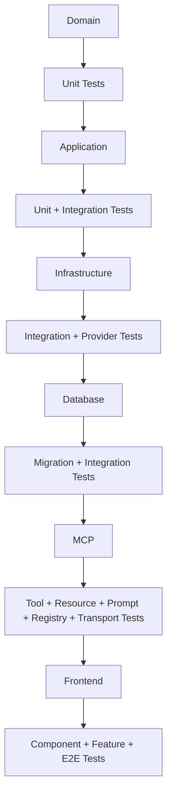

Alur kritis **HARUS** memiliki cakupan end-to-end.

Perilaku database yang kritis **HARUS** memiliki cakupan integration terhadap Supabase development nyata ketika perilaku tersebut tidak dapat dipercaya melalui mock.

## Aturan

- **WAJIB** menguji domain independent dari UI.
- **WAJIB** menguji application services.
- **WAJIB** menguji database integration yang critical.
- **WAJIB** menguji MCP primitives.
- **WAJIB** menguji transport behavior.
- **WAJIB** menguji authentication and authorization.
- **WAJIB** menguji environment-dependent database modes.
- **WAJIB** membuat regression test untuk critical defects.
- **DILARANG** menghapus tests untuk membuat build pass.

---

# 9. Pemisahan Environment Pengujian

Testing **HARUS** tidak mencampurkan production resources.

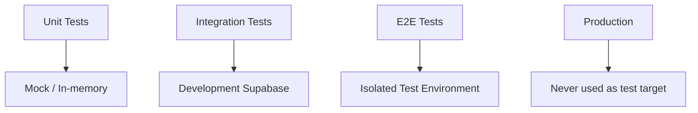

## Aturan

- **WAJIB** memisahkan test database dari production database.
- **DILARANG** menjalankan destructive test terhadap production Supabase.
- **WAJIB** menggunakan deterministic fixtures.
- **WAJIB** membersihkan test state.
- **WAJIB** menjaga test credentials berbeda dari production.

---

# 10. Validasi Arsitektur

Architecture **HARUS** dapat diverifikasi terhadap:

```text
Dependency Direction
Circular Dependency
Boundary Violations
Forbidden Imports
Dead Code
Duplicate Implementation
Protocol Leakage
Infrastructure Leakage
UI Leakage
Database Leakage
```

## Aturan

- **WAJIB** melakukan dependency validation.
- **WAJIB** mendeteksi circular dependencies.
- **WAJIB** memeriksa forbidden imports.
- **WAJIB** memeriksa duplicate implementation.
- **WAJIB** memeriksa protocol leakage.
- **WAJIB** memeriksa infrastructure leakage.
- **DILARANG** menganggap successful compilation sebagai architecture validation.

---

# 11. Validasi Build, Typecheck, Lint, Test, dan Deployment

Validasi minimum:

```text
Typecheck
Lint
Unit Tests
Integration Tests
E2E Tests where relevant
Production Build
Architecture Validation
Database Migration Validation
```

Vercel deployment readiness juga **HARUS** diverifikasi untuk changes yang memengaruhi deployment/runtime.

## Aturan

- **WAJIB** menyelesaikan type errors.
- **WAJIB** menyelesaikan lint errors.
- **WAJIB** menyelesaikan relevant test failures.
- **WAJIB** menyelesaikan build failures.
- **WAJIB** memvalidasi migration changes.
- **DILARANG** disable validation untuk menghindari failure.
- **DILARANG** mengubah validation criteria agar implementation terlihat berhasil.

---

# 12. Siklus Engineering Otonom

Engineering work **HARUS** mengikuti loop:

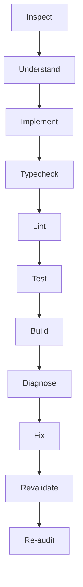

Loop **HARUS** terus berjalan sampai defined completion criteria terpenuhi.

## Aturan

- **WAJIB** melakukan iterative validation.
- **WAJIB** memperbaiki validation failure.
- **WAJIB** melakukan re-audit setelah fix.
- **WAJIB** memeriksa regression.
- **DILARANG** berhenti hanya karena first-pass build berhasil.
- **DILARANG** menganggap task selesai tanpa verification.
- **DILARANG** menonaktifkan typecheck, lint, test, atau build untuk menghindari failure.

---

# 13. Kesiapan Produksi

Application hanya boleh dianggap production-ready jika:

```text
Architecture valid
Typecheck passes
Lint passes
Tests pass
Production build passes
Database migration validated
Supabase production configuration valid
Authentication policy validated
Authorization validated
MCP transports validated
MCP capabilities validated
Observability functional
Health checks functional
External dependencies handled
No critical dead code
No critical duplicate implementation
No critical architecture violation
No known security bypass
```

Default credentials warning **HARUS** muncul apabila production menggunakan fallback bootstrap credentials.

## Aturan

- **WAJIB** melakukan production readiness validation.
- **WAJIB** memastikan production menggunakan real Supabase database.
- **WAJIB** memastikan mock database tidak aktif.
- **WAJIB** memastikan deployment configuration valid.
- **WAJIB** memastikan security boundary aktif sesuai policy.
- **DILARANG** menganggap visual correctness sebagai production readiness.

---

# 14. Kontrak Arsitektur Final

Final architecture **HARUS** dapat diringkas sebagai berikut:

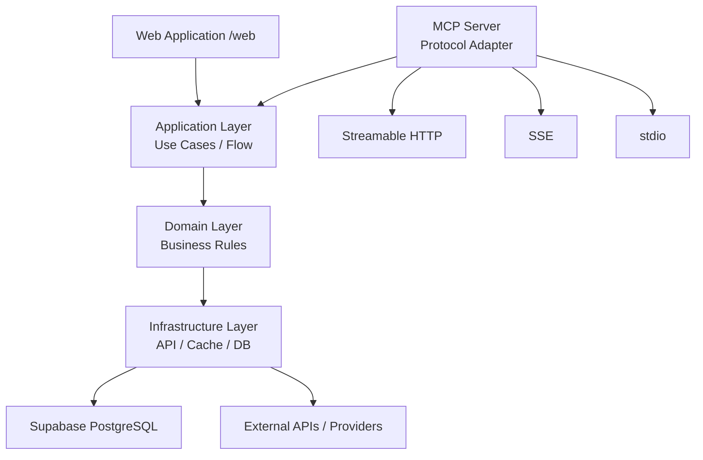

Alur Web:

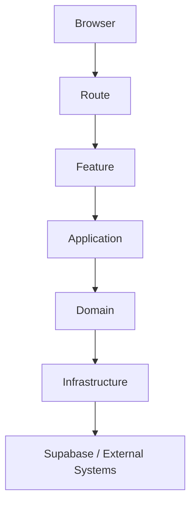

Alur MCP:

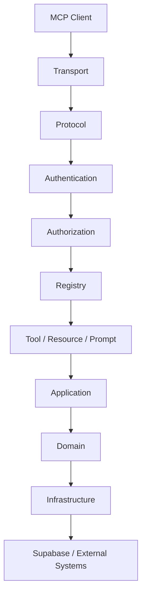

Environment flow:

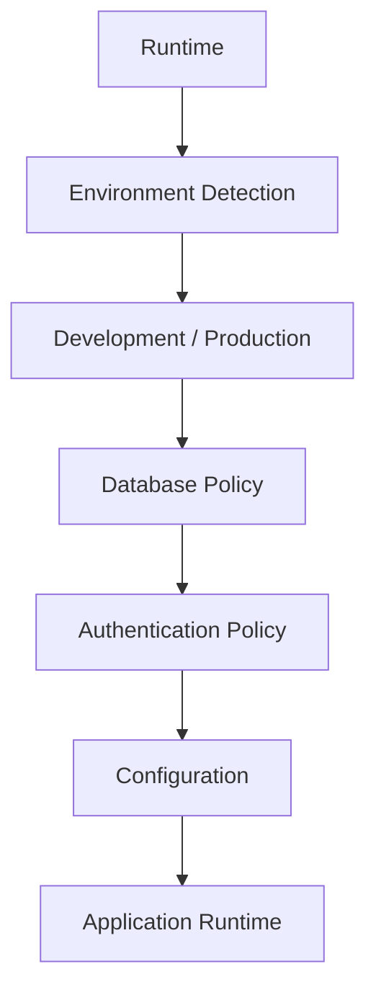

Alur database development:

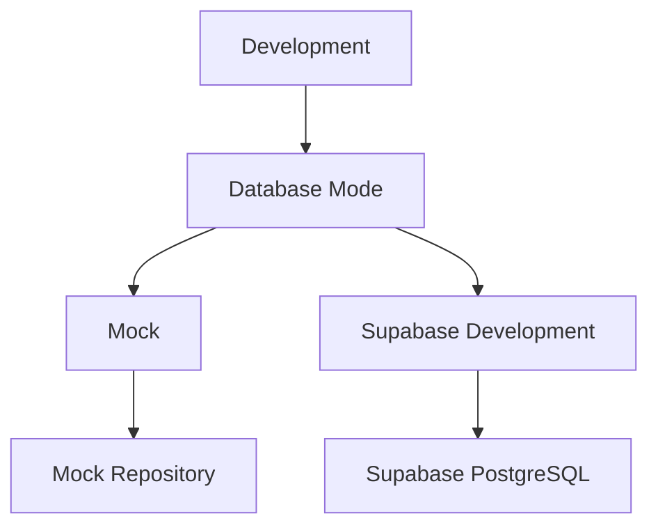

Alur database production:

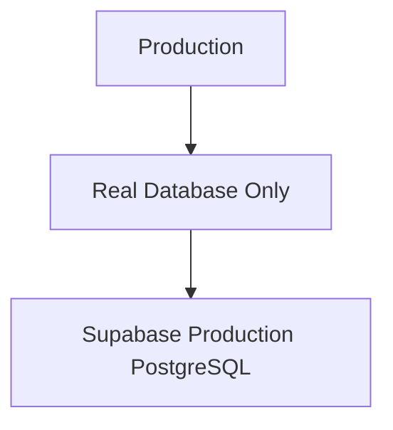

Alur autentikasi:

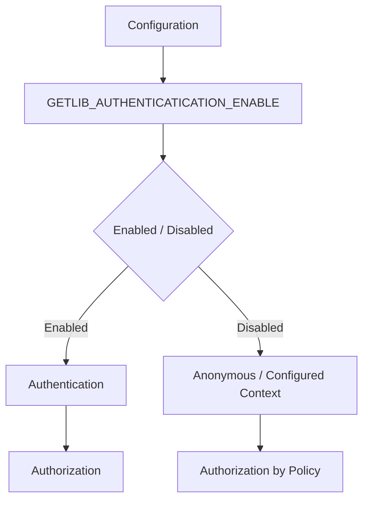

Bootstrap account flow:

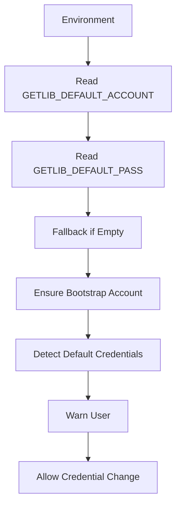

Vercel and Supabase deployment flow:

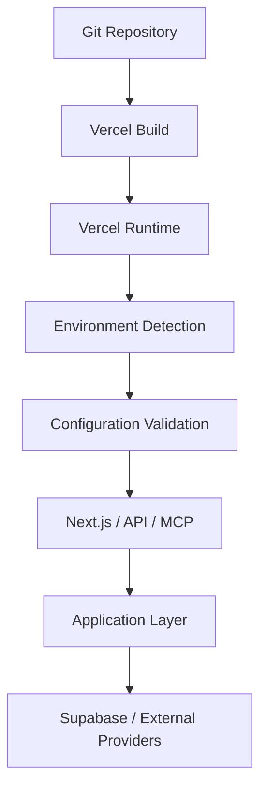

Prinsip akhir:

**Routing bukan business layer. Frontend bukan business layer. MCP bukan business layer. Infrastructure bukan business policy layer. Database bukan business policy layer. Application layer menjadi pusat use case. Domain layer menjadi pemilik business rules. Infrastructure menjadi pemilik technical integrations dan persistence. MCP menjadi protocol adapter menuju application capability. Environment policy menentukan runtime behavior. Supabase menjadi production persistence boundary. Vercel menjadi deployment/runtime boundary.**

Architecture **HARUS** tetap konsisten ketika jumlah feature, MCP capability, client, provider, database operation, user, dan deployment environment bertambah.

Seluruh implementation baru **HARUS** mengikuti boundary yang sama.

Seluruh interface baru **HARUS** mengonsumsi application capability melalui boundary yang sesuai.

Seluruh database operation baru **HARUS** melalui persistence boundary.

Seluruh MCP capability baru **HARUS** melalui registry dan protocol adapter.

Seluruh external provider baru **HARUS** memiliki infrastructure adapter.

Seluruh environment-sensitive behavior **HARUS** menggunakan centralized configuration and runtime detection.

Seluruh production persistence **HARUS** menggunakan real Supabase database.

Seluruh development runtime **HARUS** mendukung mock atau real development Supabase database sesuai development settings.

Seluruh default credential behavior **HARUS** mengikuti bootstrap contract dan warning policy yang didefinisikan dalam dokumen ini.

Seluruh perubahan **HARUS** dapat diverifikasi melalui typecheck, lint, tests, build, security validation, database validation, protocol validation, dan architecture validation yang relevan.

Target akhir arsitektur:

```text
Modular
Maintainable
Testable
Secure
Observable
Performant
Predictable
Extensible
Deployment-safe
Environment-aware
Database-safe
Protocol-safe
```

---

