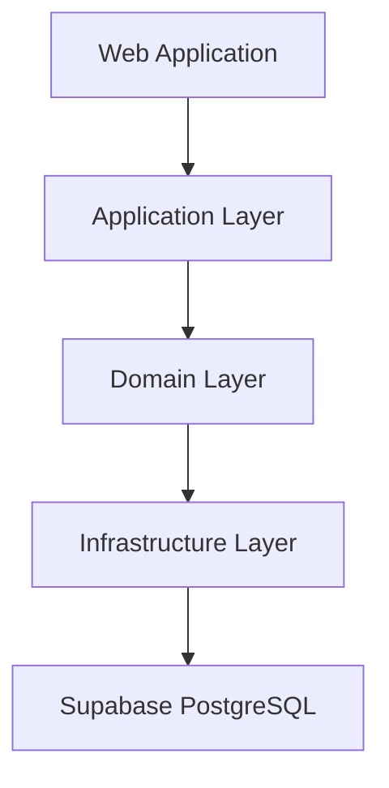
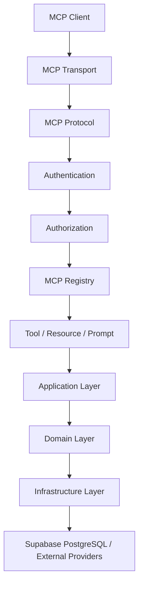
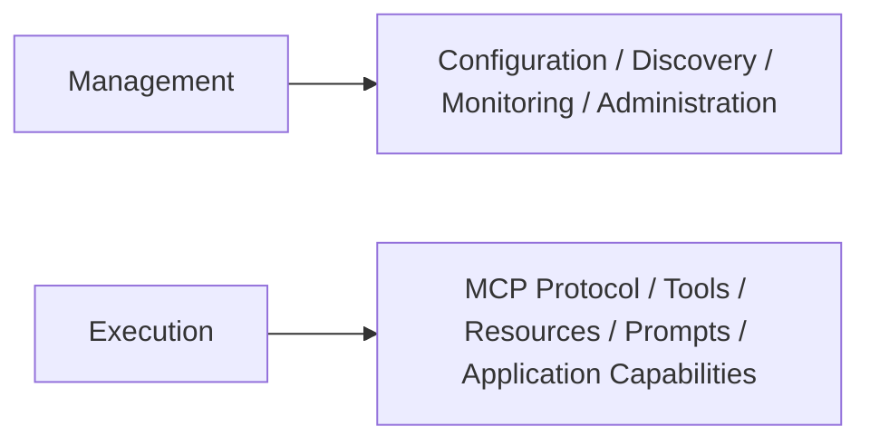
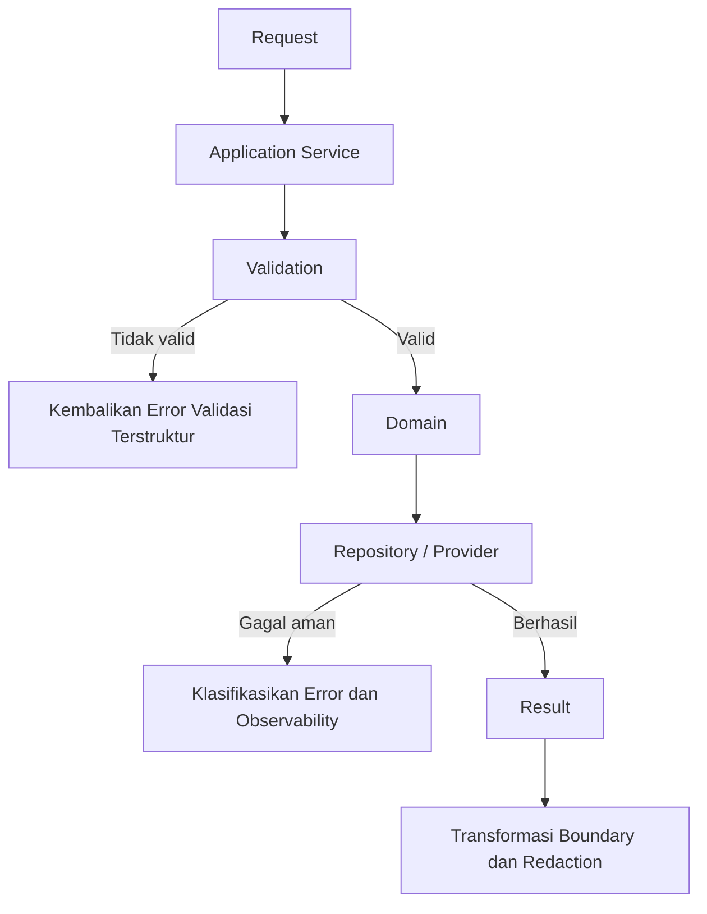
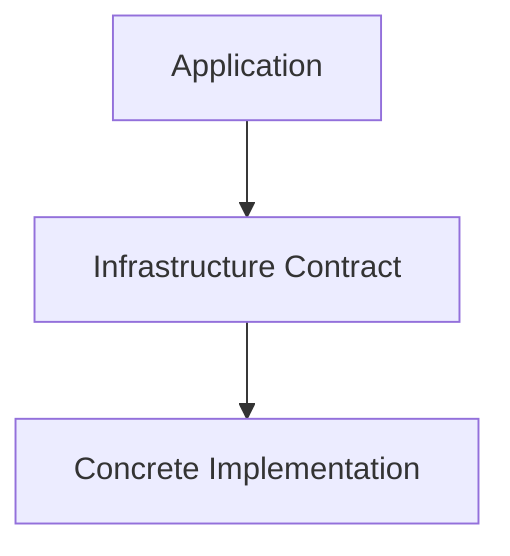
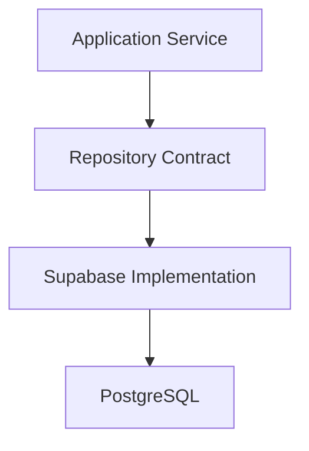
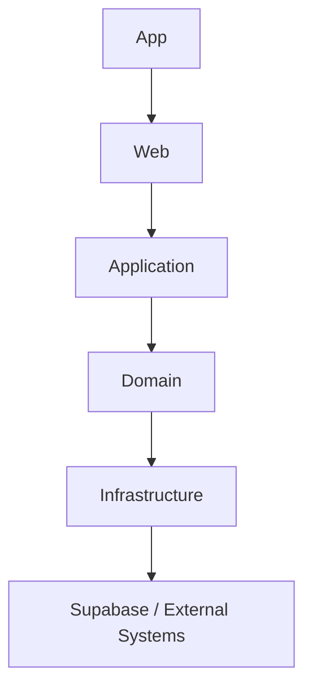
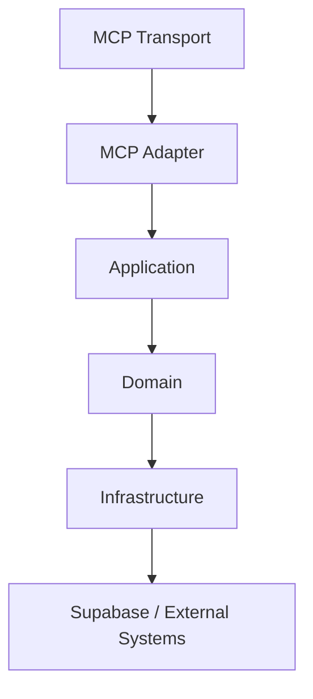
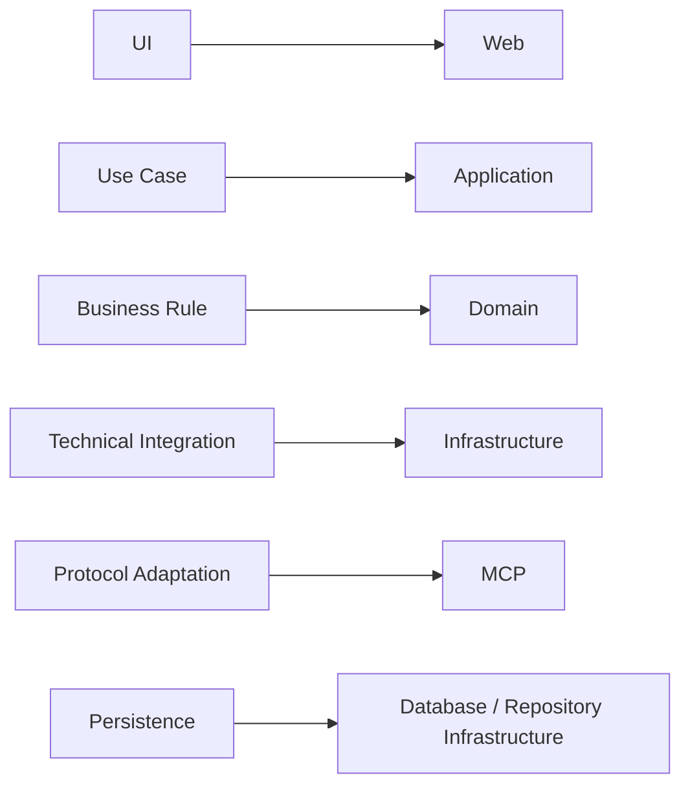

# Arsitektur dan Infrastruktur

Modul ini menetapkan arsitektur sistem, kepemilikan layer, arah dependency, boundary domain/application/infrastructure, contract persistence, caching, provider, kepemilikan module, kebijakan dead code, dan type contract.

## Cara Menggunakan Modul Ini

Baca `blueprint.md` terlebih dahulu, lalu gunakan modul ini sebagai sumber otoritatif untuk keputusan struktur kode dan kepemilikan tanggung jawab. Penomoran bagian pada file ini bersifat lokal dan berurutan mulai dari 1. Aturan di sini bersifat kumulatif dengan modul runtime, database, API, MCP, dan dokumentasi library.

Sebelum menambah atau memindahkan code, agen **HARUS** menjawab tiga pertanyaan:

1. Layer mana yang memiliki semantic responsibility tersebut?
2. Contract apa yang menjadi batas antara caller dan implementation?
3. Bukti apa yang menunjukkan bahwa dependency direction dan behavior tetap valid setelah perubahan?

## Konvensi Normatif

- **WAJIB** digunakan untuk boundary, ownership, dependency direction, dan technical integration.
- **HARUS** dipenuhi oleh setiap contract lintas module.
- **DILARANG** digunakan untuk pola yang melewati boundary atau menyamarkan ketidakpastian desain.
- Application service menjadi pusat use case yang dapat dipakai banyak interface.
- Domain menjadi pemilik business rule dan invariant.
- Infrastructure menjadi pemilik detail teknis, provider, persistence, cache, logging, metrics, dan tracing.
- Interface seperti Web, API, CLI, background job, dan MCP **DILARANG** menciptakan salinan business logic untuk use case yang sama.

## Standar Bukti Implementasi

Setiap perubahan arsitektural **HARUS** memiliki:

1. Pemetaan owner untuk module atau file baru.
2. Contract input, output, error, dan dependency yang eksplisit.
3. Pemeriksaan circular dependency, forbidden import, leakage, dead code, dan duplicate implementation bila relevan.
4. Test yang menunjukkan behavior domain dan application tetap independen dari interface.
5. Penjelasan migration path bila public contract atau persistence contract berubah.

Matriks kepemilikan ringkas:

| Concern | Owner | Contoh Lokasi Semantik |
|---------|-------|------------------------|
| Use case dan orkestrasi | Application service | Service pencarian, instalasi, dan statistik |
| Aturan bisnis dan invariant | Domain | Validasi domain, permission, dan kompatibilitas |
| Integrasi teknis dan persistence | Infrastructure | Adapter Supabase, cache, HTTP, logging, dan metrics |
| Adaptasi protocol | MCP | Registry, tool adapter, dan transport |
| Presentasi | Web atau fitur | Route, komponen, dan state UI |

Matriks dependency yang diizinkan:

| Dari | Ke Application | Ke Domain | Ke Infrastructure | Ke UI |
|------|----------------|-----------|-------------------|-------|
| Web atau fitur | Ya | Tidak langsung | Tidak langsung | Ya untuk komposisi |
| Application | Ya antar service | Ya | Melalui contract | Tidak |
| Domain | Tidak | Ya antar domain | Melalui abstraksi | Tidak |
| Infrastructure | Melalui contract | Tidak untuk policy bisnis | Ya antar adapter | Tidak |
| MCP transport atau adapter | Ya melalui application | Tidak langsung | Tidak langsung | Tidak |

---

# 1. Arsitektur Aplikasi

Aplikasi **WAJIB** diperlakukan sebagai satu sistem yang memiliki beberapa interface dan lapisan dengan tanggung jawab yang berbeda.

Aplikasi utama terdiri atas:

```text
Web Application
Application Layer
Domain Layer
Infrastructure Layer
MCP Server / Protocol Layer
Database Layer
Observability Layer
Configuration Layer
```

Arsitektur utama **HARUS** mengikuti boundary berikut:



MCP **WAJIB** menjadi antarmuka protocol terhadap kapabilitas aplikasi:



Web dan MCP **WAJIB** dapat menggunakan kapabilitas aplikasi yang sama apabila keduanya menjalankan use case yang identik.

Database merupakan dependency infrastructure dan **WAJIB** diperlakukan sebagai sumber kebenaran persistent untuk data production.

## Aturan

- **WAJIB** memisahkan concern routing, frontend, application, domain, infrastructure, database, dan protocol MCP.
- **WAJIB** mempertahankan dependency direction yang konsisten.
- **WAJIB** menjaga setiap layer tetap berada dalam responsibility-nya.
- **DILARANG** menempatkan business logic pada routing layer.
- **DILARANG** menempatkan business logic pada frontend.
- **DILARANG** menempatkan business logic pada transport MCP.
- **DILARANG** membuat MCP tool menjadi pengganti application service.
- **DILARANG** membuat infrastructure menjadi lapisan policy bisnis.
- **WAJIB** menggunakan application capability bersama ketika Web dan MCP membutuhkan perilaku yang sama.
- **WAJIB** menggunakan Supabase PostgreSQL sebagai database production.
- **WAJIB** menjaga arsitektur tetap independen dari interface tertentu.

---

# 2. Model Control Plane

Aplikasi **WAJIB** diperlakukan sebagai control plane yang menyediakan visibilitas, konfigurasi, discovery, eksekusi, dan observability terhadap kapabilitas MCP serta layanan pendukung.

Control plane memiliki dua kelompok concern utama:



Dashboard mengelola dan mengobservasi sistem.

Server MCP menyediakan kapabilitas kepada klien MCP.

Keduanya **WAJIB** menggunakan kapabilitas backend yang sama apabila semantik operasinya identik.

## Aturan

- **WAJIB** memisahkan concern management dan concern execution.
- **WAJIB** membuat dashboard menjadi control surface, bukan sumber kebenaran.
- **WAJIB** menjadikan state backend sebagai state authoritative.
- **DILARANG** menyimpan configuration penting hanya di browser.
- **DILARANG** membuat UI menjadi registry runtime.

---

# 3. Application Service Layer

Application service merupakan pusat use case dan orkestrasi.

Capability dapat mencakup:

```text
Search
Resolve
Documentation
Audit
Compatibility
Migration
Best Practices
Library Discovery
Source Management
Statistics
MCP Management
```

Contoh flow:



Application service dapat digunakan oleh:

```text
Web
API
MCP
CLI
Background Jobs
```

## Aturan

- **WAJIB** menjadikan use case yang dapat digunakan ulang sebagai application service.
- **WAJIB** menjaga service independen dari UI.
- **WAJIB** menjaga service independen dari transport MCP.
- **DILARANG** menduplikasi use case antar-interface.
- **WAJIB** menggunakan aturan domain untuk keputusan bisnis.

---

# 4. Domain Layer

Domain layer merupakan pemilik aturan bisnis dan invariant.

Domain dapat mencakup:

```text
Libraries
Documentation
Search
Sources
MCP
Accounts
Permissions
```

Domain **DILARANG** mengetahui detail:

```text
React
Next.js
Browser
HTTP framework
MCP transport implementation
Supabase client implementation
External provider SDK
```

## Aturan

- **WAJIB** menyimpan invariant bisnis pada boundary domain.
- **WAJIB** membuat domain dapat diuji tanpa UI.
- **DILARANG** membuat domain bergantung pada implementasi infrastructure konkret ketika dependency inversion diperlukan.
- **DILARANG** menggunakan object MCP sebagai model domain.
- **DILARANG** menggunakan entity database mentah sebagai model domain tanpa mapping eksplisit.

---

# 5. Infrastructure Layer

Infrastructure bertanggung jawab atas implementasi teknis:

```text
Supabase
Database
Cache
HTTP
GitHub
Documentation Providers
Package Registries
Search Providers
Filesystem
Logging
Metrics
Tracing
```

Alur:



Infrastructure **HARUS** mengisolasi detail khusus provider.

## Aturan

- **WAJIB** mengisolasi integrasi eksternal.
- **WAJIB** mengisolasi akses database.
- **WAJIB** mengisolasi implementasi caching.
- **WAJIB** mengisolasi implementasi observability.
- **DILARANG** menyebarkan percabangan khusus provider ke domain.
- **DILARANG** menjadikan infrastructure sebagai lapisan policy bisnis.

---

# 6. Repository dan Akses Data

Repository atau data access layer **HARUS** bertanggung jawab atas operasi persistence.

Alur konseptual:



Repository **DILARANG** menjadi lapisan aturan bisnis.

## Aturan

- **WAJIB** memisahkan logika persistence dari logika bisnis.
- **WAJIB** memvalidasi hasil query sesuai application contract.
- **WAJIB** menangani error database.
- **WAJIB** menjaga kepemilikan query.
- **DILARANG** menyebarkan raw SQL atau operasi query builder Supabase ke arbitrary feature code.
- **DILARANG** mengirim row database mentah sebagai public API contract.

---

# 7. Arsitektur Cache

Cache merupakan lapisan optimasi.

Cache **HARUS** memiliki:

```text
Ownership
Key strategy
TTL
Invalidation
Failure behavior
Cleanup
```

Database tetap menjadi sumber authoritative untuk state persistent.

Panduan operasional minimum:

| Keputusan | Aturan | Bukti |
|-----------|--------|-------|
| Key | Deterministik dan mencakup versi serta konteks yang relevan | Contoh key dan review collision |
| TTL | Eksplisit per jenis data | Tabel TTL dan alasan |
| Invalidasi | Terdokumentasi berbasis event atau TTL | Jalur invalidasi dan test |
| Kegagalan | Perilaku eksplisit tanpa silent replacement | Test kegagalan cache |
| Batas memori | Batas ukuran dan cleanup | Observability pertumbuhan memori |

## Aturan

- **WAJIB** menggunakan cache key yang deterministik.
- **WAJIB** memiliki strategi expiration.
- **WAJIB** memiliki strategi invalidation.
- **WAJIB** menangani kegagalan cache.
- **DILARANG** menjadikan cache sebagai sumber kebenaran tanpa sengaja.
- **WAJIB** membatasi pertumbuhan memory.

---

# 8. Arsitektur Provider Eksternal dan HTTP

Setiap external HTTP dependency **HARUS** memiliki adapter.

External operation **HARUS** menangani:

```text
Timeout
Retry
Backoff
Redirect
Malformed response
Non-success response
Rate limiting
Response size
Concurrency
```

Budget operasional minimum:

| Parameter | Aturan | Bukti |
|-----------|--------|-------|
| Timeout | Eksplisit per provider | Konfigurasi dan test timeout |
| Retry | Terbatas, hanya operasi idempoten, dengan backoff dan jitter | Retry budget dan test |
| Redirect | Batas maksimal dan validasi ulang target | Test redirect |
| Ukuran response | Batas maksimal dan validasi content type | Test malformed dan oversize |
| Concurrency | Batas eksplisit | Observability dan uji beban terbatas |

## Aturan

- **WAJIB** menentukan timeout.
- **WAJIB** membatasi retry.
- **WAJIB** mempertimbangkan idempotency.
- **WAJIB** membatasi response size.
- **WAJIB** memvalidasi content type.
- **WAJIB** menangani malformed response.
- **DILARANG** melakukan unbounded retry.
- **DILARANG** melakukan unbounded concurrency.
- **WAJIB** menerapkan SSRF protection pada user-controlled URLs.

---

# 9. Arah Dependency

Web:



MCP:



Configuration and shared technical infrastructure dapat digunakan oleh layer sesuai dependency contract tanpa membuat dependency cycle.

## Aturan

- **WAJIB** menjaga dependency satu arah.
- **WAJIB** mencegah circular dependency.
- **DILARANG** domain mengimpor frontend.
- **DILARANG** application mengimpor UI.
- **DILARANG** infrastructure mengimpor feature presentation.
- **DILARANG** MCP transport mengimpor frontend.
- **WAJIB** menggunakan dependency inversion jika diperlukan.

---

# 10. Kepemilikan Module

Kepemilikan ditentukan berdasarkan tanggung jawab semantik.



## Aturan

- **WAJIB** menentukan ownership sebelum membuat module.
- **WAJIB** menjaga public API module minimal.
- **DILARANG** menjadikan module shared sebagai penampungan tanpa kepemilikan yang jelas.
- **DILARANG** memindahkan feature-specific code ke shared hanya karena reuse.

---

# 11. Dead Code dan Code Duplikat

Dead code **HARUS** dihapus.

Termasuk:

```text
Unused imports
Unused functions
Unused types
Unused constants
Unused exports
Unused routes
Unused feature flags
Unused configuration
Obsolete compatibility code
Obsolete mocks
Obsolete database adapters
```

Duplicate behavior **HARUS** dikonsolidasikan apabila semantic ownership sama.

## Aturan

- **WAJIB** menghapus dead code.
- **WAJIB** menghapus duplicate business logic.
- **WAJIB** menghapus duplicate validation.
- **WAJIB** menghapus duplicate MCP implementation.
- **WAJIB** menghapus duplicate database behavior.
- **DILARANG** mempertahankan code sebagai backup.
- **DILARANG** membuat abstraksi semata untuk menghilangkan duplikasi insidental.

---

# 12. Keamanan Tipe dan Contract

Public boundary **HARUS** mempunyai contract yang eksplisit.

Contract meliputi:

```text
API input/output
Application input/output
Domain models
MCP input/output
Configuration
Database mapping
Provider responses
```

## Aturan

- **WAJIB** menggunakan strong typing.
- **DILARANG** menggunakan `any` untuk menyembunyikan uncertainty.
- **DILARANG** menggunakan type assertions sebagai substitute untuk validation.
- **WAJIB** memvalidasi external data.
- **WAJIB** melakukan mapping antar boundary.
- **DILARANG** menduplikasi type contract yang sama pada beberapa location.

---

