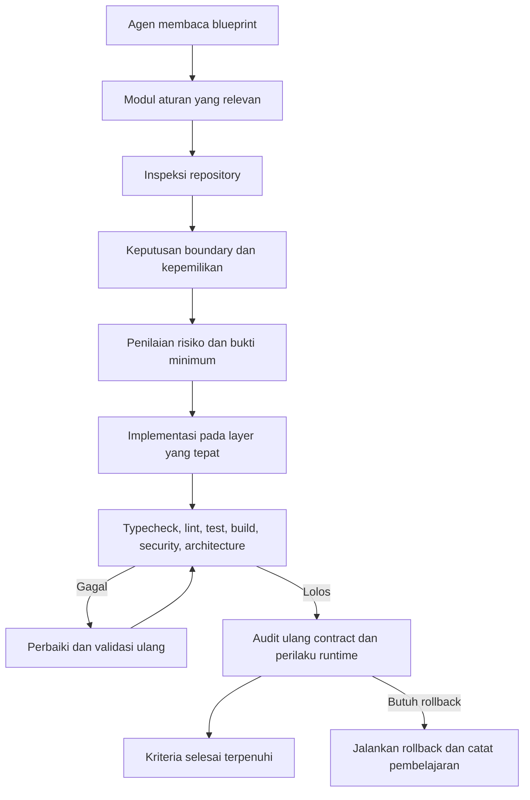
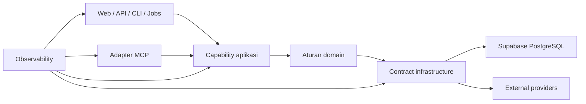

# Blueprint Aturan Agen

## 1. Tujuan dan Ruang Lingkup

Blueprint ini adalah master index dan kontrak lintas modul untuk seluruh aturan engineering pada project. Dokumen ini mengatur cara agen membaca, menafsirkan, menerapkan, dan memverifikasi aturan. Detail normatif berada pada modul fokus yang tercantum di bawah.

Blueprint tidak menggantikan modul fokus. Semua implementasi **HARUS** memenuhi blueprint dan seluruh modul yang relevan terhadap perubahan. Jika dua modul memiliki aturan yang sama, aturan tersebut bersifat kumulatif. Jika terdapat konflik, ikuti urutan prioritas pada bagian 4 dan dokumentasikan keputusan penyelesaiannya.

## 2. Modul Aturan

| Modul | Fokus Utama | Gunakan Ketika |
|-------|-------------|----------------|
| `architecture-and-infrastructure.md` | Layer, ownership, dependency, domain, application, infrastructure, persistence, cache, provider, dead code, type contract | Mengubah struktur kode atau boundary |
| `flows-and-runtime.md` | Route, product flow, environment, lifecycle, Vercel, request, maintenance, performance, resource, background work, compatibility | Mengubah flow atau perilaku runtime |
| `mcp-and-protocols.md` | MCP control center, registry, tools, resources, prompts, clients, playground, logs, health, transport, execution | Mengubah MCP atau protocol |
| `database-auth-and-deployment.md` | Supabase, PostgreSQL, migration, RLS, authentication, authorization, account, settings, deployment | Mengubah data, identity, secret, atau deployment |
| `api-observability-and-testing.md` | Search, normalization, HTTP semantics, error, logging, metrics, security, testing, validation, production readiness | Mengubah API, telemetry, security, atau quality gate |
| `library-documentation.md` | Context7, dokumentasi version-aware, freshness, fallback, coverage, token budget | Menggunakan library atau framework dependency-specific |
| `ui-ux.md` | UI/UX, accessibility, responsive behavior, design tokens, CSS, Tailwind, state, performance | Mengubah UI, copy, styling, atau interaction |
| `no-em-dashes.md` | Larangan karakter em dash, normalisasi output, quality gate | Membuat atau mengubah content apa pun |
| `security-and-privacy.md` | Threat model, secret, privacy, SSRF, abuse prevention, audit, incident response | Mengubah security boundary atau data sensitif |
| `engineering-governance-and-quality.md` | Decision record, review, change control, quality gate, ownership, definition of done | Mengubah rule, contract, atau proses engineering |
| `performance-and-scalability.md` | Pengukuran, optimasi, caching, concurrency, resource limit, profiling | Mengubah performa atau skalabilitas |
| `error-handling-and-recovery.md` | Kategorisasi error, retry, fallback, recovery, user messaging | Mengubah error handling atau resilience |

Penomoran bagian pada tiap modul bersifat lokal. Penomoran tidak mengubah identifier public, nama route, nama tool, nama resource, nama prompt, nama environment variable, atau status protocol. Perubahan contract tetap **HARUS** mengikuti aturan backward compatibility.

Bahasa utama seluruh rule adalah bahasa Indonesia. Istilah teknis resmi seperti API, MCP, HTTP, SSE, SQL, Supabase, Vercel, Context7, typecheck, lint, dan nama identifier dipertahankan agar makna teknis tetap tepat. Semua penjelasan, larangan, alasan, dan instruksi penerapan **HARUS** ditulis dalam bahasa Indonesia.

## 3. Aturan Global

### 3.1 Boundary dan Kepemilikan

- Routing, frontend, application, domain, infrastructure, database, MCP, dan observability **HARUS** memiliki tanggung jawab yang terpisah.
- Application layer menjadi pusat use case dan orkestrasi.
- Domain layer menjadi pemilik aturan bisnis dan invariant.
- Infrastructure menjadi pemilik detail integrasi teknis, persistence, cache, logging, metrics, dan tracing.
- MCP menjadi adapter protocol, bukan lapisan bisnis.
- Dashboard menjadi control surface, bukan sumber kebenaran.

### 3.2 Diagram dan Hubungan Visual

Semua diagram arsitektur, dependency, alur, lifecycle, routing, decision flow, hierarchy, process flow, dan hubungan visual **HARUS** memakai Mermaid. Diagram ASCII **DILARANG** digunakan. Fenced text hanya untuk code, data, path, configuration, command, literal output, atau daftar yang bukan diagram. Listing struktur file seperti `src/` termasuk kategori path sehingga boleh memakai fenced text, bukan Mermaid.

### 3.3 Keamanan

- Semua input eksternal dianggap tidak tepercaya.
- Enforcement keamanan **HARUS** berada pada boundary server-side.
- Autentikasi dan otorisasi **HARUS** dipisahkan.
- Secret **DILARANG** masuk source code, browser, log, telemetry, atau response public.
- URL yang dikendalikan user **HARUS** divalidasi dan dilindungi dari SSRF.
- Path traversal, penyalahgunaan origin atau host, penyalahgunaan rate limit, dan kebocoran data **HARUS** ditangani sesuai boundary.
- Operasi sensitif **HARUS** fail closed jika policy tidak dapat diverifikasi.

### 3.4 Persistence dan Environment

- Persistence production menggunakan Supabase PostgreSQL nyata.
- Production **DILARANG** jatuh ke mock database, local filesystem, atau memory proses sebagai sumber kebenaran.
- Development boleh memakai mock atau Supabase development sesuai policy.
- Schema, migration, policy, dan seed **HARUS** memiliki versioning.
- Deteksi environment dan typed configuration **HARUS** terpusat.

### 3.5 Contract dan Interoperabilitas

- Public contract **HARUS** eksplisit, typed, tervalidasi, dan memiliki semantik error.
- Data **HARUS** dinormalisasi pada boundary eksternal dan ditransformasi pada boundary protocol.
- Object khusus provider, entity database mentah, dan object protocol **DILARANG** bocor ke domain atau consumer yang salah.
- Web, API, CLI, background job, dan MCP **HARUS** memakai application capability yang sama jika use case-nya identik.

### 3.6 Observability dan Validasi

- Request, correlation, error, latency, dependency, database, cache, provider, dan event keamanan **HARUS** dapat ditelusuri melalui telemetry yang sesuai.
- Logging **HARUS** terstruktur, terpusat, dan sudah disanitasi.
- Validasi minimum meliputi typecheck, lint, unit test, integration test, E2E bila relevan, production build, migration validation, security validation, protocol validation, dan architecture validation.
- Build yang berhasil saja tidak cukup untuk menyatakan task selesai.

### 3.7 Aturan Global yang Tetap Terpisah

Aturan UI/UX dan aturan larangan em dash adalah concern global tersendiri. Keduanya tidak diduplikasi di modul fokus agar satu aturan tidak memiliki beberapa sumber kebenaran. Ketika file aturan global tersebut tersedia di workspace, agen **HARUS** membacanya sebelum mengubah UI, copy, atau format punctuation. Blueprint ini tetap menetapkan bahwa file yang dibuat atau diperbarui **DILARANG** menggunakan em dash, kecuali blok kode definisi karakter pada `no-em-dashes.md` itu sendiri dan fixture eksternal immutable yang dikecualikan secara eksplisit.

## 4. Prioritas Aturan

Gunakan urutan berikut ketika membuat keputusan:

1. Keamanan, privasi, dan keamanan credential.
2. Integritas data, keamanan persistence, dan correctness migration.
3. Public protocol, API, dan kompatibilitas mundur.
4. Kepemilikan boundary dan arah dependency.
5. Keandalan runtime, lifecycle resource, dan observability.
6. Kemudahan pengujian, maintainability, performa, dan ergonomi.
7. Preferensi presentasi dan konsistensi visual.

Aturan dengan prioritas lebih rendah **DILARANG** mengorbankan aturan dengan prioritas lebih tinggi. Bila perubahan tetap membutuhkan tradeoff, tuliskan risiko, alternatif yang ditolak, rollback atau migration path, serta bukti validasinya.

## 5. Urutan Membaca Agen

Untuk task biasa:

1. Baca `blueprint.md`.
2. Identifikasi boundary dan public contract yang terpengaruh.
3. Baca modul fokus yang relevan.
4. Baca aturan UI/UX dan no-em-dashes bila perubahan menyentuh UI atau teks.
5. Inspeksi source, test, package manifest, configuration, migration, dan deployment file yang relevan.
6. Rancang perubahan paling kecil yang memenuhi contract.
7. Implementasikan pada layer yang memiliki ownership.
8. Jalankan validasi sesuai risiko.
9. Re-audit boundary, security, compatibility, dan dokumentasi.

Kedalaman membaca:

| Situasi | Modul Wajib | Keluaran |
|---------|-------------|----------|
| Perubahan satu file non-public | Blueprint dan satu modul fokus | Ringkasan boundary dan test yang dijalankan |
| Perubahan public contract | Blueprint, modul fokus, governance, dan modul security atau data yang relevan | Decision record, compatibility plan, dan rollback |
| Perubahan repository luas | Seluruh modul dan aturan global yang relevan sebelum keputusan arsitektural | Design review, matriks risiko, dan rencana validasi |

## 6. Matriks Perubahan dan Bukti Minimum

| Perubahan | Modul Utama | Bukti Minimum | Tingkat Risiko |
|-----------|-------------|---------------|----------------|
| Layer atau module baru | Arsitektur | Ownership, dependency check, typecheck, test | Sedang sampai tinggi |
| Route atau product flow | Flow dan runtime | Route semantics, Mermaid flow, authorization, regression test | Sedang |
| Database atau migration | Database dan deployment | Migration test, policy review, environment separation, rollback plan | Tinggi |
| Auth atau account | Database dan deployment | Auth matrix, authorization test, redaction, audit | Tinggi |
| API atau result contract | API dan observability | Status semantics, schema validation, error mapping, contract test | Tinggi |
| External provider | Arsitektur dan API | Adapter, timeout, retry, size limit, malformed response test | Sedang |
| MCP capability | MCP dan protocol | Registry, schema, collision, permission, transport test | Sedang sampai tinggi |
| Library atau framework | Library documentation | Version lookup, authoritative source, typecheck, build | Rendah sampai sedang |
| Logging atau metrics | API dan observability | Correlation, redaction, metric definition, privacy review | Sedang |
| Performance atau background job | Flow dan runtime | Measurement, bounded concurrency, cancellation, cleanup | Sedang |
| UI, copy, atau styling | UI/UX dan no-em-dashes | Accessibility, responsive review, state coverage, punctuation scan | Rendah sampai sedang |
| Security atau privacy | Security dan privacy | Threat model, authorization test, redaction, audit evidence | Tinggi |
| Perubahan rule atau proses | Governance dan quality | Review record, impact analysis, validation plan | Sedang sampai tinggi |
| Error handling | Error handling | Kategorisasi, retry policy, fallback, user message | Sedang |
| Performance | Performance | Baseline, target, profiling, regression test | Sedang |

## 7. Definition of Done untuk Agen

Sebuah perubahan baru boleh dianggap selesai jika seluruh kriteria yang relevan di bawah terpenuhi:

- Behavior existing yang valid tetap terjaga.
- Boundary dan ownership tidak menjadi lebih kabur.
- Tidak ada duplicate business logic, validation, registry, atau persistence behavior yang tidak memiliki alasan semantic.
- Input external tervalidasi dan output sudah dipetakan ke contract.
- Authentication, authorization, dan secret handling sudah diverifikasi.
- Error memiliki kategori, status, retryability, correlation, dan safe transformation yang sesuai.
- Resource memiliki owner dan cleanup path.
- Public contract memiliki compatibility atau migration plan.
- Test dan validation yang relevan berhasil, atau kegagalannya dicatat sebagai blocker yang nyata.
- Dokumentasi modul, contoh, diagram, dan metadata tetap konsisten.
- Tidak ada karakter em dash pada file yang dibuat atau diperbarui, kecuali blok definisi pada `no-em-dashes.md` dan fixture eksternal yang dikecualikan.

## 8. Kontrak Ringkas Sistem

---

