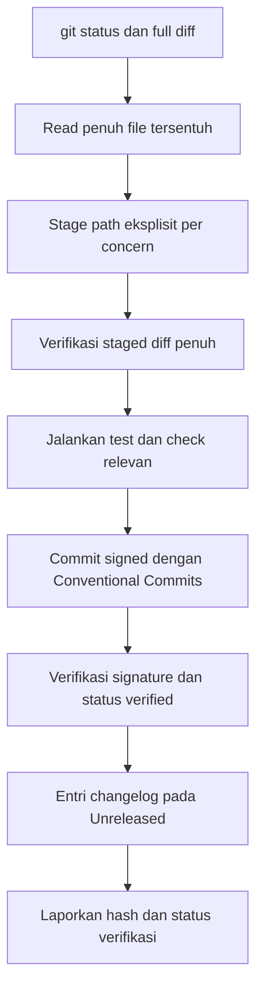

# Commit dan Changelog

Instruksi tetap untuk setiap commit pada repository ini. Aturan ini dihimpun dari arahan owner lintas sesi dan berlaku prioritas untuk seluruh pekerjaan commit dan changelog, kecuali owner secara eksplisit mengesampingkannya untuk satu task tertentu.

## Cara Menggunakan Modul Ini

Baca `blueprint.md` terlebih dahulu, lalu gunakan modul ini sebagai sumber otoritatif untuk staging, commit message, signing, verifikasi, push policy, dan changelog. Terapkan bersama `engineering-governance-and-quality.md` untuk decision record dan compatibility, serta `no-em-dashes.md` untuk setiap pesan dan entri teks. Penomoran bagian pada file ini bersifat lokal dan berurutan mulai dari 1.

Muat skill `dizzy-commit` untuk pekerjaan commit dan baca seluruh file referensinya secara penuh tanpa kecuali.

## Konvensi Normatif

- **WAJIB** berarti persyaratan commit yang **HARUS** dipenuhi sebelum commit dibuat.
- **DILARANG** berarti pola yang tidak boleh digunakan pada staging, commit, push, atau changelog.
- Command git, path file, identifier versi, dan format pesan pada contoh **HARUS** dipertahankan persis kecuali ada instruksi eksplisit owner.
- Tanpa instruksi push yang eksplisit, pekerjaan berhenti pada commit lokal dan pelaporan.

## Standar Bukti Implementasi

Setiap commit **HARUS** dapat menunjukkan full diff yang direview, hasil read penuh, staged diff yang terverifikasi, hasil check yang dijalankan atau alasan jujur bila dilewati, status signature verified, dan entri changelog yang tepat.

## 1. Satu Concern per Commit

- Setiap commit menyatakan tepat satu perubahan logis. **DILARANG** mencampur perubahan yang tidak berkaitan, dan **DILARANG** men-stage semuanya demi kemudahan.
- **DILARANG** memecah berlebihan: gabungkan file yang berkaitan erat dan membentuk satu concern ke dalam satu commit.
- Unit atomik tipikal: satu bug fix, satu feature, satu refactor, satu docs update, satu dependency change, atau satu test addition.
- Apabila staged diff jelas memuat perubahan yang tidak berkaitan, pisahkan sebelum commit.

## 2. Larangan Menebak: Full Diff dan Full Read

- Sebelum commit, tampilkan FULL diff per file tanpa truncating atau batasan.
- Baca setiap file tersentuh secara PENUH dengan read tool, tanpa limit atau slicing. Partial read tidak dapat diterima karena konteks yang terlewat menyebabkan kesalahan changelog.
- Verifikasi tidak ada referensi menggantung apabila file dipindah atau dihapus (imports, re-exports, tests).
- Verifikasi file baru tidak ter-ignore dan dependensinya resolve.

## 3. Penempatan Changelog

- Entri baru masuk ke `## [Unreleased]` secara default. Entri hanya masuk ke section rilis apabila owner secara eksplisit memerintahkan.
- Section rilis tidak boleh disunting untuk menambah pekerjaan baru, kecuali owner secara eksplisit memerintahkan pemindahan (contoh konsolidasi Unreleased menjadi rilis, atau pemindahan entri pasca-rilis ke section patch). **DILARANG** amend atau rebase history yang sudah di-push.

## 4. Disiplin Section Changelog

- Setiap section versi memuat tiap heading `###` maksimal SATU kali: satu `### Added`, satu `### Fixed`, satu `### Changed` (plus `### Removed` atau `### Security` hanya bila dibutuhkan).
- **DILARANG** membuat heading `###` duplikat. Selalu append bullet ke heading yang sudah ada.
- Petakan setiap bullet ke tipe commit:
  - commit `feat` masuk `### Added`
  - commit `fix` masuk `### Fixed`
  - commit `refactor`, `perf`, `test`, `chore`, `docs`, `ci` masuk `### Changed`
- Pertahankan urutan heading Added, Fixed, Changed pada tiap section.

## 5. Larangan Em Dash

- Karakter em dash **DILARANG** di seluruh tempat: code, comments, documentation, changelog, commit messages, UI text, dan logs.
- Gunakan hyphen, koma, kolon, atau susun ulang kalimat.

## 6. Commit Signed dan Verified (Wajib)

- Setiap commit **WAJIB** signed (GPG) dan berstatus verified (`G`).
- Sebelum lanjut ke commit berikutnya, verifikasi signature commit baru DAN verifikasi bahwa seluruh commit yang belum di-push berstatus verified.
- **DILARANG** lanjut selama ada commit yang unsigned atau unverified.

## 7. Recovery Kunci GPG (Hanya Bila Hilang)

- Material signing key tersimpan pada `gpg-key-backup/`: `private.asc`, `public.asc`, `ownertrust.txt`.
- Keyring `~/.gnupg` berulang kali ter-wipe pada environment ini. Apabila signing gagal, reimport dari folder backup dan preset passphrase, lalu commit dan verifikasi dalam satu alur.
- Passphrase adalah `2005`. Gunakan HANYA apabila passphrase hilang atau terlupa, tidak untuk selain itu.
- **DILARANG** meng-commit isi `gpg-key-backup/` (sudah gitignored).

## 8. Skill dan Referensi

- Muat skill `dizzy-commit` untuk pekerjaan commit dan baca SELURUH file referensinya secara penuh tanpa kecuali.
- Ikuti aturannya tentang staging discipline, message style, commit execution, verification, strict mode, dan push safety.
- Pesan commit memakai Conventional Commits (`type(scope): summary`), imperative mood, tanpa trailing period, tanpa emoji, dan tanpa em dash.

## 9. Disiplin Staging

- Jalankan `git status --short` tepat sebelum staging. File dapat muncul atau berubah di tengah sesi.
- Stage hanya path eksplisit milik concern berjalan. **DILARANG** `git add .` atau `git add -A`.
- Jalankan `git check-ignore` pada file baru sebelum staging. **DILARANG** men-stage file yang ter-ignore.
- Verifikasi staged diff secara penuh sebelum commit.
- Periksa history terkini untuk duplikat commit sebelum membuat yang baru.

## 10. Verifikasi Sebelum Commit

- Jalankan test yang relevan untuk area tersentuh sebelum commit.
- Jalankan typecheck untuk perubahan cross-cutting.
- Jalankan `bun run validate` penuh pada akhir rangkaian kerja (typecheck, no-em-dash check, boundary check, tests, production build).
- **DILARANG** mengklaim check lolos tanpa menjalankannya. Check yang gagal berarti commit belum lengkap, kecuali kegagalan terbukti environmental dan dilaporkan secara jujur.

## 11. Policy Push

- **DILARANG** push kecuali owner secara eksplisit meminta push.
- Defaultnya owner melakukan push sendiri.
- Apabila push diminta eksplisit beserta token: inspeksi remote, branch, upstream, dan commit yang belum di-push terlebih dahulu; push memakai URL terautentikasi sekali pakai tanpa menyimpan token pada git config; verifikasi branch tracking setelahnya.
- Remote saat ini: `origin` mengarah ke `https://github.com/D1ZZY4/GetLib-MCP.git` (fetch dan push).
- **DILARANG** force-push, rewrite public history, atau ubah remote tanpa instruksi eksplisit yang spesifik untuk operasi tersebut.

## 12. Presentasi Changelog

- Setiap section versi collapsible memakai tag `
`. Unreleased tetap terbuka; versi rilis mulai collapsed.
- Alur rilis: pindahkan konten Unreleased ke section baru `## [X.Y.Z] - YYYY-MM-DD`, kosongkan kembali Unreleased, bump `package.json` dan `SERVER_VERSION` bersamaan, jaga version contract test tetap hijau, dan commit sebagai `chore(release)`.

## 13. Kehati-hatian Worktree Bersama

- Agen lain bekerja pada tree yang sama secara konkuren. Perlakukan perubahan yang asing atau sedang berjalan sebagai milik user: inspeksi, **DILARANG** melakukan commit tanpa pemeriksaan memadai, dan **DILARANG** clean atau restore demi memudahkan pekerjaan sendiri.
- Apabila perubahan pending bertentangan dengan pekerjaan yang sudah di-commit (contoh revert versi yang merusak version contract test), kecualikan dari commit dan laporkan segera.
- Apabila changelog direstrukturisasi oleh sesi lain, baca ulang secara penuh sebelum menyunting agar heading tidak duplikat dan section rilis tidak tercemar.

## 14. Pelaporan Jujur

- Laporkan tepat apa yang di-commit beserta hash dan status verifikasi. Laporkan diskrepansi, kegagalan, dan check yang dilewati secara apa adanya, bukan disembunyikan.
- Apabila instruksi bertentangan dengan aturan safety atau policy, aturan precedence yang lebih tinggi menang; jelaskan konfliknya dan jalur yang lebih aman.

---
