# Database, Authentication, dan Deployment

Modul ini menetapkan Supabase dan arsitektur database, migration dan RLS, autentikasi dan otorisasi, bootstrap account, profile dan settings, deployment, serta policy runtime yang berhubungan dengan keamanan.

## Cara Menggunakan Modul Ini

Gunakan modul ini untuk setiap perubahan yang menyentuh persistence, identity, session, access policy, environment, secret, deployment, atau lifecycle serverless. `blueprint.md` menetapkan urutan membaca dan aturan lintas modul. Penomoran bagian pada file ini bersifat lokal dan berurutan mulai dari 1.

Pisahkan tiga jenis keputusan:

1. **Data policy**, yaitu siapa yang boleh membaca atau mengubah data.
2. **Runtime policy**, yaitu bagaimana environment memilih database, auth mode, credential, dan capability.
3. **Deployment policy**, yaitu bagaimana configuration, migration, connection, dan lifecycle dijalankan pada platform target.

Perlakukan authentication, authorization, display identity, dan application configuration sebagai konsep yang berbeda. Setiap konsep **WAJIB** memiliki boundary dan bukti validasi tersendiri.

## Konvensi Normatif

- **WAJIB** berlaku untuk persistence, credential, identity, access policy, dan deployment safety.
- **DILARANG** mengandalkan browser, process memory, mock, atau local filesystem sebagai authoritative production state.
- Nama environment variable dan credential contract yang ada **HARUS** dipertahankan persis sampai migration resmi selesai.
- Nilai secret bersifat write-only atau masked. Secret **DILARANG** dikembalikan ke UI, log, error, telemetry, atau response public.
- Production **WAJIB** gagal secara eksplisit apabila konfigurasi kritis tidak valid dan tidak terdapat fallback yang secara eksplisit diizinkan.

## Standar Bukti Implementasi

Perubahan pada modul ini minimal **HARUS** dapat menunjukkan:

1. Environment target yang dipakai dan alasan pemilihannya.
2. Database mode yang aktif dan bukti bahwa production tidak pernah memakai mock.
3. Migration, constraint, index, policy, dan seed yang terpengaruh.
4. Authentication dan authorization behavior pada mode enabled dan disabled.
5. Audit, warning, redaction, rollback, serta recovery behavior yang relevan.
6. Validasi pada development sebelum perubahan dipromosikan ke production.

---

# 1. Arsitektur Settings dan User Profile

Settings **HARUS** memiliki dua jenis concern:

```text
Application Configuration
User / Account Configuration
```

Application configuration dapat mencakup:

```text
General
Authentication
MCP
Database / Development
Advanced
```

Konfigurasi user atau account mencakup identity dan preferensi user.

Settings user **HARUS** dapat diakses melalui profile/avatar control pada dashboard apabila settings tersebut bukan concern navigasi utama.

Menu profile yang direkomendasikan:

```text
Profile
Account
Preferences
Development
Security
About
Sign out
```

Menu tersebut TIDAK WAJIB muncul pada primary sidebar navigation.

## Aturan

- **WAJIB** memisahkan profile user dan configuration aplikasi.
- **WAJIB** menempatkan kontrol terkait account pada menu profile/avatar.
- **WAJIB** melindungi configuration yang memengaruhi runtime.
- **DILARANG** menyimpan settings aplikasi authoritative hanya pada browser.
- **DILARANG** menampilkan nilai configuration sensitif secara mentah setelah disimpan.

---

# 2. Integrasi Supabase

Supabase digunakan sebagai platform database utama.

Supabase menyediakan database PostgreSQL penuh dan dapat digunakan melalui Data API, client library, serta connection pooling. Untuk traffic aplikasi dari serverless atau edge function, transaction-mode pooling ditujukan untuk banyak koneksi transient.

Application **HARUS** memilih metode koneksi berdasarkan runtime.

Model konseptual:

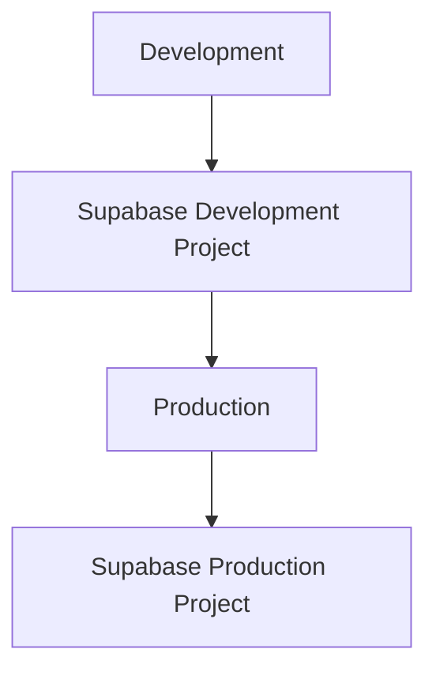

Configuration Supabase **HARUS** terisolasi per environment.

## Aturan

- **WAJIB** menggunakan Supabase sebagai platform database persistent.
- **WAJIB** memiliki pemisahan project dan environment.
- **WAJIB** memilih metode koneksi sesuai workload.
- **DILARANG** menggunakan credential Supabase production pada default path development.
- **WAJIB** menggunakan credential server-side yang aman untuk operasi privileged.
- **WAJIB** menggunakan RLS atau kontrol otorisasi setara ketika exposure data melewati Supabase client atau Data API.
- **WAJIB** menjaga schema dan migration tetap memiliki versioning.

---

# 3. Model Mengaktifkan atau Menonaktifkan Autentikasi

Autentikasi dikendalikan oleh:

```text
GETLIB_AUTHENTICATION_ENABLE=true
```

atau:

```text
GETLIB_AUTHENTICATION_ENABLE=false
```

Ketika authentication enabled:

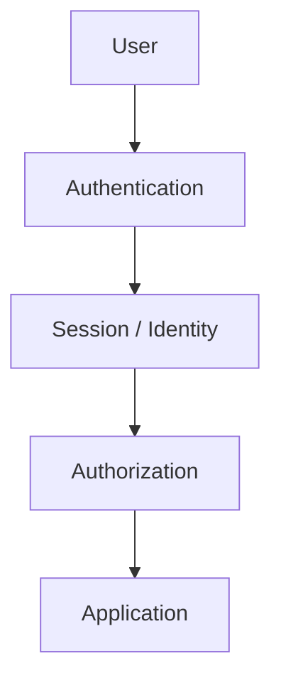

Ketika authentication disabled:

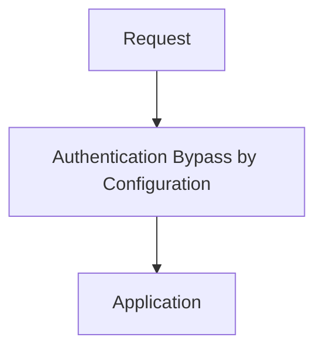

Autentikasi yang dinonaktifkan TIDAK berarti pemeriksaan keamanan lain ikut dinonaktifkan secara otomatis.
Authorization terhadap system capabilities, dangerous operations, management operations, dan internal boundaries tetap **HARUS** diterapkan sesuai security model.

Autentikasi yang dinonaktifkan berarti user tidak diwajibkan memiliki account terautentikasi untuk menggunakan interface aplikasi sesuai policy.

## Aturan

- **WAJIB** menentukan mode autentikasi dari configuration terpusat.
- **WAJIB** membedakan autentikasi dan otorisasi.
- **DILARANG** membuat mode tanpa autentikasi menonaktifkan seluruh kontrol keamanan.
- **WAJIB** memastikan perilaku mode dengan dan tanpa autentikasi deterministik.
- **DILARANG** meminta login ketika autentikasi secara eksplisit dinonaktifkan.
- **DILARANG** menganggap production tanpa autentikasi sebagai default aman untuk deployment public tanpa policy keamanan yang eksplisit.

---

# 4. Bootstrap Account Default

Bootstrap account production dikendalikan oleh:

```text
GETLIB_DEFAULT_ACCOUNT
GETLIB_DEFAULT_PASS
```

Fallback default account:

```text
awesomemcp@getlib-local.com
```

Fallback default password:

```text
getlib123
```

Ketika environment variable tidak diisi, application menggunakan fallback tersebut untuk bootstrap account sesuai deployment policy.

Credential fallback bersifat tidak aman dan **HARUS** dianggap sebagai credential emergency atau bootstrap sementara, bukan credential jangka panjang. Perilaku fallback tidak berlaku untuk production normal.

Production **DILARANG** berjalan dengan fallback credentials aktif. Apabila production mendeteksi fallback credentials masih aktif, startup **HARUS** gagal secara eksplisit dengan error aman dan audit, bukan sekadar warning.

Dashboard **HARUS** menampilkan warning ketika fallback credentials sedang digunakan.

Warning **HARUS** menyatakan bahwa default credentials **HARUS** segera diubah.

## Aturan

- **WAJIB** membaca `GETLIB_DEFAULT_ACCOUNT` dan `GETLIB_DEFAULT_PASS` dari configuration terpusat.
- **WAJIB** menggunakan account fallback `awesomemcp@getlib-local.com` ketika variable kosong dan perilaku fallback diizinkan oleh policy environment.
- **WAJIB** menggunakan password fallback `getlib123` ketika variable kosong dan perilaku fallback diizinkan oleh policy environment.
- **WAJIB** memberikan warning yang jelas ketika credential fallback aktif.
- **WAJIB** menyediakan mekanisme untuk mengganti password bootstrap.
- **WAJIB** membatasi exposure terhadap credential default.
- **DILARANG** mengizinkan fallback credentials pada production, kecuali deployment policy secara eksplisit mendefinisikan mode bootstrap darurat yang terdokumentasi.
- **WAJIB** menggagalkan startup production dengan error aman dan audit apabila fallback credentials terdeteksi aktif di luar mode tersebut.
- **DILARANG** menampilkan password default pada UI public tanpa otorisasi yang sesuai.
- **DILARANG** mencatat password default ke log.

---

# 5. Model Account Development

Autentikasi development menggunakan identity demo:

```text
Account:
demo@getlibmcp.com

Password:
demo123
```

Account demo development tidak **WAJIB** disimpan pada database production.

Mock development mode dapat menggunakan demo identity secara deterministic.

Mode Supabase development nyata dapat menggunakan account demo yang di-seed ke database development sesuai workflow initialization development.

## Aturan

- **WAJIB** menggunakan `demo@getlibmcp.com` sebagai account demo development pada mock mode.
- **WAJIB** menggunakan `demo123` sebagai password demo development pada mock mode.
- **DILARANG** menggunakan credential demo development pada production.
- **WAJIB** menjaga identity development terpisah dari identity production.
- **WAJIB** memastikan mock mode tidak bergantung pada database production.

---

# 6. Lifecycle Bootstrap Account

Flow bootstrap account **HARUS** mengikuti:

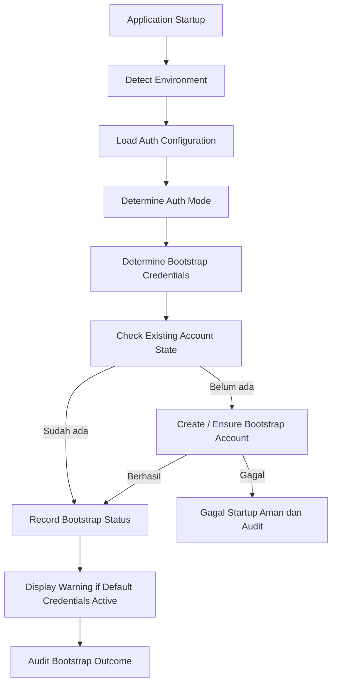

Proses bootstrap **HARUS** idempotent.

Jika account sudah ada, application **DILARANG** membuat account duplikat.

Jika fallback credentials digunakan, dashboard **HARUS** dapat menunjukkan status:

```text
Default credentials active
```

Setelah credential diubah, warning **HARUS** berubah sesuai state baru.

## Aturan

- **WAJIB** membuat operasi bootstrap idempotent.
- **WAJIB** mencegah pembuatan account duplikat.
- **WAJIB** mendeteksi apakah bootstrap account sudah tersedia.
- **WAJIB** menyimpan status bootstrap secara authoritative.
- **DILARANG** menjalankan bootstrap pada setiap request.
- **WAJIB** menjalankan bootstrap pada lifecycle initialization yang sesuai.

---

# 7. Flow Autentikasi

Alur dengan autentikasi aktif:

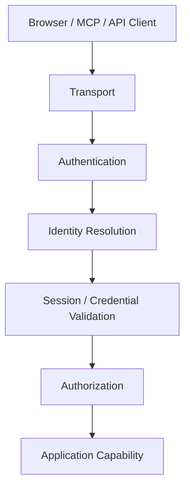

Alur tanpa autentikasi:

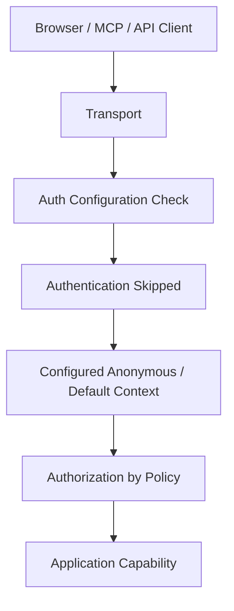

Context anonymous **HARUS** memiliki semantik identity yang jelas jika audit, permission, rate limiting, atau observability membutuhkan identity.

## Aturan

- **WAJIB** membuat mode autentikasi eksplisit.
- **WAJIB** memvalidasi identity pada mode dengan autentikasi aktif.
- **WAJIB** menggunakan context anonymous yang eksplisit pada mode tanpa autentikasi jika diperlukan.
- **WAJIB** menjaga otorisasi tetap terpisah dari autentikasi.
- **DILARANG** menggunakan user terautentikasi palsu hanya untuk menghindari pemeriksaan otorisasi.

---

# 8. Settings User dan Kontrol Account

Settings user atau account **HARUS** berada pada menu profile/avatar dan bukan pada navigasi utama, kecuali feature account benar-benar membutuhkan route khusus.

Profile menu dapat berisi:

```text
Profile
Account
Preferences
Security
Development
About
Sign out
```

Profile page dapat mengatur:

```text
Display name
Email
Avatar
Default account context
```

Account page dapat mengatur:

```text
Authentication status
Password
Sessions
Account status
```

Halaman development dapat mengatur perilaku runtime development sesuai environment.

## Aturan

- **WAJIB** menempatkan kontrol account pada menu profile/avatar.
- **WAJIB** memisahkan preferensi personal dari configuration aplikasi.
- **WAJIB** melindungi perubahan password dan operasi sensitif.
- **DILARANG** membuat nilai password dapat dibaca kembali setelah disimpan.
- **DILARANG** menaruh kontrol reset database production pada settings user.

---

# 9. Flow Data Database

Database **HARUS** menjadi bagian eksplisit dari semua alur yang membutuhkan persistence.

Alur Web:

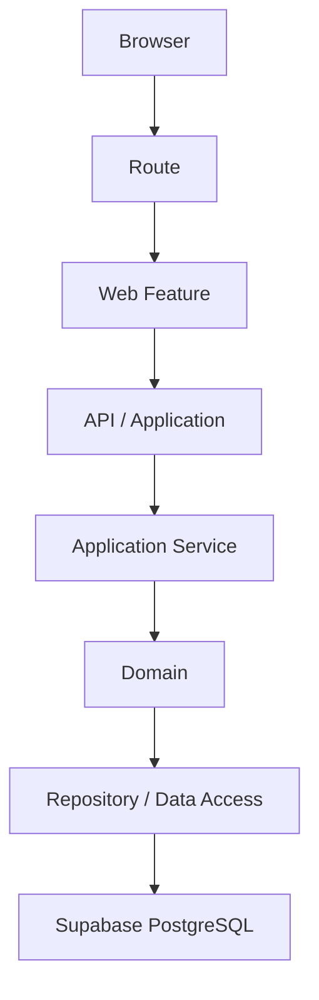

Alur MCP:

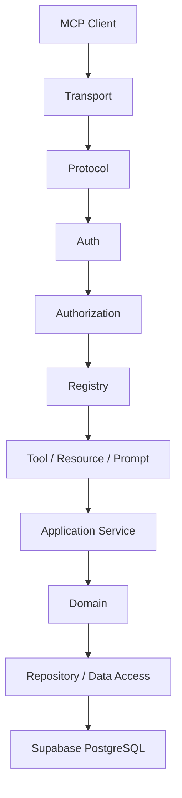

Database **HARUS** hanya diakses melalui data boundary server-side.

## Aturan

- **WAJIB** menempatkan akses database pada boundary infrastructure atau data.
- **WAJIB** menggunakan Supabase untuk data production persistent.
- **DILARANG** membuat frontend melakukan akses DB privileged.
- **DILARANG** membuat protocol MCP melakukan raw DB query sebagai perilaku default.
- **WAJIB** menggunakan abstraction repository atau data access jika domain/application membutuhkan portability atau isolasi test.

---

# 10. Schema Database dan Migration

Schema database **HARUS** memiliki versioning.

Migration **HARUS** menjadi satu-satunya mekanisme perubahan schema production setelah database masuk ke lifecycle terkelola.

Migration **HARUS** menangani:

```text
Tables
Columns
Indexes
Constraints
Policies
Functions
Triggers
Seeds where applicable
```

Checklist migration aman minimum:

| Tahap | Bukti Wajib |
|-------|-------------|
| Desain | Dampak backward compatibility dan rencana rollback |
| Development | Migration lolos pada Supabase development dan integration test |
| Review | Policy RLS, constraint, dan index direview |
| Deploy | Urutan deploy kode dan migration aman untuk traffic berjalan |
| Verifikasi | Health check database dan audit migration tercatat |
| Rollback | Skrip atau rencana pemulihan teruji |

## Aturan

- **WAJIB** melakukan versioning migration.
- **WAJIB** menguji migration pada database development sebelum production.
- **WAJIB** mempertimbangkan kompatibilitas mundur pada deployment yang membutuhkannya.
- **DILARANG** mengubah schema production secara manual sebagai workflow normal.
- **DILARANG** mengandalkan perubahan database dari dashboard saja tanpa catatan migration.
- **WAJIB** menjaga seed data development terpisah dari data production.

---

# 11. Keamanan Database dan RLS

Supabase PostgreSQL **HARUS** diperlakukan sebagai security boundary.

Jika data diakses melalui Supabase client atau Data API, Row Level Security **HARUS** diterapkan sesuai kepemilikan data dan access policy. Supabase mendukung akses melalui Data API dan client library dengan RLS sebagai mekanisme enforcement.

Operasi backend privileged **HARUS** menggunakan context server-side tepercaya.

Pola RLS minimum:

| Pola | Kapan Digunakan | Bukti |
|------|-----------------|-------|
| Ownership per user | Data milik pengguna spesifik | Policy owner dan negative test akses silang |
| Peran administratif | Operasi bootstrap dan maintenance | Policy peran dan audit |
| Read-only public | Katalog publik tanpa data sensitif | Policy baca dan redaction test |
| Deny by default | Seluruh tabel sensitif | Test akses tanpa policy ditolak |

Pemisahan credential minimum: public atau publishable key hanya untuk path yang dilindungi RLS, secret key hanya pada server-side boundary yang terotorisasi.

## Aturan

- **WAJIB** menentukan kepemilikan data.
- **WAJIB** menerapkan RLS atau enforcement setara pada data yang dapat diakses melalui public atau client data path.
- **DILARANG** mengekspos credential Supabase privileged ke browser.
- **WAJIB** memisahkan credential public atau publishable dari credential secret.
- **WAJIB** melakukan otorisasi pada application boundary walaupun policy database juga tersedia.

---

# 12. Flow Keputusan Autentikasi dan Account Default

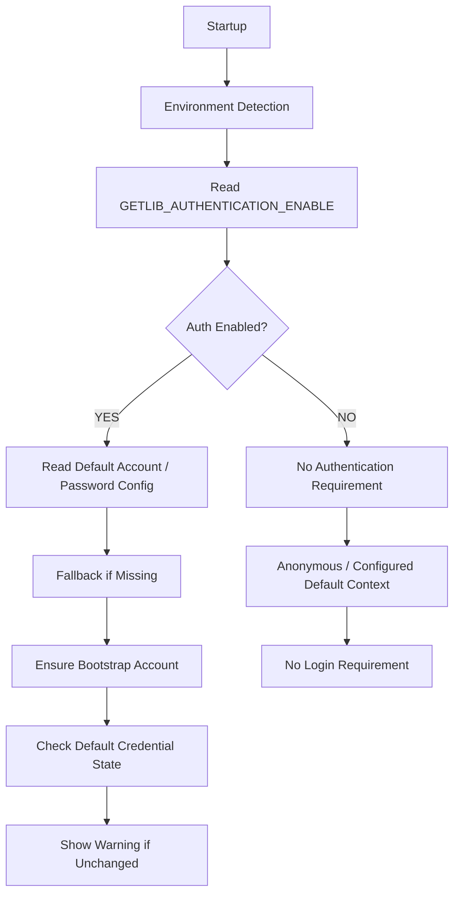

Autentikasi yang dinonaktifkan tidak menghapus halaman settings user.

Settings user tetap dapat mengatur:

```text
Authentication Enable State
Default Account
Default Password
Display Name
```

Namun semantiknya berubah berdasarkan mode autentikasi.

## Aturan

- **WAJIB** mempertahankan visibilitas configuration meskipun autentikasi dinonaktifkan.
- **WAJIB** menjelaskan mode autentikasi saat ini kepada user.
- **DILARANG** meminta login account ketika autentikasi dinonaktifkan.
- **DILARANG** menganggap account default aktif sebagai identity keamanan terautentikasi ketika autentikasi dinonaktifkan tanpa policy eksplisit.

---

# 13. Flow Aplikasi Tanpa Autentikasi

Ketika autentikasi dinonaktifkan:

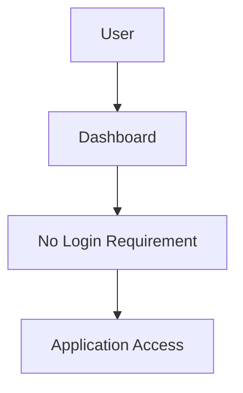

Profile menu tetap tersedia dan dapat menampilkan:

```text
Current Display Name
Authentication: Disabled
Development
Preferences
Application Settings
```

Settings account atau password default tetap dapat ditampilkan pada interface configuration administratif jika memang diperlukan oleh application contract, tetapi nilai secret tetap **DILARANG** ditampilkan kembali setelah disimpan.

## Aturan

- **WAJIB** membuat mode tanpa autentikasi benar-benar tidak membutuhkan login.
- **WAJIB** menjaga admin configuration boundary tetap terlindungi ketika operasinya sensitif.
- **DILARANG** mengartikan autentikasi nonaktif sebagai tanpa keamanan.
- **WAJIB** menjaga rate limiting, validation, SSRF protection, dan keamanan transport tetap aktif.

---

# 14. Identity User dan Display Name

Dashboard **HARUS** memiliki display identity terlepas dari mode autentikasi.

Dengan autentikasi aktif:

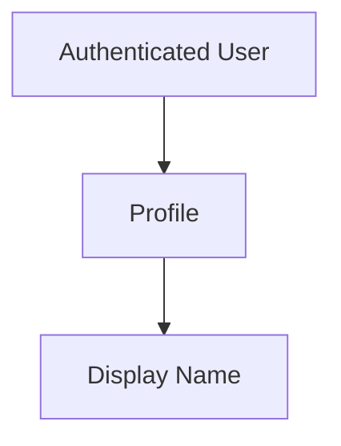

Tanpa autentikasi:

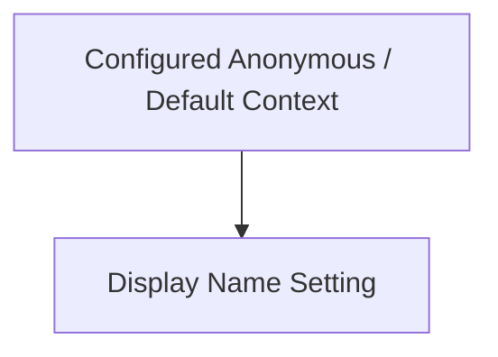

Profile avatar **HARUS** menampilkan identity yang sesuai dengan current context.

## Aturan

- **WAJIB** menyediakan display name semantics.
- **WAJIB** memisahkan display identity dari security identity.
- **DILARANG** menggunakan display name sebagai authorization identity.
- **WAJIB** mengaudit sensitive changes menggunakan real security identity jika authentication tersedia.

---

# 15. Interaksi Profile dan Avatar

Kontrol profile/avatar menjadi access point untuk settings account dan aplikasi sekunder.

Interaksi konseptual:

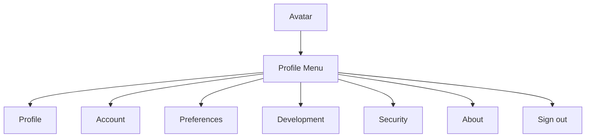

`Sign out` hanya ditampilkan ketika authentication enabled dan session tersedia.

## Aturan

- **WAJIB** menyesuaikan menu terhadap auth mode.
- **WAJIB** menyembunyikan Sign out ketika tidak ada session yang dapat di-terminate.
- **WAJIB** menjaga sensitive actions tetap protected.

---

# 16. Persistensi Menyeluruh di Database

Seluruh state aplikasi **WAJIB** dipersistensi pada database, termasuk configuration, settings, fitur, metadata, dan state operasional lain atau semacamnya.

Browser, process memory, dan local filesystem hanya boleh menjadi cache atau state transient. Ketiganya **DILARANG** menjadi sumber kebenaran.

## Aturan

- **WAJIB** mempersistensi configuration aplikasi pada database.
- **WAJIB** mempersistensi settings user dan account pada database.
- **WAJIB** mempersistensi state fitur dan metadata operasional pada database.
- **WAJIB** memuat ulang state dari database pada initialization, bukan merekonstruksi dari default.
- **DILARANG** menyimpan state authoritative hanya pada browser.
- **DILARANG** menyimpan state authoritative hanya pada process memory.
- **DILARANG** menyimpan state authoritative pada local filesystem sebagai pengganti database.
- **WAJIB** menjaga konsistensi antara cache lokal dan database melalui invalidation yang eksplisit.

---

