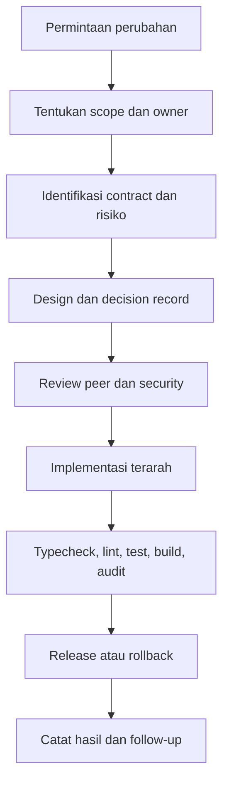
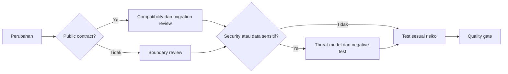

# Governance Engineering dan Quality

## Cara Menggunakan Modul Ini

Baca `blueprint.md` terlebih dahulu. Modul ini adalah pendalaman governance untuk ownership, decision record, review, change management, compatibility, validasi, release, dan definition of done. Gunakan setiap kali mengubah rule, contract, atau proses engineering. Penomoran bagian pada file ini bersifat lokal dan berurutan mulai dari 1.

## Konvensi Normatif

- **WAJIB** berarti persyaratan governance yang **HARUS** dipenuhi sebelum perubahan dianggap selesai.
- **DILARANG** berarti pola proses yang tidak boleh digunakan, termasuk menutup sinyal kegagalan validasi.
- Setiap perubahan **HARUS** memiliki owner, alasan, boundary, risiko, contract, bukti, dan jalur pemulihan.
- Prioritas keputusan mengikuti blueprint: security, integritas data, compatibility, boundary, reliability, testability, lalu presentasi.

## Standar Bukti Implementasi

Perubahan governance minimal **HARUS** menunjukkan scope dan owner, decision record dengan opsi yang ditolak, analisis compatibility dan migration, rencana rollback, serta bukti validasi sesuai risiko.

## 1. Tujuan dan Kewenangan

Aturan ini memastikan setiap perubahan memiliki owner, alasan, boundary, risiko, contract, bukti, dan jalur pemulihan. `blueprint.md` adalah master index. Modul fokus menjadi sumber normatif untuk domainnya. Konflik diselesaikan sesuai prioritas security, integritas data, compatibility, boundary, reliability, testability, lalu presentasi.

## 2. Siklus Perubahan

Setiap decision record **WAJIB** menyebut masalah, opsi, opsi yang ditolak, dampak, compatibility, migration, rollback, dan bukti validasi. **DILARANG** mengubah contract public, route, schema, environment variable, protocol status, atau identifier resmi secara diam-diam.

Template decision record minimum:

| Field | Isi Wajib |
|-------|-----------|
| Masalah | Pernyataan masalah dan batas scope |
| Opsi | Minimal dua opsi yang dipertimbangkan |
| Opsi ditolak | Alasan penolakan tiap opsi |
| Dampak | Boundary, contract, migration, dan risiko |
| Rollback | Langkah pemulihan dan kriteria pemicu |
| Bukti | Typecheck, test, review, dan scan yang relevan |

## 3. Ownership dan Review

- **WAJIB** menentukan owner semantic untuk file, module, route, capability, schema, migration, dan telemetry.
- **WAJIB** meminta review lintas boundary ketika perubahan menyentuh database, authentication, public API, MCP, security, atau deployment.
- **DILARANG** menjadikan shared module, dashboard, frontend, atau registry UI sebagai sumber kebenaran tanpa contract backend.
- **WAJIB** menjaga perubahan kecil, reversible, dan dapat diuji.
- **DILARANG** menutup test, lint, typecheck, atau build untuk menghilangkan sinyal kegagalan.

## 4. Quality Gate

Bukti minimum ditentukan oleh risiko. Perubahan kode **WAJIB** mempertimbangkan typecheck, lint, unit test, integration test, E2E apabila relevan, production build, architecture validation, migration validation, protocol validation, security validation, observability review, dan no-em-dash scan. Status build yang hijau semata bukan bukti selesai.

## 5. Compatibility dan Release

Identifikasi API endpoints, MCP tool names, MCP tool schemas, MCP resource URIs, MCP prompt identifiers, configuration contracts, dan database contracts yang terekspos. Breaking change **WAJIB** disengaja, memiliki deprecation atau migration path, compatibility test, release note, dan rollback. Migration database **WAJIB** backward compatible apabila deployment berjalan bertahap.

Matriks persetujuan minimum:

| Jenis Perubahan | Review Wajib | Bukti Rilis |
|-----------------|--------------|-------------|
| Additive non-breaking | Owner modul | Test dan typecheck |
| Corrective sensitif | Owner modul dan reviewer security atau data | Negative test dan audit |
| Breaking public contract | Owner modul, reviewer lintas boundary, dan catatan migrasi | Compatibility test, release note, dan rollback plan |
| Migration database | Owner data dan reviewer deployment | Migration test pada development dan rencana rollback |

## 6. Diagram Keputusan Quality

## 7. Checklist dan Definition of Done

- [ ] Scope, owner, contract, risiko, dan rollback tercatat.
- [ ] Boundary, dependency direction, dan public compatibility direview.
- [ ] Test dipilih berdasarkan behavior dan risiko, bukan sekadar coverage.
- [ ] Security, privacy, migration, observability, dan documentation diperiksa.
- [ ] Typecheck, lint, test, build, serta scan yang relevan lulus.
- [ ] Tidak ada identifier, route, schema, atau environment variable resmi yang berubah tanpa keputusan migrasi.

Perubahan selesai bila acceptance criteria terpenuhi, bukti validasi tersedia, review owner selesai, failure mode dipahami, rollback dapat dilakukan, dan blueprint atau rule terkait sudah diperbarui bila ownership atau proses berubah.

---

