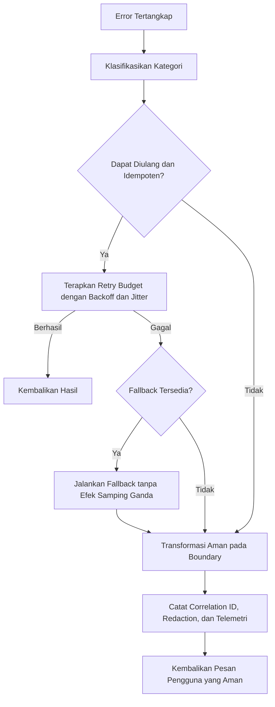

# Error Handling dan Recovery

## Cara Menggunakan Modul Ini

Baca `blueprint.md` terlebih dahulu, lalu gunakan modul ini sebagai pendalaman otoritatif untuk kategorisasi error, retry, fallback, recovery, dan user messaging. Terapkan bersama `api-observability-and-testing.md` bagian 4 untuk kontrak error operasional, serta modul runtime dan database untuk retry dan recovery yang spesifik. Penomoran bagian pada file ini bersifat lokal dan berurutan mulai dari 1. Kategori error di sini sama dengan kategori pada modul API dan bersifat kumulatif.

## Konvensi Normatif

- **WAJIB** berarti persyaratan error handling yang **HARUS** dipenuhi sebelum perubahan dianggap selesai.
- **DILARANG** berarti pola yang tidak boleh digunakan, termasuk menelan error atau membocorkan detail internal.
- Setiap error **HARUS** memiliki kategori, retryability, correlation context, dan transformasi yang aman pada boundary.
- Pesan kepada pengguna **WAJIB** jelas dan dapat ditindaklanjuti tanpa membocorkan secret, stack trace, atau data pengguna lain.

## Standar Bukti Implementasi

Perubahan error handling minimal **HARUS** menunjukkan kategori, status dan mapping protocol, retry policy dan fallback, correlation ID, redaction, recovery path yang diuji, dan user messaging yang aman.

## 1. Tujuan

Modul ini menetapkan cara menangani error secara konsisten, aman, dan dapat dipulihkan. Error **HARUS** dikategorikan, dipetakan ke response yang tepat, dan dicatat untuk observability.

## 2. Kategori Error

```text
Validation Error
Authentication Error
Authorization Error
Domain Error
Not Found Error
Conflict Error
Rate Limit Error
External Provider Error
Database Error
Infrastructure Error
Unexpected Error
```

Taksonomi operasional:

| Kategori | Dapat Diulang | Pemetaan HTTP Umum | Pesan Pengguna |
|----------|---------------|--------------------|----------------|
| Validation Error | Tidak, kecuali input diperbaiki | 400 atau 422 | Jelaskan field, batas, dan format yang benar |
| Authentication Error | Tidak | 401 | Minta autentikasi ulang tanpa membocorkan detail credential |
| Authorization Error | Tidak | 403 | Nyatakan akses ditolak dan sertakan correlation ID |
| Domain Error | Tidak | 422 | Jelaskan aturan bisnis yang dilanggar |
| Not Found Error | Tidak | 404 | Nyatakan resource tidak ditemukan |
| Conflict Error | Dapat diulang setelah state berubah | 409 | Jelaskan konflik dan langkah resolusi |
| Rate Limit Error | Dapat diulang setelah backoff | 429 | Sertakan retry-after apabila tersedia |
| External Provider Error | Terbatas, hanya operasi idempoten | 502 atau 504 | Nyatakan dependency bermasalah dan sertakan correlation ID |
| Database Error | Terbatas, hanya operasi aman | 503 atau 500 | Nyatakan kegagalan sementara dan sertakan correlation ID |
| Infrastructure Error | Terbatas sesuai retry budget | 503 atau 500 | Nyatakan gangguan dan sertakan correlation ID |
| Unexpected Error | Tidak | 500 | Pesan generik dan correlation ID, tanpa detail internal |



## 3. Prinsip

- **WAJIB** menggunakan model error yang konsisten.
- **WAJIB** membedakan error yang dapat diulang dan tidak.
- **WAJIB** mempertahankan correlation ID.
- **DILARANG** mengirim stack trace ke client tidak tepercaya.
- **DILARANG** menelan error tanpa alasan.
- **WAJIB** melakukan transformasi error yang aman pada boundary API dan MCP.

## 4. Retry dan Fallback

- **WAJIB** menetapkan kebijakan retry hanya untuk operasi idempoten.
- **WAJIB** menggunakan exponential backoff dan jitter.
- **WAJIB** membatasi jumlah retry.
- **WAJIB** menyediakan fallback jika tersedia.
- **DILARANG** melakukan retry tanpa batas.

Budget retry minimum:

| Parameter | Aturan | Alasan |
|-----------|--------|--------|
| Maksimum percobaan | Tetapkan eksplisit, contoh 3 kali termasuk percobaan awal | Mencegah beban berlebih pada dependency |
| Backoff | Exponential dengan jitter | Menghindari thundering herd |
| Timeout per percobaan | Tetapkan eksplisit | Mencegah request menggantung |
| Idempotency | Hanya operasi idempoten yang boleh diulang | Mencegah efek samping ganda |
| Fallback | **WAJIB** dievaluasi sebelum retry pada path kritis | Menjaga ketersediaan tanpa duplikasi side effect |

## 5. Recovery

- **WAJIB** memiliki jalur pemulihan untuk error kritis.
- **WAJIB** mencatat error dan recovery ke observability.
- **WAJIB** memastikan recovery tidak menyebabkan duplikasi side effect.
- **WAJIB** menguji skenario recovery.

## 6. User Messaging

- **WAJIB** memberikan pesan error yang jelas, dapat ditindaklanjuti, dan tidak membocorkan informasi sensitif.
- **WAJIB** menyertakan correlation ID untuk keperluan dukungan.
- **DILARANG** menampilkan detail internal atau stack trace kepada pengguna.

## 7. Checklist

- [ ] Kategori error terdefinisi.
- [ ] Retry policy dan fallback ditetapkan.
- [ ] Correlation ID digunakan.
- [ ] Redaction pada error message.
- [ ] Recovery path diuji.
- [ ] User messaging aman dan jelas.

## 8. Definition of Done

Error handling selesai bila setiap error memiliki kategori, response yang tepat, observability, retry policy, fallback, dan user messaging yang aman.