# Flow dan Runtime

Modul ini menetapkan route aplikasi dan product flow, strategi environment, lifecycle runtime, perilaku Vercel, configuration, initialization dan shutdown, request flow, maintenance, refactoring, repository inspection, performance, lifecycle resource, background work, dan compatibility.

## Cara Menggunakan Modul Ini

Gunakan modul ini ketika perubahan memengaruhi URL, navigasi, pemrosesan request, startup, shutdown, deteksi environment, database mode, kepemilikan resource, background work, performance, atau public compatibility. Baca `blueprint.md` terlebih dahulu dan kombinasikan aturan ini dengan modul layer, database, API, dan MCP. Penomoran bagian pada file ini bersifat lokal dan berurutan mulai dari 1.

Setiap flow **HARUS** dapat dijelaskan sebagai urutan input, boundary, keputusan, side effect, output, dan cleanup. Jika sebuah flow berjalan asynchronous, catat owner, retry, cancellation, idempotency, timeout, dan observability-nya.

## Konvensi Normatif

- **WAJIB** memiliki semantic ownership yang jelas untuk setiap route dan flow.
- **HARUS** membedakan state durable, state process, state session, dan state UI.
- **DILARANG** menggunakan workaround di interface untuk menutupi defect pada application, domain, infrastructure, atau database.
- Production **WAJIB** memakai policy yang deterministik dan **DILARANG** bergantung pada pemilihan manual oleh pengguna pada saat startup normal.
- Semua resource **HARUS** memiliki owner, cleanup path, dan perilaku pada success, failure, cancellation, serta shutdown.

## Standar Bukti Implementasi

Perubahan flow atau runtime **HARUS** menyertakan:

1. Diagram Mermaid untuk hubungan atau lifecycle yang berubah.
2. Daftar route, input, output, authorization, error, dan side effect.
3. Bukti bahwa initialization dan shutdown tetap terurut.
4. Bukti bahwa timeout, retry, cancellation, concurrency, dan cleanup memiliki batas yang dapat diuji.
5. Pemeriksaan backward compatibility untuk public endpoint dan contract.

---

# 1. Root Application dan Dashboard

Root route:

```text
/
```

HARUS menjadi Dashboard Overview.

Root dashboard **HARUS** menjadi operational entry point application.

Dashboard **HARUS** memberikan gambaran kondisi system secara keseluruhan.

Area konseptual:

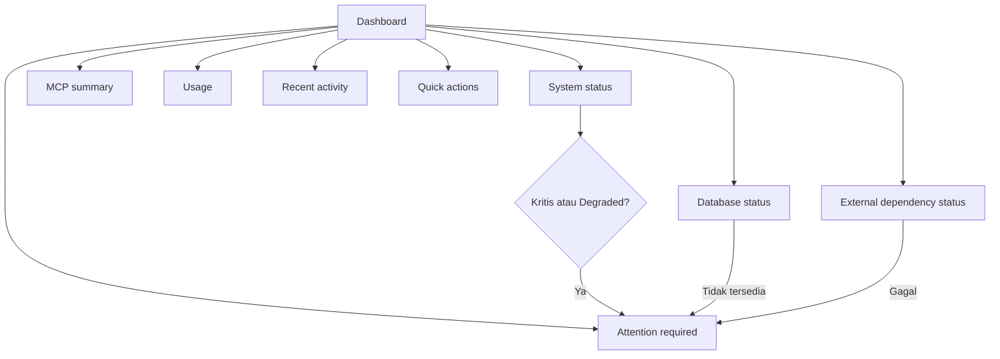

Kriteria tampilan minimum:

| Kondisi | Tampilan Wajib | Bukti |
|---------|----------------|-------|
| Normal | Status sistem, database, dan MCP terkini | Telemetri server-side |
| Degraded | Indikator penyebab dan dampak | Health check dan log |
| Data kosong | Empty state dengan tindakan berikutnya | Review state kosong |
| Error | Pesan aman dengan correlation ID | Negative test |

Status sistem dapat mencakup:

```text
MCP runtime
API
Supabase database
Cache
Sumber eksternal
Autentikasi
```

MCP summary dapat mencakup:

```text
Registered servers
Registered tools
Registered resources
Registered prompts
Connected clients
```

Penggunaan dapat mencakup:

```text
Request
Rasio keberhasilan
Rasio error
Latency
Database operations
Cache behavior
```

Root dashboard **WAJIB** menjawab:

> "Apa kondisi sistem saya sekarang?"

Root dashboard **WAJIB** menyajikan ringkasan operasional, bukan sekadar halaman sambutan berhiaskan kartu dan chart.

## Aturan

- **WAJIB** menggunakan `/` sebagai operational dashboard.
- **WAJIB** menampilkan system status yang relevan.
- **WAJIB** menampilkan database status ketika database-backed capability digunakan.
- **WAJIB** menampilkan critical warnings yang membutuhkan tindakan.
- **DILARANG** membuat root dashboard menjadi sekadar welcome page.
- **DILARANG** membuat duplicate dashboard route tanpa semantic purpose.
- **DILARANG** mengambil data dashboard langsung dari database client pada UI.

---

# 2. Route Utama Aplikasi

Primary routes **HARUS** memiliki semantic responsibility yang jelas.

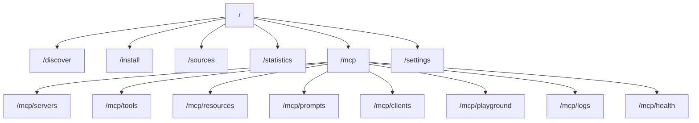

Semantik yang direkomendasikan:

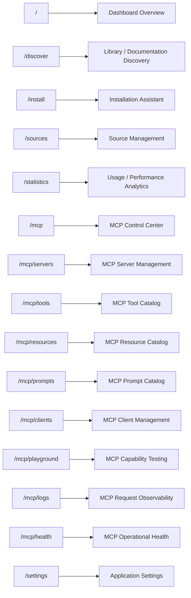

Route autentikasi:

```text
/signin
```

Route autentikasi tambahan dapat dibuat apabila fungsionalitas tersebut terbukti diperlukan.

## Aturan

- **WAJIB** memberi semantic meaning pada setiap route.
- **WAJIB** menghindari duplicate route.
- **WAJIB** memisahkan browser route dari protocol endpoint.
- **DILARANG** membuat route hanya karena sebuah component membutuhkan URL.
- **WAJIB** menggunakan canonical route definitions pada navigation dan links.

---

# 3. Discovery

Route:

```text
/discover
```

HARUS menjadi user-facing discovery interface.

Discovery dapat mencakup:

```text
Search
Filters
Library catalog
Version
Source
Framework
Language
Popularity
Availability
```

Discovery berfungsi menemukan candidate data.

Discovery tidak bertanggung jawab terhadap installation.

Alur:

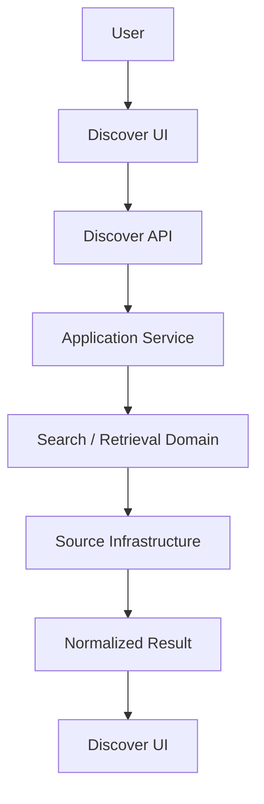

## Aturan

- **WAJIB** memisahkan search behavior dari presentation.
- **WAJIB** menggunakan application capability untuk search.
- **DILARANG** menempatkan ranking atau provider routing pada React component.
- **DILARANG** melakukan direct external fetch dari discovery UI.
- **WAJIB** melakukan result normalization sebelum hasil dikonsumsi frontend.

---

# 4. Instalasi

Route:

```text
/install
```

HARUS menangani installation dan setup workflow.

Installation dapat menghasilkan:

```text
Install instructions
MCP configuration
Client configuration
CLI commands
Framework-specific setup
```

Client target dapat mencakup:

```text
Claude Code
Cursor
VS Code
OpenCode
Codex
Custom MCP clients
```

Discovery dan installation **HARUS** tetap berbeda.

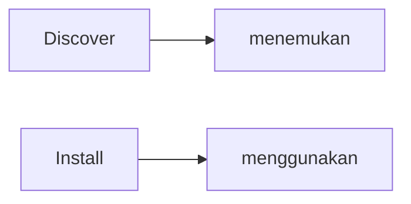

## Aturan

- **WAJIB** memisahkan discovery lifecycle dan installation lifecycle.
- **WAJIB** menggunakan canonical source metadata.
- **WAJIB** menggunakan typed configuration contract.
- **DILARANG** menduplikasi source metadata hanya untuk installation UI.
- **DILARANG** hardcode client-specific behavior pada page component.

---

# 5. Sumber Data

Route:

```text
/sources
```

HARUS menjadi Source Management interface.

Source management mencakup:

```text
Active sources
Disabled sources
Source health
Source priority
Source type
Last sync
Add source
Edit source
Test source
```

Source merupakan data acquisition layer.

Source bukan MCP primitive.

Alur:

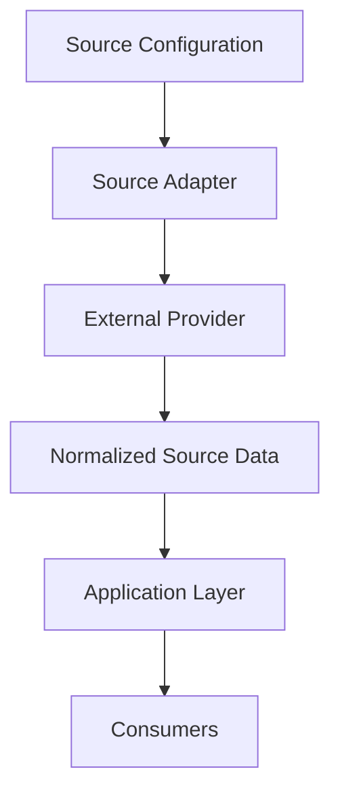

## Aturan

- **WAJIB** mengisolasi provider-specific behavior.
- **WAJIB** mempunyai explicit source identity.
- **WAJIB** mempunyai source health state.
- **WAJIB** memiliki source priority policy jika routing memerlukannya.
- **WAJIB** menyimpan source configuration pada backend ketika configuration tersebut bersifat authoritative.
- **DILARANG** menempatkan provider-specific implementation pada MCP tool.
- **DILARANG** menganggap source sebagai MCP primitive secara otomatis.
- **WAJIB** menganggap external source content sebagai untrusted input.

---

# 6. Statistik

Route:

```text
/statistics
```

HARUS menjadi analytics dan observability presentation layer.

Statistics dapat mencakup:

```text
Volume request
Tool usage
Search usage
Resolve usage
Fetch usage
Volume query database
Cache hit rate
Cache miss rate
Average latency
P95 latency
P99 latency
Rasio error
Source popularity
Library popularity
```

Logical sections:

```text
Overview
Request
Tools
Sources
Database
Performa
Error
```

Statistics **HARUS** menggunakan server-side authoritative telemetry.

## Aturan

- **WAJIB** menggunakan centralized telemetry.
- **WAJIB** membedakan usage analytics dari operational health.
- **WAJIB** menggunakan consistent metric definitions.
- **DILARANG** membuat setiap feature menghitung metric yang sama secara berbeda.
- **DILARANG** menjadikan chart component sebagai metric calculation layer.

---

# 7. Model Environment

Application **HARUS** membedakan runtime environment secara otomatis.

Minimal environment:

```text
Development
Production
```

Environment detection **HARUS** berasal dari runtime/deployment metadata dan **DILARANG** mengandalkan user untuk memilih environment secara manual pada setiap startup.

Model konseptual:

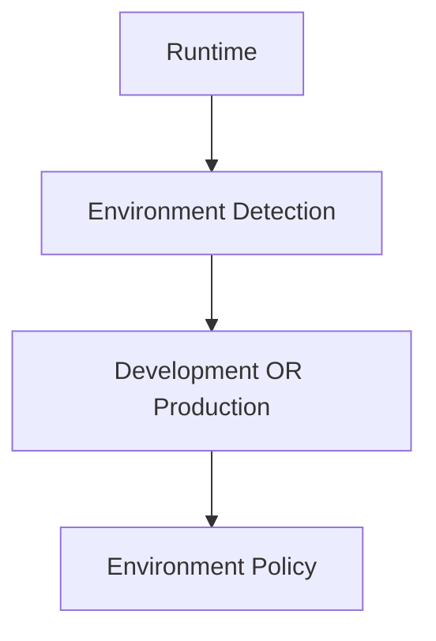

Policy development dapat menggunakan:

```text
Mock Database
```

atau:

```text
Real Development Supabase Database
```

Policy production **HARUS** selalu menggunakan:

```text
Real Supabase Database
```

## Aturan

- **WAJIB** mendeteksi development dan production secara otomatis.
- **DILARANG** meminta user memilih environment secara manual untuk runtime normal.
- **WAJIB** menggunakan environment-aware configuration.
- **WAJIB** membuat production path tidak pernah jatuh ke mock database.
- **DILARANG** menggunakan mock data pada production.
- **WAJIB** memvalidasi environment policy saat startup.

---

# 8. Strategi Database Development

Development **HARUS** menyediakan dua mode database:

```text
Mock
Real Development Database
```

Mock mode digunakan untuk development cepat, pekerjaan UI, development offline, dan testing yang tidak membutuhkan persistent external state.

Real development database digunakan ketika development membutuhkan:

```text
Real persistence
Real schema
Real queries
Integrasi autentikasi
Migrations
RLS behavior
Integration testing
```

Real development database **HARUS** merupakan environment Supabase development yang terpisah dari production data.

## Development Settings

Kontrol development **HARUS** tersedia pada halaman settings yang terkait development.

Contoh:

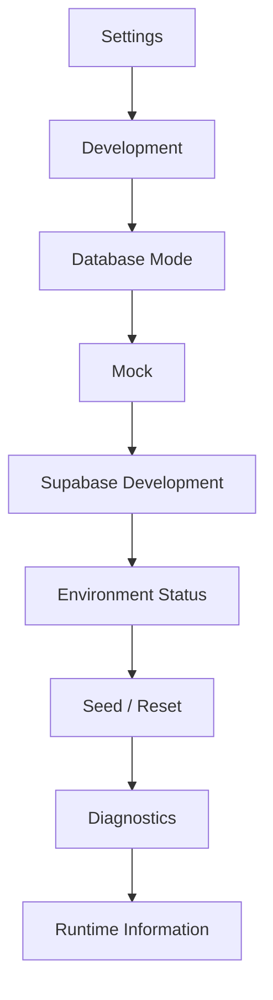

Halaman development **HARUS** menampilkan mode yang aktif.

## Aturan

- **WAJIB** menyediakan Mock dan Real Development Database mode.
- **WAJIB** memisahkan development Supabase project dari production database.
- **WAJIB** menampilkan active database mode secara jelas.
- **WAJIB** mencegah development configuration mengarah accidental ke production database.
- **WAJIB** menyediakan reset/seed behavior hanya untuk development.
- **DILARANG** menyediakan destructive reset controls pada production UI.

---

# 9. Strategi Database Production

Production **HARUS** menggunakan Supabase PostgreSQL nyata.

Database production **HARUS** menjadi sumber kebenaran persistent yang authoritative.

Production database **HARUS** digunakan untuk:

```text
Users
State aplikasi terkait autentikasi
Application configuration
MCP metadata
Source configuration
Logs / durable observability data when persistence is required
Statistics / aggregated metrics when persistence is required
```

Akses database **HARUS** melalui boundary server-side.

Untuk serverless runtime, database connection strategy **HARUS** memperhitungkan short-lived execution dan connection pooling. Supabase menyediakan Supavisor, termasuk transaction pooling untuk serverless atau edge workloads.

## Aturan

- **WAJIB** menggunakan Supabase PostgreSQL untuk production persistence.
- **DILARANG** menggunakan mock database pada production.
- **DILARANG** menggunakan local filesystem sebagai production database.
- **WAJIB** menggunakan connection strategy yang sesuai dengan serverless runtime.
- **WAJIB** menjaga database credentials server-side.
- **WAJIB** menerapkan migration strategy.
- **WAJIB** memisahkan development dan production database.

---

# 10. Arsitektur Deployment Vercel

Application **HARUS** dirancang untuk deployment Vercel native.

Deployment model **HARUS** mempertimbangkan bahwa serverless execution bersifat stateless dan runtime instance dapat dibuat, dibekukan, atau dihentikan.

Deployment konseptual:

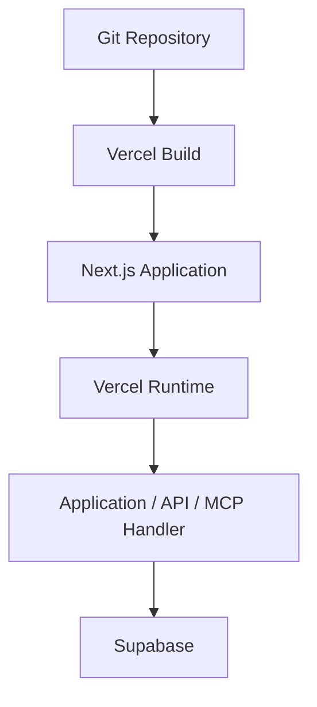

Vercel dan Supabase dapat diintegrasikan melalui Vercel Marketplace; integrasi tersebut dapat menyinkronkan environment variables ke project yang terhubung.

Application **HARUS** tetap memiliki typed environment validation walaupun variable dapat disinkronkan secara otomatis.

## Aturan

- **WAJIB** mendukung deployment langsung pada Vercel.
- **WAJIB** tidak bergantung pada persistent local process state.
- **WAJIB** tidak mengandalkan local filesystem sebagai durable production storage.
- **WAJIB** menyimpan persistent state pada Supabase atau external durable service.
- **WAJIB** menangani serverless lifecycle.
- **WAJIB** menggunakan environment-specific Vercel configuration.
- **DILARANG** menganggap satu runtime instance selalu hidup.
- **DILARANG** menyimpan state penting hanya pada process memory.

---

# 11. Arsitektur Environment Variable

Environment variable **HARUS** diakses melalui centralized typed configuration layer.

Application **DILARANG** melakukan arbitrary environment access dari seluruh codebase.

Minimum configuration **HARUS** mencakup:

```text
GETLIB_AUTHENTICATICATION_ENABLE
GETLIB_DEFAULT_ACCOUNT
GETLIB_DEFAULT_PASS
```

Spelling variable **HARUS** dipertahankan persis sesuai contract application.

Additional variables dapat mencakup Supabase URL, publishable key, secret key, database connection configuration, runtime flags, dan provider credentials.

## Aturan

- **WAJIB** memusatkan environment parsing.
- **WAJIB** memvalidasi environment variables saat startup.
- **DILARANG** melakukan arbitrary direct environment access dari feature code.
- **WAJIB** membedakan public dan server-only variables.
- **DILARANG** mengekspos server secrets ke browser.
- **WAJIB** memiliki explicit default behavior untuk configuration yang memang mempunyai safe default.
- **WAJIB** menggunakan fail-fast behavior untuk required production secrets kecuali variable tersebut memang memiliki defined fallback contract.

---

# 12. Boundary Management API

Management API **HARUS** digunakan oleh dashboard untuk configuration dan operational management.

Struktur konseptual:

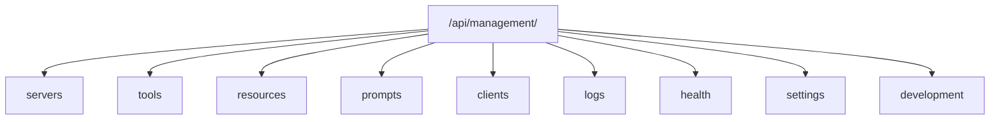

Management API **HARUS** menggunakan application services.

## Aturan

- **WAJIB** memisahkan management API dari MCP protocol endpoint.
- **WAJIB** melakukan authentication dan authorization pada protected management endpoints.
- **WAJIB** menggunakan application service.
- **DILARANG** menempatkan business logic kompleks pada route handler.
- **DILARANG** membiarkan browser langsung mengakses Supabase privileged database credentials.

---

# 13. Flow Kegagalan dan Recovery Database

Database failure **HARUS** menghasilkan deterministic application behavior.

Flow:

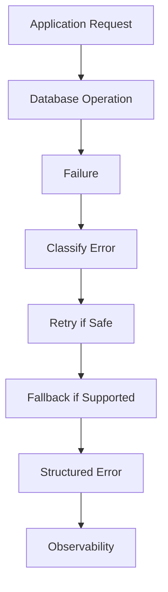

Database timeout **HARUS** dapat dibedakan dari authentication failure dan business validation failure.

## Aturan

- **WAJIB** memiliki timeout policy.
- **WAJIB** melakukan bounded retry hanya jika operation aman.
- **WAJIB** mencatat database failure melalui observability.
- **DILARANG** mengubah database failure menjadi successful response hanya agar UI tidak error.
- **DILARANG** menggunakan stale cache sebagai silent replacement tanpa explicit semantics.

---

# 14. Strategi Koneksi Serverless Supabase dan Vercel

Karena Vercel runtime dapat bersifat transient, strategi koneksi database **WAJIB** mempertimbangkan connection reuse, pooling, timeout, dan cleanup.

Supabase mendokumentasikan transaction-mode pooling sebagai pilihan untuk serverless atau edge functions yang menggunakan banyak koneksi transient.

Supabase juga mendokumentasikan potensi masalah connection timeout jika client-side persistent connections digunakan secara tidak tepat pada serverless functions.

## Aturan

- **WAJIB** memilih connection strategy berdasarkan Vercel runtime characteristics.
- **WAJIB** menghindari persistent local connection assumptions.
- **WAJIB** menggunakan pooling strategy yang sesuai untuk serverless workload.
- **WAJIB** menangani stale connection dan timeout.
- **DILARANG** menganggap process reuse selalu tersedia.
- **WAJIB** melakukan connection cleanup sesuai runtime.

---

# 15. Flow Configuration Environment Vercel

Environment flow:

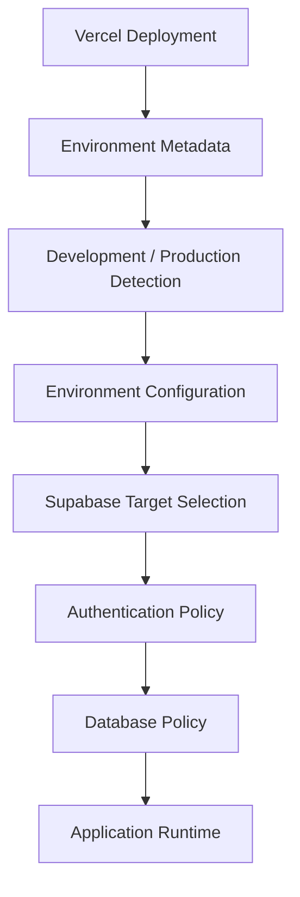

Vercel environment variables dapat disediakan melalui deployment configuration dan Supabase Vercel Marketplace integration dapat menyinkronkan variable yang diperlukan ke project yang terhubung.

Application tetap **HARUS** memvalidasi environment setelah variable tersedia.

## Aturan

- **WAJIB** melakukan runtime environment detection.
- **WAJIB** memetakan production deployment ke production Supabase configuration.
- **WAJIB** memetakan development ke development/mock policy.
- **DILARANG** meminta manual environment selection untuk normal startup.
- **WAJIB** fail clearly jika production configuration tidak valid dan tidak memiliki defined fallback.

---

# 16. UI Configuration dan Environment Otomatis

Pengguna **DILARANG** diminta mengisi environment variable melalui shell untuk setiap perubahan operasional apabila aplikasi menyediakan management UI yang sesuai.

Model konseptual:

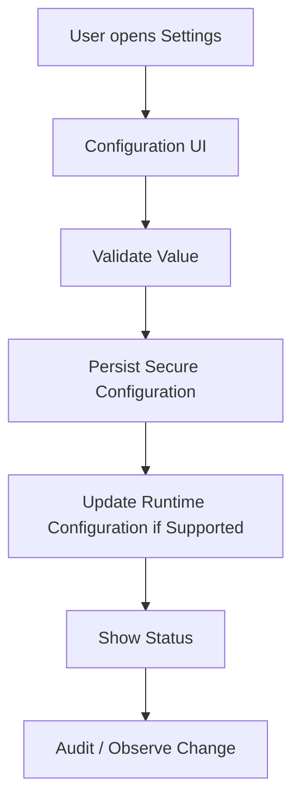

Untuk secret value, UI **HARUS** menggunakan write-only or masked semantics.

Environment variable bootstrap tetap dapat berasal dari deployment platform. UI application settings tidak otomatis sama dengan process environment variable. Jika configuration runtime membutuhkan restart/redeploy, UI **HARUS** menjelaskan status tersebut.

## Aturan

- **WAJIB** menyediakan automatic configuration discovery.
- **WAJIB** memisahkan secret configuration dari normal settings.
- **WAJIB** memvalidasi configuration sebelum persistence.
- **WAJIB** menunjukkan apakah perubahan langsung aktif atau membutuhkan restart/redeploy.
- **DILARANG** menampilkan secret value yang sudah tersimpan.
- **DILARANG** berpura-pura melakukan runtime update jika platform tidak mendukungnya.

---

# 17. Halaman Settings Development

Development settings hanya boleh tersedia ketika runtime benar-benar berada pada development environment.

Bagian yang direkomendasikan:

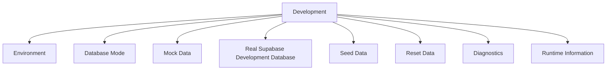

Database mode:

```text
Mock
Supabase Development
```

Production **HARUS** menyembunyikan atau menonaktifkan kontrol development yang destruktif.

## Aturan

- **WAJIB** menampilkan active environment.
- **WAJIB** menampilkan active database mode.
- **WAJIB** memberikan clear indication ketika data adalah mock.
- **WAJIB** memisahkan mock dan real development state.
- **DILARANG** menyediakan reset mock/development database pada production.
- **WAJIB** mencegah accidental production targeting.

---

# 18. Flow Database Mode

Development:

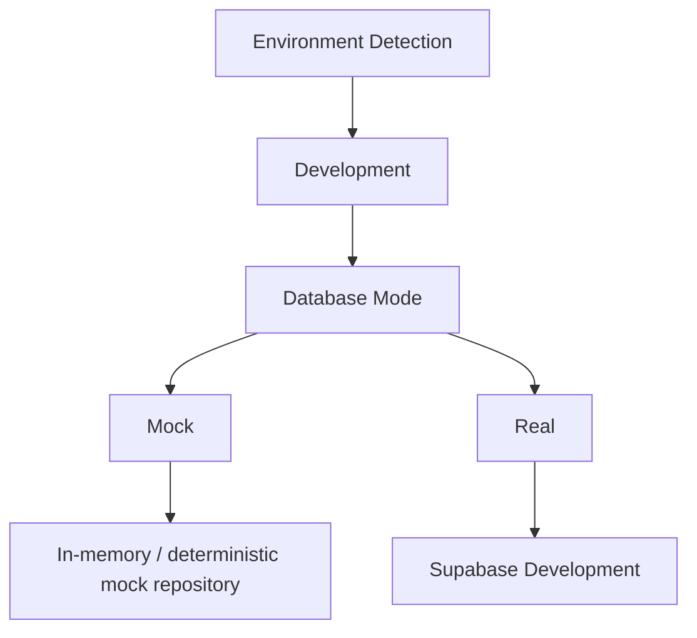

Production:

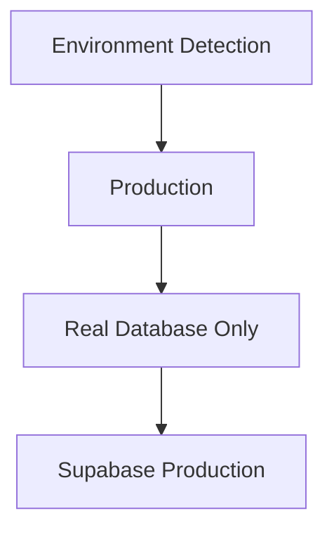

Tidak ada:

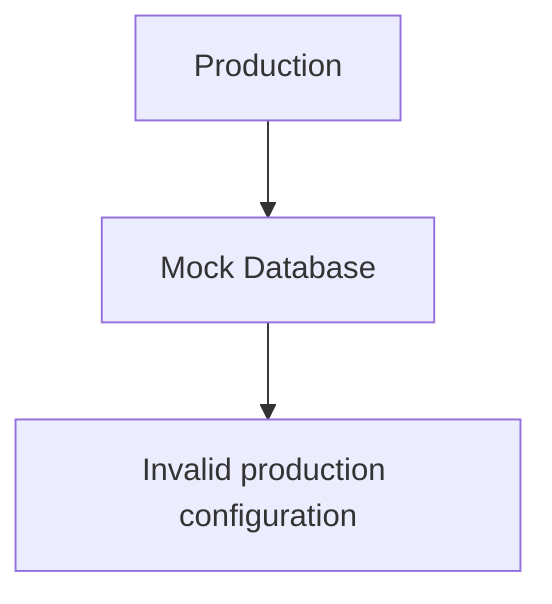

## Aturan

- **WAJIB** membuat production database mode fixed ke real database.
- **DILARANG** memungkinkan production memilih mock database.
- **WAJIB** membuat mock repository mengikuti application contract.
- **WAJIB** menjaga mock implementation tidak bocor ke production.

---

# 19. Flow Request Web Lengkap

Contoh request dashboard yang membutuhkan database:

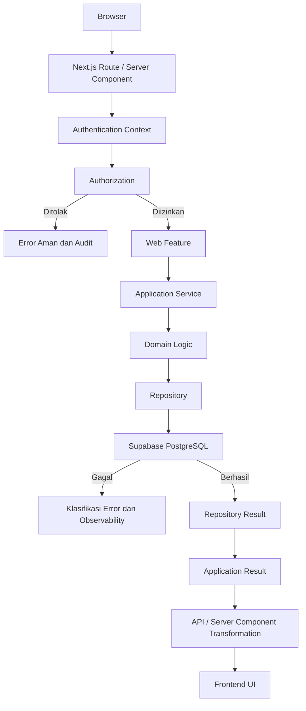

Prakondisi dan pascakondisi:

| Tahap | Prakondisi | Pascakondisi |
|-------|------------|--------------|
| Auth dan otorisasi | Identity tervalidasi dan policy tersedia | Akses diizinkan atau ditolak dengan audit |
| Eksekusi aplikasi | Input tervalidasi dan database mode ditentukan | Hasil ternormalisasi atau error terstruktur |
| Transformasi output | Contract konsumen tersedia | Response tervalidasi dan tersanitasi |

External provider dependency dapat masuk dari infrastructure layer:

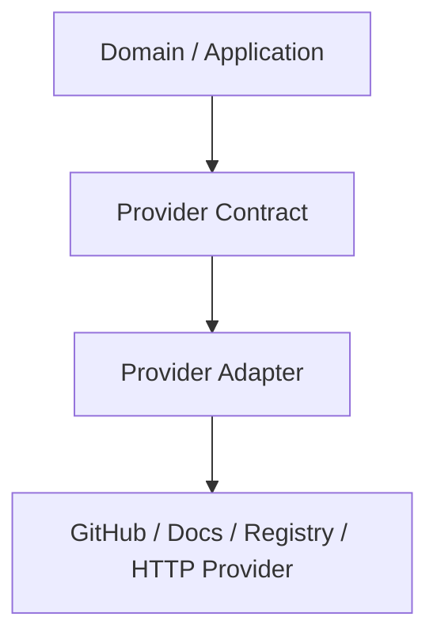

## Aturan

- **WAJIB** menjaga flow tetap explicit.
- **WAJIB** melakukan authorization sebelum protected operation.
- **WAJIB** melakukan transformation pada output boundary.
- **DILARANG** melewati application layer tanpa technical reason yang jelas.

---

# 20. Flow Initialization Aplikasi Lengkap

Alur startup **WAJIB** mengikuti:

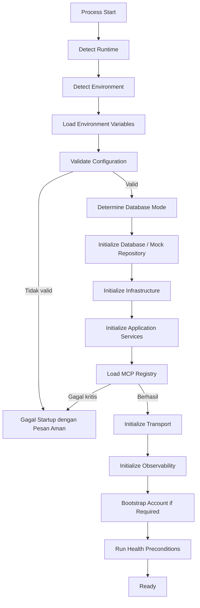

Production **WAJIB** gagal pada saat startup apabila konfigurasi database kritis tidak valid dan tidak terdapat fallback aman yang didefinisikan secara eksplisit.

## Aturan

- **WAJIB** menentukan initialization order.
- **WAJIB** memvalidasi environment sebelum readiness.
- **WAJIB** menentukan database mode sebelum application capability digunakan.
- **WAJIB** menyelesaikan critical registry initialization sebelum serving traffic jika diperlukan.
- **WAJIB** menjalankan bootstrap idempotently.
- **DILARANG** melakukan hidden initialization melalui arbitrary import side effects.

---

# 21. Flow Shutdown Aplikasi Lengkap

```mermaid
flowchart TD
    n0["Shutdown Signal"]
    n1["Stop New Work"]
    n2["Stop Accepting New Connections"]
    n3["Cancel / Drain Active Work"]
    n4["Flush Observability"]
    n5["Close Database / Provider Resources"]
    n6["Close Transport"]
    n7["Process Exit"]
    n0 --> n1
    n1 --> n2
    n2 --> n3
    n3 --> n4
    n4 --> n5
    n5 --> n6
    n6 --> n7
```

## Aturan

- **WAJIB** menyediakan shutdown cleanup.
- **WAJIB** menangani active request lifecycle.
- **WAJIB** memastikan resources ditutup.
- **DILARANG** meninggalkan database, network, stream, atau timer resource secara tidak terkendali.

---

# 22. Flow Maintenance

Maintenance **HARUS** diarahkan berdasarkan root cause.

Bug UI:

```mermaid
flowchart TD
    n0["Bug"]
    n1["Web Feature"]
    n2["Component / Hook"]
    n3["Frontend Test"]
    n0 --> n1
    n1 --> n2
    n2 --> n3
```

Bug perilaku bisnis:

```mermaid
flowchart TD
    n0["Bug"]
    n1["Application / Domain"]
    n2["Unit Test"]
    n3["Integration Test"]
    n0 --> n1
    n1 --> n2
    n2 --> n3
```

Bug protocol MCP:

```mermaid
flowchart TD
    n0["Bug"]
    n1["Transport / Registry / MCP Adapter"]
    n2["Protocol Test"]
    n0 --> n1
    n1 --> n2
```

Bug database:

```mermaid
flowchart TD
    n0["Bug"]
    n1["Repository / Database Infrastructure"]
    n2["Database Test"]
    n3["Integration Test"]
    n0 --> n1
    n1 --> n2
    n2 --> n3
```

Bug provider eksternal:

```mermaid
flowchart TD
    n0["Bug"]
    n1["Provider Adapter"]
    n2["Provider Test"]
    n3["Integration Test"]
    n0 --> n1
    n1 --> n2
    n2 --> n3
```

## Aturan

- **WAJIB** mencari root cause.
- **WAJIB** memperbaiki defect pada layer yang benar.
- **DILARANG** memperbaiki backend defect dengan frontend workaround tanpa alasan.
- **DILARANG** memperbaiki MCP defect dengan duplicate business logic.
- **WAJIB** melakukan regression validation.

---

# 23. Flow Refactoring

Refactoring **HARUS** mengikuti:

```mermaid
flowchart TD
    n0["Inspect"]
    n1["Understand"]
    n2["Identify Ownership"]
    n3["Identify Boundary"]
    n4["Plan Minimal Change"]
    n5["Implement"]
    n6["Validate"]
    n7["Re-audit"]
    n0 --> n1
    n1 --> n2
    n2 --> n3
    n3 --> n4
    n4 --> n5
    n5 --> n6
    n6 --> n7
```

Refactoring **HARUS** meningkatkan:

```text
Boundary clarity
Maintainability
Testability
Correctness
Complexity
Duplication
```

## Aturan

- **WAJIB** memahami existing behavior sebelum refactoring.
- **WAJIB** memahami dependency sebelum relocation.
- **WAJIB** mempertahankan behavior yang valid.
- **DILARANG** melakukan rewrite hanya untuk cosmetic reasons.
- **DILARANG** membuat abstraction tanpa semantic need.
- **WAJIB** menghapus obsolete implementation setelah migration selesai.

---

# 24. Inspeksi Repository

Sebelum perubahan structural, seluruh context yang relevan **HARUS** dipahami.

Inspection mencakup bila relevan:

```text
Source code
Tests
Package manifests
Runtime configuration
Build configuration
Database schema
Migrations
Environment configuration
CI configuration
Documentation
MCP configuration
Deployment configuration
```

## Aturan

- **WAJIB** melakukan repository inspection sebelum significant changes.
- **WAJIB** membaca seluruh file yang relevan terhadap behavior yang diubah.
- **WAJIB** memeriksa tests sebelum mengubah public behavior.
- **WAJIB** memeriksa runtime dan dependency constraints.
- **DILARANG** membuat architectural decision berdasarkan partial inspection ketika file yang belum dibaca dapat mengubah kesimpulan.
- **DILARANG** mengasumsikan API atau dependency tanpa verification.

---

# 25. Performa

Pendalaman otoritatif untuk baseline, target, profiling, caching, concurrency, resource limit, dan skalabilitas ada pada `performance-and-scalability.md`. Bagian ini menetapkan kontrak runtime yang kumulatif dengan modul tersebut.

Performance optimization **HARUS** berdasarkan measurement.

Area yang dapat dioptimalkan:

```text
Database queries
Caching
Concurrency
Batching
Streaming
Provider calls
Serialization
Rendering
```

## Aturan

- **WAJIB** mengukur performance sebelum optimization signifikan.
- **WAJIB** menghindari unnecessary network calls.
- **WAJIB** menghindari unnecessary database queries.
- **WAJIB** membatasi concurrency.
- **WAJIB** membatasi memory growth.
- **DILARANG** melakukan micro-optimization tanpa evidence.
- **DILARANG** mengorbankan correctness demi optimization yang belum dibutuhkan.

---

# 26. Lifecycle Resource

Semua resource **HARUS** memiliki owner dan cleanup path.

Resources mencakup:

```text
Database connections
HTTP connections
SSE connections
Streams
Files
Timers
Background tasks
Temporary resources
```

Cleanup **HARUS** terjadi pada:

```text
Success
Failure
Cancellation
Shutdown
```

## Aturan

- **WAJIB** melakukan cleanup.
- **WAJIB** menangani exception path.
- **WAJIB** menangani cancellation.
- **DILARANG** membuat resource tanpa lifecycle owner.
- **WAJIB** mencegah connection leaks.
- **WAJIB** mencegah memory leaks.

---

# 27. Pekerjaan Latar

Background jobs **HARUS** mempunyai:

```text
Lifecycle
Retry
Cancellation
Concurrency limit
Observability
Cleanup
Idempotency
```

Jobs **DILARANG** bergantung pada process memory sebagai durable state.

## Aturan

- **WAJIB** membatasi concurrency.
- **WAJIB** memiliki retry policy jika diperlukan.
- **WAJIB** memastikan retry tidak membuat duplicate side effects.
- **WAJIB** menyediakan cancellation behavior.
- **WAJIB** melakukan observability.
- **DILARANG** membuat unbounded background execution.

---

# 28. Kompatibilitas Mundur

Public contract dapat berupa:

```text
API endpoints
MCP tool names
MCP tool schemas
MCP resource URIs
MCP prompt identifiers
Configuration contracts
Database contracts where externally consumed
```

Breaking change **HARUS** dilakukan secara intentional.

## Aturan

- **WAJIB** mengidentifikasi public contract sebelum perubahan.
- **WAJIB** mempertimbangkan backward compatibility.
- **WAJIB** menyediakan migration path jika diperlukan.
- **DILARANG** mengubah MCP schema secara diam-diam.
- **DILARANG** menghapus public endpoint tanpa migration atau deprecation strategy yang sesuai.

---

