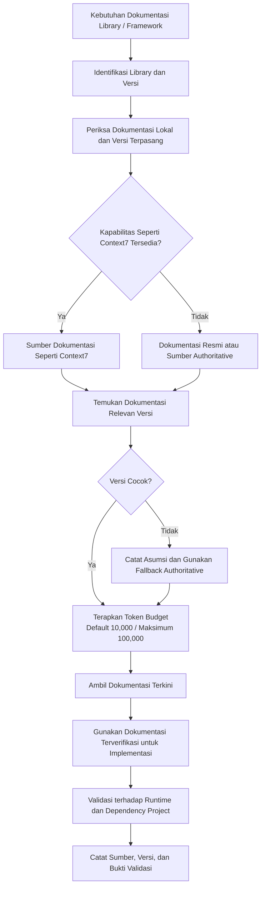

# Dokumentasi Library

Modul ini menetapkan workflow dokumentasi library, penggunaan kapabilitas dokumentasi seperti Context7, kesegaran dokumentasi, cakupan library, kesadaran versi, sumber authoritative sebagai fallback, dan token budget.

## Cara Menggunakan Modul Ini

Aktifkan modul ini sebelum menulis atau mengubah code yang bergantung pada API, configuration, behavior, lifecycle, atau feature khusus versi dari library dan framework. Dokumentasi project lokal dan versi yang benar-benar terpasang tetap **HARUS** dibandingkan dengan hasil lookup. Kapabilitas yang digunakan bersifat gratis dan berperan sebagai pesaing Context7, bukan ketergantungan pada layanan Context7 itu sendiri. Penomoran bagian pada file ini dimulai dari 1 dan **DILARANG** membawa nomor dari dokumen gabungan.

Context7 merupakan salah satu contoh sumber. Apabila kapabilitas seperti Context7 tersedia untuk library yang dibutuhkan, gunakan kapabilitas tersebut. Apabila tidak tersedia, gunakan dokumentasi resmi atau sumber authoritative lain. Tidak ada hasil dokumentasi yang menggantikan typecheck, test, build, atau verifikasi runtime.

## Konvensi Normatif

- **WAJIB** mengidentifikasi nama library dan versi yang relevan sebelum mengambil keputusan dependency-specific.
- **WAJIB** mencatat asumsi yang belum dapat diverifikasi.
- **DILARANG** mengarang signature, option, configuration, atau behavior.
- Token budget **HARUS** dipilih sesuai kebutuhan. Gunakan budget default untuk lookup terarah dan budget maksimum hanya ketika konteks luas memang diperlukan.
- Dokumentasi yang dipakai **HARUS** dapat ditelusuri kembali ke versi dan sumber yang sesuai.

## Standar Bukti Implementasi

Untuk perubahan dependency-specific, agen **HARUS** dapat menunjukkan:

1. Library, versi, dan API yang diverifikasi.
2. Alasan bahwa dokumentasi tersebut cocok dengan runtime project.
3. Configuration dan contoh penggunaan yang tidak bertentangan dengan contract lokal.
4. Hasil validasi typecheck, test, build, dan runtime yang relevan.
5. Fallback source yang digunakan ketika kapabilitas seperti Context7 tidak menyediakan library atau versi yang dibutuhkan.

---

# 1. Kapabilitas Dokumentasi Library Seperti Context7

Akses dokumentasi library dan framework **WAJIB** diperlakukan sebagai capability engineering utama. Agen **WAJIB** memiliki kapabilitas dokumentasi seperti Context7, yaitu alternatif gratis yang berperan sebagai pesaing Context7, bukan kewajiban memakai layanan Context7 itu sendiri.

Integrasi dokumentasi **WAJIB** menyediakan akses ke katalog terkurasi dan terkini yang memuat lebih dari 1.500 entri dokumentasi library yang diperbarui.

Batas token retrieval dokumentasi:

- Default token budget: `10,000`
- Maximum token budget: `100,000`

Budget default **WAJIB** cukup untuk lookup dokumentasi normal, sedangkan batas maksimum memungkinkan retrieval dokumentasi besar ketika task benar-benar membutuhkan konteks yang lebih luas.

Retrieval dokumentasi library **WAJIB** memprioritaskan dokumentasi terkini yang relevan dengan versi, bukan mengandalkan pengetahuan model yang stale.

Alur konseptual dokumentasi:

## Kriteria Evaluasi Sumber Dokumentasi

| Kriteria | Wajib Dipenuhi | Bukti |
|----------|----------------|-------|
| Kesesuaian versi | Dokumentasi sesuai major dan minor yang terpasang | Nomor versi dan tautan sumber |
| Keakuratan API | Signature, option, dan behavior terverifikasi | Cuplikan dokumentasi dan hasil typecheck |
| Kelengkapan | Lifecycle, configuration, dan edge case tercakup | Daftar bagian yang dirujuk |
| Kebaruan | Prioritaskan dokumentasi terkini, bukan memori model | Tanggal atau versi dokumentasi |
| Ketertelusuran | Sumber dan versi tercatat pada decision record | Catatan sumber pada PR atau ADR |
| Fallback jelas | Apabila kapabilitas tidak mencakup library, fallback authoritative ditetapkan | Nama fallback dan alasan |

## Panduan Token Budget

| Kebutuhan | Budget | Kapan Digunakan |
|-----------|--------|-----------------|
| Lookup terarah | Default `10,000` | Satu API, satu option, atau satu panduan migrasi kecil |
| Konteks luas | Maksimum `100,000` | Migrasi major, evaluasi framework, atau perbandingan beberapa versi |
| Melebihi maksimum | Pecah menjadi beberapa lookup | Ambil per modul atau per versi, lalu sintesis |

Token budget **WAJIB** dikonfigurasi secara terpusat. Feature code DILARANG menduplikasi nilai budget.

## Aturan

- **WAJIB** memiliki kapabilitas dokumentasi seperti Context7 sebagai sumber dokumentasi ketika library atau framework yang dibutuhkan tersedia. Context7 dapat digunakan sebagai salah satu contoh, tetapi bukan satu-satunya sumber yang diwajibkan.
- **WAJIB** menyediakan katalog dengan lebih dari 1.500 entri dokumentasi library yang terkini dan diperbarui sebagai pesaing Context7.
- **WAJIB** menggunakan token budget default `10,000`.
- **WAJIB** mendukung maximum token budget `100,000`.
- **WAJIB** memilih dokumentasi yang relevan dengan versi library atau framework yang benar-benar digunakan project.
- **WAJIB** memprioritaskan dokumentasi terkini dan spesifik versi dibanding asumsi atau memory yang tidak diverifikasi.
- **WAJIB** memvalidasi API, configuration, dan pola penggunaan terhadap dokumentasi yang tersedia sebelum memperkenalkan implementasi khusus dependency.
- **DILARANG** mengarang API, option, configuration, atau behavior library ketika dokumentasi yang relevan dapat diverifikasi.
- **DILARANG** menggunakan dokumentasi stale ketika dokumentasi versi yang sesuai tersedia.
- **DILARANG** menjadikan kapabilitas dokumentasi seperti Context7 sebagai pengganti validasi runtime, typecheck, test, atau build.
- **WAJIB** menggunakan dokumentasi resmi atau sumber authoritative sebagai fallback ketika library yang diperlukan tidak tersedia melalui kapabilitas seperti Context7.
- **WAJIB** menjaga lookup dokumentasi sebagai capability engineering yang dapat digunakan ulang oleh Web, API, MCP, background jobs, dan workflow agen.
- **WAJIB** mempertahankan token budget agar dapat dikonfigurasi secara terpusat tanpa configuration duplikat pada feature code.

---

# 2. Update Dependency dan Vulnerability

Update dependency, terutama major version, diperlakukan sebagai perubahan berisiko dan mengikuti modul governance untuk compatibility dan rollback.

## Aturan

- **WAJIB** membaca changelog dan panduan migrasi versi target sebelum upgrade major.
- **WAJIB** menjaga lockfile konsisten dan me-review diff dependency sebelum commit.
- **WAJIB** menjalankan typecheck, test, dan build penuh setelah update dependency.
- Apabila terdapat advisory keamanan, prioritaskan patch sesuai tingkat risiko dan catat pada decision record.
- **DILARANG** upgrade major tanpa compatibility test dan rollback plan.
- **DILARANG** menyembunyikan advisory keamanan yang belum ditangani.

---

