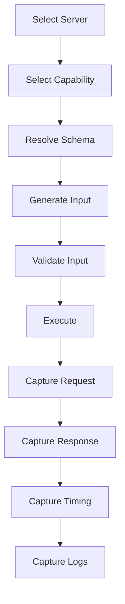
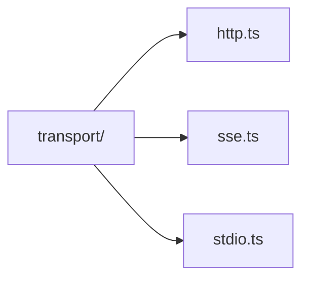
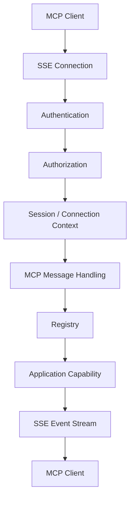
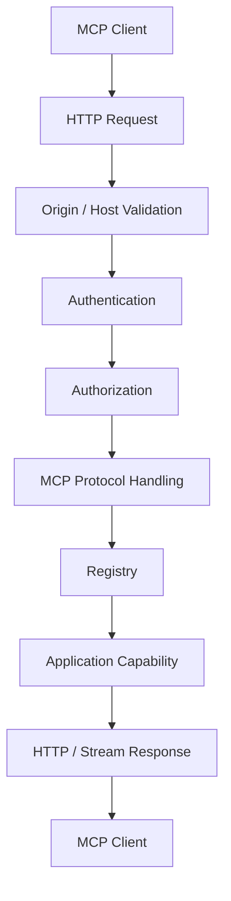
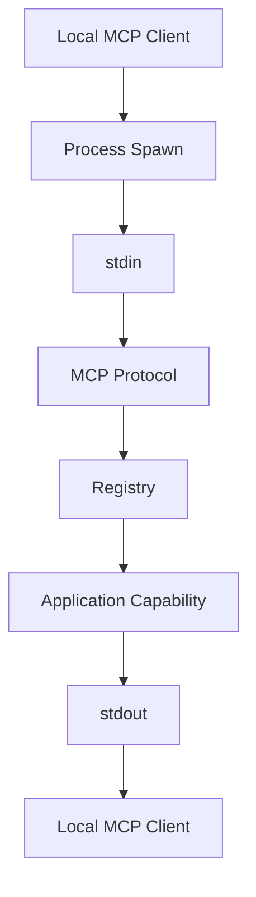
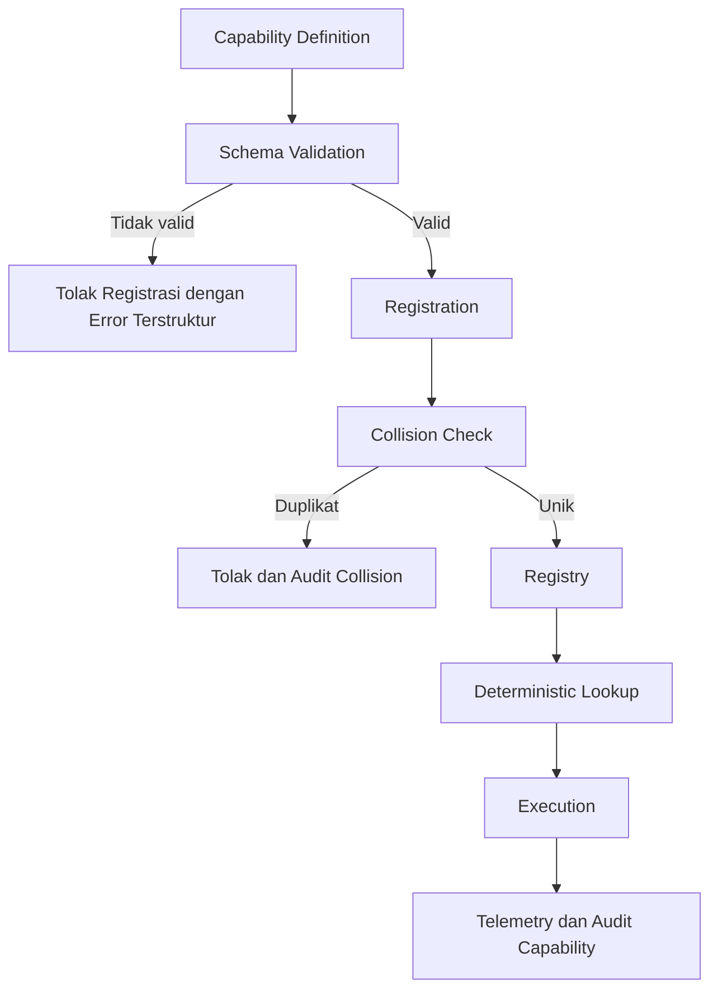
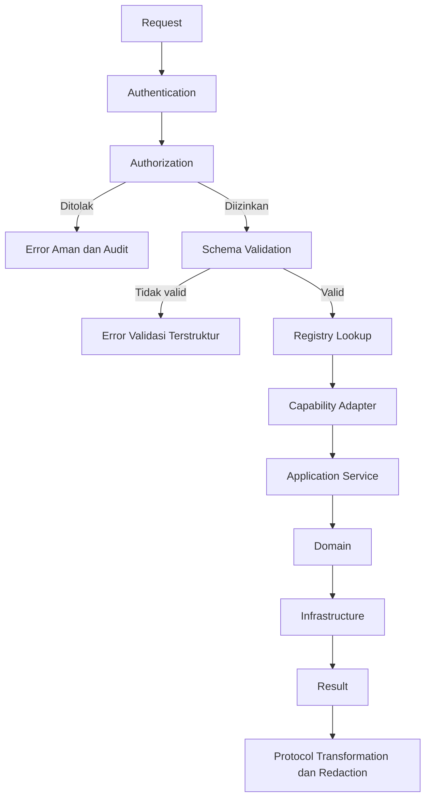
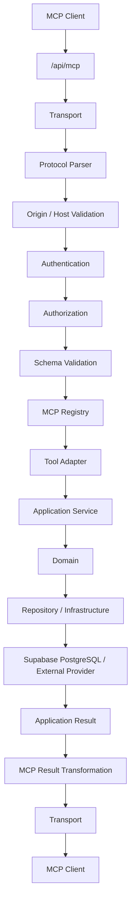
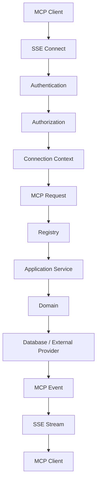
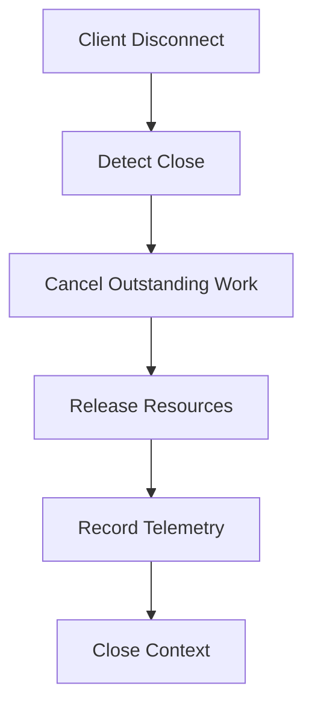

# MCP dan Protocol

Modul ini menetapkan MCP control center dan arsitektur protocol, capability registry, tools, resources, prompts, clients, playground, logs, health, transport HTTP/SSE/stdio, request flow MCP, dan capability execution.

## Cara Menggunakan Modul Ini

Gunakan modul ini untuk perubahan pada MCP endpoint, transport, capability registry, tool, resource, prompt, client session, playground, log, health check, atau adapter protocol. `blueprint.md` menetapkan aturan lintas modul. Application service dan domain tetap menjadi pemilik use case dan aturan bisnis. MCP hanya menjadi adapter protocol. Penomoran bagian pada file ini bersifat lokal dan berurutan mulai dari 1.

Setiap capability baru **HARUS** didefinisikan melalui contract, schema, identity, permission, registration, lookup, execution, transformation, observability, dan compatibility. Transport boleh berbeda, tetapi semantics capability yang setara **HARUS** tetap konsisten.

## Konvensi Normatif

- **WAJIB** memisahkan transport, protocol, registry, adapter, application, domain, dan infrastructure.
- **HARUS** menggunakan registry sebagai source of truth untuk tools, resources, dan prompts.
- **DILARANG** menaruh business logic, raw database access, atau provider routing pada transport dan UI.
- Semua transport **HARUS** menerapkan validation, authentication, authorization, correlation, timeout, dan cleanup sesuai policy.
- Payload, argument, error, log, dan event **HARUS** disanitasi sesuai security boundary sebelum dikirim atau disimpan.

## Standar Bukti Implementasi

Perubahan MCP **HARUS** dapat menunjukkan:

1. Capability contract dan schema yang sudah divalidasi.
2. Collision check serta deterministic registry lookup.
3. Kesetaraan behavior pada transport yang didukung.
4. Authorization sebelum execution dan protocol transformation sesudahnya.
5. Test untuk registry, tool, resource, prompt, transport, session, error, dan lifecycle yang relevan.
6. Cleanup untuk disconnect, cancellation, timeout, failure, dan shutdown.

---

# 1. MCP Control Center

Route:

```text
/mcp
```

HARUS menjadi MCP operational control center.

Overview MCP **HARUS** memberikan visibilitas terhadap:

```text
Status server
Client yang terhubung
Tool terdaftar
Resource terdaftar
Prompt terdaftar
Status transport
Status database
Throughput request
Rasio error
Pemanggilan tool terbaru
Error MCP terbaru
```

## Aturan

- **WAJIB** menampilkan state runtime MCP saat ini.
- **WAJIB** menggunakan registry sebagai sumber capability authoritative.
- **WAJIB** menggunakan state backend untuk state runtime.
- **DILARANG** membuat frontend menjadi sumber kebenaran capability MCP.
- **DILARANG** mengubah state runtime MCP tanpa operasi backend yang terotorisasi.

---

# 2. MCP Servers

Route:

```text
/mcp/servers
```

HARUS menjadi interface pengelolaan registry server.

Daftar server dapat menampilkan:

```text
Status server
Endpoint
Transport
Capability
Version
Health
Last request
Client count
Aktif/nonaktif
```

Detail:

```text
/mcp/servers/[serverId]
```

dapat mencakup:

```text
Overview
Capability
Tool
Resource
Prompt
Client
Configuration
Log
Health
Metrics
Dependency database
```

## Aturan

- **WAJIB** menggunakan identity server canonical.
- **WAJIB** memisahkan configuration persistent dari state runtime.
- **WAJIB** memvalidasi configuration sebelum aktivasi.
- **WAJIB** menampilkan health dari state backend authoritative.
- **DILARANG** menyimpan registry server canonical hanya pada state browser lokal.

---

# 3. MCP Tools

Route:

```text
/mcp/tools
```

HARUS menjadi catalog tool.

Metadata dapat mencakup:

```text
Nama tool
Deskripsi
Schema input
Schema output
Domain sumber
Permission
Usage
Rasio keberhasilan
Latency
Status
```

Detail:

```text
/mcp/tools/[toolName]
```

dapat mencakup:

```text
Overview tool
Schema
Arguments
Examples
Pemanggilan terbaru
Metrics
Errors
Permissions
Status implementasi
```

Catalog tool bukan tempat implementasi tool MCP.

## Aturan

- **WAJIB** memiliki identifier yang unik.
- **WAJIB** memiliki schema input.
- **WAJIB** memiliki contract output.
- **WAJIB** memiliki deskripsi yang akurat.
- **WAJIB** menggunakan registry sebagai sumber canonical.
- **DILARANG** mencampurkan code eksekusi tool dengan komponen UI.
- **DILARANG** membuat metadata dashboard menjadi registry duplikat.

---

# 4. MCP Resources

Route:

```text
/mcp/resources
```

HARUS menjadi resource catalog.

Metadata dapat mencakup:

```text
Resource URI
Description
Mime type
Source
Availability
Access count
Permissions
```

Detail:

```text
/mcp/resources/[resourceId]
```

Resource URI **HARUS** mempunyai deterministic semantics.

## Aturan

- **WAJIB** menggunakan canonical resource identity.
- **WAJIB** memvalidasi resource identifier.
- **WAJIB** menerapkan authorization.
- **DILARANG** menempatkan retrieval business logic pada UI.
- **DILARANG** membocorkan database representation secara langsung.

---

# 5. MCP Prompts

Route:

```text
/mcp/prompts
```

HARUS menjadi prompt catalog.

Metadata:

```text
Name
Description
Arguments
Usage
Version
Status
Permissions
```

Detail:

```text
/mcp/prompts/[promptName]
```

## Aturan

- **WAJIB** mempunyai stable identifier.
- **WAJIB** mempunyai explicit argument contract jika diperlukan.
- **WAJIB** memisahkan prompt generation dari tool execution.
- **DILARANG** menggunakan implementasi prompt sebagai penampungan logika bisnis.
- **DILARANG** melakukan unauthorized side effects.

---

# 6. MCP Clients

Route:

```text
/mcp/clients
```

HARUS memberikan visibility terhadap connected clients.

Client information dapat mencakup:

```text
Client name
Client version
Protocol version
Transport
Connection status
Last seen
Capabilities
Requests
Authentication state
```

Detail:

```text
/mcp/clients/[clientId]
```

## Aturan

- **WAJIB** mencatat client identity ketika tersedia.
- **WAJIB** menyimpan protocol version ketika tersedia.
- **WAJIB** memisahkan client metadata dari connection state.
- **DILARANG** menentukan capability hanya berdasarkan client name.
- **WAJIB** menggunakan negotiated capability state.

---

# 7. MCP Playground

Route:

```text
/mcp/playground
```

HARUS menyediakan capability testing interface.

Flow:



Playground **HARUS** menggunakan execution path yang sama dengan production capability sebisa mungkin.

## Aturan

- **WAJIB** mengambil schema dari authoritative registry.
- **WAJIB** menggunakan validation contract yang sama dengan production.
- **WAJIB** menampilkan structured result.
- **WAJIB** menerapkan authentication dan authorization.
- **DILARANG** membuat playground menjadi security bypass.
- **DILARANG** menduplikasi tool implementation hanya untuk playground.

---

# 8. MCP Logs

Route:

```text
/mcp/logs
```

HARUS menjadi structured observability interface.

Filter:

```text
Time
Client
Tool
Method
Status
Duration
Error
Protocol version
Transport
Request ID
```

Detail:

```text
/mcp/logs/[requestId]
```

dapat mencakup:

```text
Request metadata
Authentication context
MCP method
Arguments
Execution stages
Response
Latency
Error
Stack trace
Database operations
External provider operations
```

Sensitive data **HARUS** disanitasi.

## Aturan

- **WAJIB** menggunakan structured logging.
- **WAJIB** menyediakan request/correlation identifier.
- **WAJIB** melakukan redaction.
- **DILARANG** menyimpan raw authorization header.
- **DILARANG** menyimpan access token.
- **DILARANG** menyimpan password.
- **DILARANG** menganggap browser console sebagai observability system.
- **WAJIB** menjaga traceability sampai database/external provider operation ketika relevan.

---

# 9. MCP Health

Route:

```text
/mcp/health
```

HARUS menjadi operational health interface.

Health checks dapat mencakup:

```text
MCP endpoint
Application runtime
Supabase database
Cache
External HTTP
GitHub
Documentation sources
Search engine
Package registry
Authentication subsystem
```

Status:

```text
Healthy
Degraded
Unavailable
```

Metadata:

```text
Last check
Latency
Error
Dependency
```

## Aturan

- **WAJIB** memberikan deterministic health semantics.
- **WAJIB** menggunakan timeout.
- **WAJIB** membedakan service failure dan dependency degradation ketika memungkinkan.
- **DILARANG** menjalankan workload mahal dari health endpoint tanpa alasan.
- **WAJIB** mencegah sensitive information leakage.

---

# 10. MCP Protocol Endpoint

MCP protocol endpoint:

```text
/api/mcp
```

HARUS menjadi protocol boundary.

Endpoint tersebut **HARUS** mendukung transport yang memang diimplementasikan oleh application deployment model.

Daftar transport yang didukung:

```text
Streamable HTTP
SSE
stdio
```

Setiap transport memiliki lifecycle dan execution characteristics sendiri.

## Aturan

- **WAJIB** menjaga protocol endpoint terpisah dari management API.
- **WAJIB** mempertahankan protocol semantics lintas transport.
- **DILARANG** menduplikasi business logic untuk setiap transport.
- **WAJIB** menggunakan shared registry dan application capability.
- **DILARANG** menjadikan route path sebagai tool registry source of truth.

---

# 11. Arsitektur Transport MCP

Transport bertanggung jawab terhadap:

```text
Connection lifecycle
Protocol message handling
Request parsing
Response delivery
Session behavior
Transport-specific concerns
```

Transport implementations:



Streamable HTTP digunakan untuk penyajian MCP berbasis HTTP yang modern.

SSE **WAJIB** diperlakukan sebagai transport dengan lifecycle koneksi yang berbeda dan **DILARANG** dipaksa mengikuti asumsi implementasi yang sama dengan stdio.

Stdio digunakan untuk integrasi proses lokal.

Perbandingan transport:

| Aspek | Streamable HTTP | SSE | stdio |
|-------|-----------------|-----|-------|
| Lifecycle | Request respons stateless | Koneksi event persisten | Proses lokal |
| Session | Per request dengan correlation ID | Connection context eksplisit dan cleanup | Process lifecycle |
| Auth | Per request | Saat connect dan per message sesuai policy | Kepercayaan proses lokal |
| Skala Vercel | Paling sesuai serverless | Perlu strategi lifecycle eksplisit | Tidak untuk serverless |
| Logging | Logger terpusat | Stream event tanpa secret | stderr atau logger khusus, bukan stdout protocol |

## Aturan

- **WAJIB** memisahkan transport implementation.
- **WAJIB** menyediakan SSE transport ketika SSE compatibility memang merupakan supported requirement.
- **WAJIB** menjaga SSE session lifecycle secara explicit.
- **WAJIB** menjaga stdio bebas dari browser HTTP assumptions.
- **WAJIB** menjaga HTTP transport bebas dari process-stdin assumptions.
- **DILARANG** menaruh search, database, provider, atau business logic pada transport.
- **WAJIB** memastikan seluruh transport memanggil capability layer yang sama.

---

# 12. Flow Transport SSE

SSE transport **HARUS** mempunyai flow yang jelas:



SSE connection state **HARUS** dapat dilacak.

Connection termination **HARUS** melakukan cleanup.

SSE **DILARANG** digunakan sebagai tempat menyimpan authoritative application state.

## Aturan

- **WAJIB** mempunyai connection lifecycle management.
- **WAJIB** menangani client disconnect.
- **WAJIB** membersihkan session resources.
- **WAJIB** menerapkan authentication dan authorization sesuai policy.
- **WAJIB** memiliki timeout atau lifecycle strategy yang sesuai deployment environment.
- **DILARANG** mengandalkan in-memory connection state sebagai persistent source of truth.
- **WAJIB** mempertimbangkan stateless serverless execution ketika SSE di-deploy pada Vercel.

---

# 13. Flow Transport Streamable HTTP

Streamable HTTP flow:



## Aturan

- **WAJIB** menerapkan request validation.
- **WAJIB** menerapkan authentication/authorization sesuai policy.
- **WAJIB** menjaga protocol response format.
- **WAJIB** mempertimbangkan serverless execution lifecycle.
- **DILARANG** membuat HTTP route melakukan business orchestration sendiri.

---

# 14. Flow Transport stdio

stdio flow:



Logging untuk stdio **HARUS** menggunakan channel yang tidak merusak protocol stream.

## Aturan

- **WAJIB** menjaga stdout hanya untuk protocol output jika protocol implementation membutuhkannya.
- **WAJIB** mengarahkan diagnostics ke stderr atau dedicated logger ketika applicable.
- **DILARANG** mencetak debug output ke protocol stream.
- **WAJIB** menangani process shutdown dengan cleanup.

---

# 15. Registry MCP

Registry **HARUS** menjadi canonical source untuk:

```text
Tools
Resources
Prompts
```

Registry flow:



Siklus capability minimum: definisi, validasi schema, registrasi, collision check, lookup deterministik, eksekusi melalui application service, transformasi protocol, telemetri, versioning, deprecation, dan penghapusan dengan migration path.

Registry **HARUS** deterministic.

## Aturan

- **WAJIB** menggunakan registry sebagai source of truth.
- **WAJIB** melakukan schema validation.
- **WAJIB** mendeteksi duplicate/collision.
- **WAJIB** menyediakan deterministic lookup.
- **DILARANG** melakukan registry mutation dari frontend.
- **DILARANG** membuat route filesystem menjadi registry source of truth.
- **DILARANG** menyimpan business rules pada registry.

---

# 16. Eksekusi Capability MCP

Capability execution **HARUS** mengikuti:



Capability adapter hanya menerjemahkan protocol input/output.

## Aturan

- **WAJIB** memisahkan protocol adaptation dan application execution.
- **WAJIB** menggunakan application service untuk reusable use case.
- **DILARANG** menempatkan direct arbitrary DB access pada tool.
- **DILARANG** menduplikasi search, resolve, cache, atau provider logic pada tool.
- **WAJIB** mengembalikan contract yang sesuai protocol.

---

# 17. Flow Request MCP Lengkap

Contoh tool request:



## Aturan

- **WAJIB** menggunakan satu application capability untuk equivalent Web/MCP use cases.
- **WAJIB** melakukan authorization sebelum execution.
- **WAJIB** melakukan protocol transformation pada boundary.
- **DILARANG** membuat MCP tool mengulang database/service logic.

---

# 18. Flow Request dan Session SSE MCP Lengkap



Penutupan koneksi:



## Aturan

- **WAJIB** menangani client disconnect.
- **WAJIB** melakukan cleanup.
- **WAJIB** membatalkan long-running work ketika cancellation semantics memungkinkan.
- **DILARANG** menyimpan durable application state pada SSE session memory.

---

