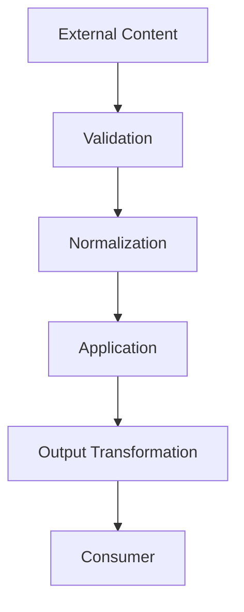
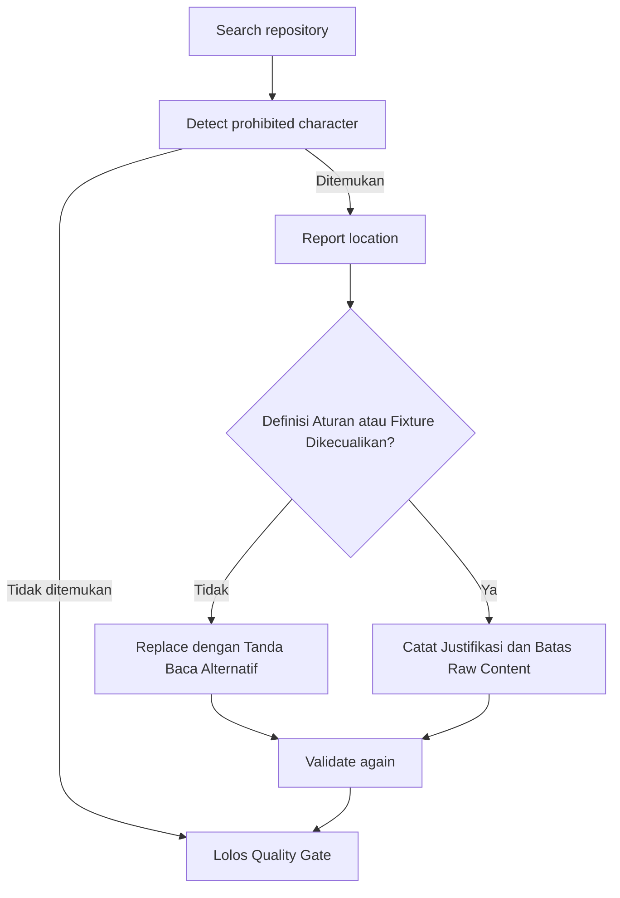

# Aturan Tanpa Em Dash

## Cara Menggunakan Modul Ini

Baca `blueprint.md` terlebih dahulu. Modul ini adalah aturan global yang berlaku untuk seluruh perubahan content, code, dokumentasi, dan output. Terapkan bersama modul lain yang relevan setiap kali membuat atau mengubah teks apa pun. Penomoran bagian pada file ini bersifat lokal dan berurutan mulai dari 1.

Pengecualian dokumentasi diri: file aturan ini boleh memuat karakter terlarang hanya di dalam blok kode yang memang mendefinisikan karakter tersebut. Blok kode definisi tersebut bukan pelanggaran. Scan validasi HARUS mengecualikan blok definisi pada file ini dan hanya gagal bila em dash muncul di luar blok definisi atau pada file terkontrol lain.

Karakter em dash (U+2014) **DILARANG** digunakan di seluruh project, kecuali blok kode definisi pada file aturan ini dan fixture eksternal immutable yang dikecualikan secara eksplisit.

Aturan ini berlaku secara global terhadap seluruh source code, configuration, documentation, comments, tests, generated files, user-facing text, tool output, log message, error message, metadata, dan seluruh text atau content yang dihasilkan dalam repository maupun melalui application.

## 1. Larangan Global

Karakter berikut:

```text
—
```

**DILARANG** muncul pada:

```text
Source code
Comments
Documentation
Markdown
Configuration
JSON
YAML
TOML
HTML
CSS
JavaScript
TypeScript
Python
SQL
Shell scripts
Tests
Fixtures
Snapshots
Logs
Error messages
UI text
API responses
MCP responses
Generated content
Prompts
Commit messages
Changelog
README
```

Tidak terdapat pengecualian berdasarkan jenis file, lapisan, environment, runtime, framework, atau tujuan output.

## 2. Pengganti yang Wajib Digunakan

Gunakan tanda baca alternatif yang sesuai dengan konteks.

Gunakan:

```text
-
,
:
;
()
[]
```

atau susun ulang struktur kalimat.

Contoh:

```text
SALAH:
Application layer — responsible for use cases.

BENAR:
Application layer - responsible for use cases.
```

atau:

```text
Application layer is responsible for use cases.
```

## 3. Source Code

Em dash **DILARANG** muncul dalam:

```text
String literals
Comments
Template literals
Error messages
Log messages
Identifiers
Documentation comments
Test descriptions
Fixtures
Snapshots
```

Contoh yang tidak disarankan:

```ts
const message = "Request failed — retry later";
```

Contoh yang **DISARANKAN**:

```ts
const message = "Request failed - retry later";
```

## 4. Dokumentasi

Seluruh dokumentasi HARUS bebas dari em dash.

Termasuk:

```text
README
Markdown
Architecture documents
Engineering rules
API documentation
MCP documentation
Developer documentation
User documentation
Changelog
Release notes
```

Generated documentation juga HARUS mengikuti rule ini.

## 5. Konten User-Facing

Seluruh text yang terlihat oleh user HARUS bebas dari em dash.

Termasuk:

```text
Page titles
Descriptions
Buttons
Labels
Tooltips
Notifications
Toast messages
Error messages
Success messages
Empty states
Dialog messages
Validation messages
MCP responses
API-generated UI content
```

## 6. Output yang Dihasilkan

Seluruh generated output HARUS bebas dari em dash.

Rule ini berlaku terhadap:

```text
AI-generated text
Generated code
Generated documentation
Generated configuration
Generated JSON
Generated Markdown
Generated test fixtures
Generated API responses
Generated MCP responses
```

Generated content tidak dianggap valid apabila mengandung em dash.

## 7. Konten Pihak Ketiga dan Eksternal

Konten eksternal yang berasal dari provider, API, sumber dokumentasi, repository, website, atau layanan eksternal dapat memuat em dash.

Konten eksternal **WAJIB** diperlakukan sebagai data yang tidak tepercaya.

Apabila konten eksternal akan digunakan sebagai:

```text
UI content
Application output
MCP output
Documentation
Generated content
Stored normalized content
```

Konten **WAJIB** dinormalisasi atau ditangani sesuai kebutuhan agar output global tidak melanggar aturan ini.

Payload eksternal mentah dapat mempertahankan konten asli hanya apabila diperlukan untuk correctness, auditability, atau source fidelity dan tidak menjadi output yang dikendalikan aplikasi.

## 8. Transformasi Data

Apabila aplikasi mentransformasikan konten eksternal, lapisan transformasi HARUS dapat menormalkan em dash apabila kontrak output melarang karakter tersebut.

Alur konseptual:



Normalisasi **DILARANG** merusak makna semantik secara tidak perlu.

## 9. Validasi

Validasi repository HARUS dapat mendeteksi keberadaan em dash.

Validasi **WAJIB** mencakup konten repository yang relevan.

Pemeriksaan konseptual:



Prosedur remediasi minimum:

| Langkah | Aturan | Bukti |
|---------|--------|-------|
| Deteksi | Scan repository setelah formatting dan generation | Lokasi temuan |
| Klasifikasi | Bedakan output terkontrol, definisi aturan, dan fixture eksternal | Justifikasi tertulis |
| Perbaikan | Ganti dengan `-`, `,`, `:`, `;`, tanda kurung, atau susun ulang kalimat | Diff perbaikan |
| Validasi ulang | Scan ulang hingga bersih di luar pengecualian | Hasil scan akhir |

Contoh CI minimum: jalankan scan sebagai quality gate terpisah, gagalkan build apabila karakter terlarang ditemukan di luar blok definisi dan fixture yang dikecualikan, serta lakukan scan setelah seluruh generation selesai.

File yang dikendalikan source control dan memuat em dash **WAJIB** diperbaiki, kecuali file aturan ini pada blok kode definisi karakter atau fixture eksternal immutable yang secara eksplisit membutuhkan fidelitas sumber yang persis.

## 10. CI dan Quality Gate

Apabila proyek memiliki CI atau quality gate, pemeriksaan no-em-dash **WAJIB** menjadi bagian dari validasi.

Build atau validasi HARUS gagal apabila em dash terlarang ditemukan pada file yang termasuk scope aturan repository, di luar blok definisi pada file aturan ini dan di luar fixture eksternal yang dikecualikan secara eksplisit.

Pemeriksaan **WAJIB** dilakukan setelah formatting dan generation agar hasil akhir tetap patuh.

## 11. Log dan Error

Log aplikasi dan pesan error HARUS bebas dari em dash.

Contoh yang tidak disarankan:

```text
Failed to fetch source — timeout
```

Gunakan:

```text
Failed to fetch source - timeout
```

atau:

```text
Failed to fetch source: timeout
```

## 12. MCP

Deskripsi tool MCP, deskripsi resource, deskripsi prompt, error tool, hasil tool, konten resource, output prompt, instruksi server, dan teks protocol-facing yang dihasilkan aplikasi HARUS bebas dari em dash apabila konten tersebut dikendalikan atau dihasilkan oleh aplikasi.

Response MCP **WAJIB** mengikuti batasan teks global ini.

Konten eksternal mentah yang diteruskan secara verbatim hanya diperlakukan sebagai pengecualian raw-content eksplisit apabila fidelitas persis merupakan persyaratan.

## 13. API

Response API yang dibentuk atau dikendalikan oleh aplikasi HARUS bebas dari em dash.

Payload error, pesan validasi, metadata, deskripsi, dan konten response yang dihasilkan **WAJIB** mengikuti aturan ini.

Payload eksternal mentah **DILARANG** dianggap sebagai konten yang ditulis aplikasi.

## 14. Komentar dan Code Review

Review code **WAJIB** memperlakukan em dash sebagai pelanggaran gaya.

Komentar yang memuat em dash **WAJIB** diperbaiki.

Developer DILARANG menambahkan em dash secara sengaja.

## 15. Larangan Penyiasatan

**DILARANG** menyiasati aturan dengan:

```text
Unicode escape
HTML entity
Encoded representation
String concatenation
Generated runtime substitution
Indirect interpolation
```

apabila hasil akhirnya memuat em dash pada output yang dikendalikan.

Contoh yang tidak disarankan:

```ts
const separator = "\u2014";
```

atau bentuk encoded lain yang menghasilkan:

```text
—
```

pada output yang dikendalikan aplikasi.

## 16. Ruang Lingkup

Aturan ini berlaku terhadap:

```text
Entire repository
Entire application
Entire backend
Entire frontend
Entire MCP server
Entire API surface
Entire documentation
Entire generated output
Entire developer-facing output
Entire user-facing output
```

Tidak terdapat modul, fitur, route, service, tool, provider adapter, test suite, script, atau file dokumentasi yang dikecualikan secara otomatis.

## 17. Aturan Final

Karakter:

```text
—
```

**DILARANG secara sengaja dimasukkan ke dalam konten project yang terkontrol atau output aplikasi yang terkontrol.**

Seluruh implementasi, generated content, dokumentasi, komentar, teks UI, response API, response MCP, log, test, konfigurasi, dan konten repository **WAJIB** menggunakan tanda baca alternatif yang tidak menghasilkan em dash.

Kepatuhan no-em-dash merupakan bagian dari kualitas code, kualitas dokumentasi, kualitas output, dan standar engineering.

---

