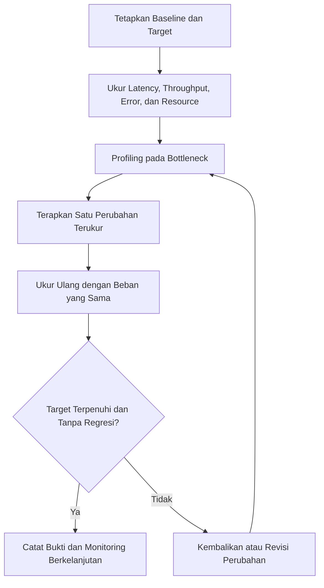

# Performance dan Scalability

## Cara Menggunakan Modul Ini

Baca `blueprint.md` terlebih dahulu, lalu gunakan modul ini sebagai pendalaman otoritatif untuk pengukuran, optimasi, caching, concurrency, resource limit, profiling, dan skalabilitas. Terapkan bersama `flows-and-runtime.md` bagian 25 sampai 27 untuk perilaku runtime, serta modul arsitektur dan API untuk cache, provider, dan observability. Penomoran bagian pada file ini bersifat lokal dan berurutan mulai dari 1. Aturan di sini bersifat kumulatif dengan aturan performa pada modul runtime.

## Konvensi Normatif

- **WAJIB** berarti persyaratan performa yang **HARUS** dipenuhi bila perubahan menyentuh area yang dioptimalkan.
- **DILARANG** menandai pola optimasi terlarang, termasuk micro-optimization tanpa bukti dan unbounded concurrency atau retry.
- Optimasi **HARUS** berdasarkan measurement dengan baseline dan target yang eksplisit.
- Perubahan performa tidak boleh mengorbankan correctness, security, atau maintainability tanpa tradeoff yang terdokumentasi.

## Standar Bukti Implementasi

Perubahan performa minimal **HARUS** menunjukkan baseline dan target, hasil profiling pada bottleneck, strategi cache dan invalidation, batas concurrency dan timeout, serta bukti tidak ada regresi correctness atau security.

## 1. Tujuan

Modul ini menetapkan cara mengukur, menganalisis, dan mengoptimalkan performa serta skalabilitas aplikasi. Optimasi **HARUS** berdasarkan data, bukan asumsi.

## 2. Prinsip Dasar

- **WAJIB** mengukur sebelum mengoptimalkan.
- **WAJIB** menetapkan baseline dan target.
- **DILARANG** melakukan micro-optimization tanpa bukti.
- **WAJIB** mempertimbangkan tradeoff antara performa, correctness, dan maintainability.
- **WAJIB** memantau performa secara berkelanjutan.

## 3. Area Optimasi

```text
Database queries
Caching
Concurrency
Batching
Streaming
Provider calls
Serialization
Rendering
Network latency
Memory usage
```

## 4. Pengukuran dan Profiling

- Gunakan metrics terpusat untuk latency, throughput, error rate, dan resource usage.
- Lakukan profiling pada layer yang teridentifikasi sebagai bottleneck.
- Catat hasil sebelum dan sesudah optimasi.
- Simpan bukti dalam bentuk laporan atau test yang dapat direproduksi.

Metode pengukuran minimum:



| Area | Metrik Utama | Bukti Minimum |
|------|--------------|---------------|
| Database queries | Latency query, error rate, dan frekuensi N plus 1 | Sebelum dan sesudah, rencana index atau batching |
| Caching | Hit rate, miss rate, dan latency | Strategi key, TTL, invalidasi, dan failure behavior |
| Concurrency | Throughput dan saturasi connection pool | Batas concurrency dan hasil uji beban realistis |
| Provider calls | Latency, timeout, dan failure rate | Timeout, retry budget, dan size limit |
| Rendering | Layout shift dan waktu render kritis | Loading boundary dan skeleton struktural |

## 5. Caching

- **WAJIB** memiliki strategi cache key, TTL, invalidation, dan failure behavior.
- **DILARANG** menjadikan cache sebagai sumber kebenaran.
- **WAJIB** membatasi ukuran cache dan pertumbuhan memory.
- **WAJIB** menangani cache stampede dan stale data.

Keputusan cache minimum:

| Keputusan | Aturan | Bukti |
|-----------|--------|-------|
| Key strategy | Deterministik dan mencakup versi serta konteks penyewa apabila multi-tenant | Contoh key dan collision review |
| TTL | Eksplisit per jenis data | Tabel TTL dan alasan |
| Invalidation | Event-based atau TTL-based yang terdokumentasi | Jalur invalidasi dan test |
| Failure behavior | Fail open atau fail closed yang eksplisit, tanpa silent replacement | Test kegagalan cache |
| Stampede | Single-flight, jitter, atau pre-warming sesuai kebutuhan | Test beban dan observability |

## 6. Concurrency dan Resource Limit

- **WAJIB** membatasi concurrency untuk operasi database, HTTP, dan background job.
- **WAJIB** menetapkan timeout dan cancellation.
- **WAJIB** memantau penggunaan resource (CPU, memory, connection pool).
- **DILARANG** melakukan unbounded concurrency atau retry.

## 7. Skalabilitas

- Rancang aplikasi agar dapat scale secara horizontal pada Vercel.
- Gunakan connection pooling yang sesuai untuk serverless.
- Hindari state yang hanya disimpan pada memori proses.
- Gunakan background job untuk operasi yang berat.
- Uji skalabilitas dengan beban yang realistis.

## 8. Checklist

- [ ] Baseline dan target performa terdokumentasi.
- [ ] Profiling dilakukan pada bottleneck yang teridentifikasi.
- [ ] Caching memiliki strategi yang jelas.
- [ ] Concurrency dan resource limit ditetapkan.
- [ ] Timeout dan cancellation diuji.
- [ ] Monitoring performa berkelanjutan tersedia.
- [ ] Perubahan performa tidak mengorbankan correctness atau security.

## 9. Definition of Done

Performa selesai bila baseline dan target terukur, optimasi divalidasi dengan data, tidak ada regresi yang tidak diterima, dan monitoring berkelanjutan aktif.

---

