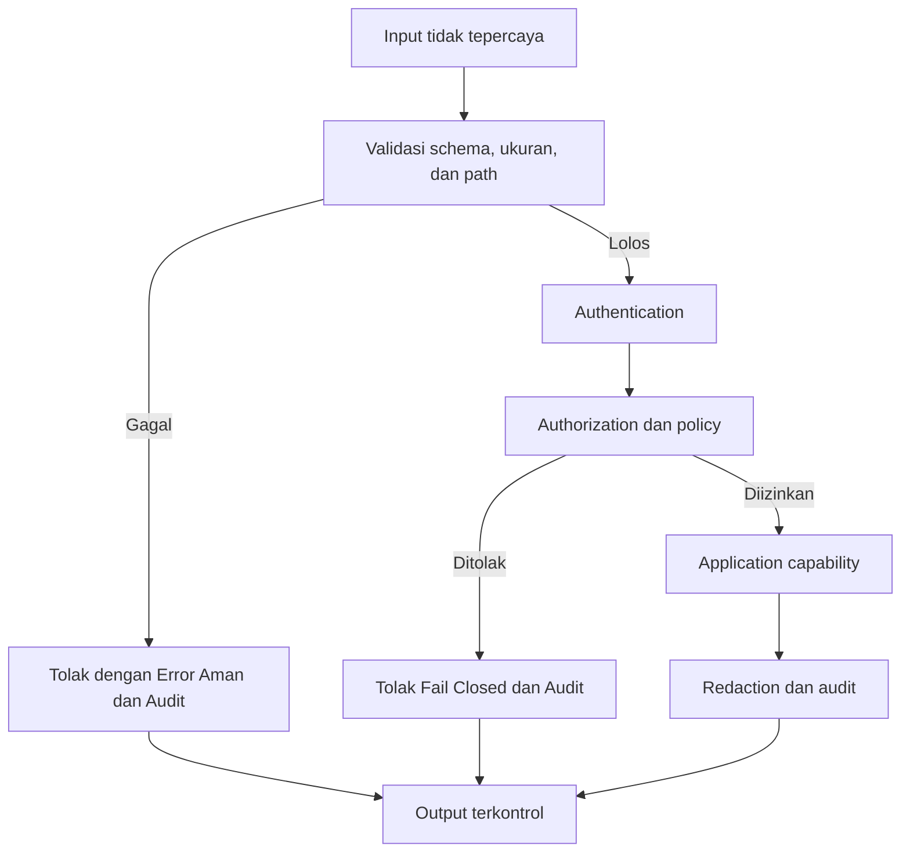

# Security dan Privacy

## Cara Menggunakan Modul Ini

Baca `blueprint.md` terlebih dahulu, lalu gunakan modul ini sebagai sumber otoritatif untuk threat model, secret, privacy, SSRF, abuse prevention, audit, dan incident response. Terapkan bersama `api-observability-and-testing.md` bagian 7, `database-auth-and-deployment.md`, dan `no-em-dashes.md` untuk perubahan security boundary atau data sensitif. Penomoran bagian pada file ini bersifat lokal dan berurutan mulai dari 1. Bila aturan di sini dan di modul API sama, keduanya bersifat kumulatif dan modul ini menjadi pendalaman yang otoritatif untuk aspek security dan privacy.

## Konvensi Normatif

- **WAJIB** berarti persyaratan security yang **HARUS** dipenuhi sebelum perubahan dianggap selesai.
- **DILARANG** berarti pola yang tidak boleh digunakan pada security boundary.
- Enforcement **HARUS** berada pada server-side. Semua input eksternal dianggap tidak tepercaya.
- Secret bersifat write-only atau masked dan tidak boleh bocor ke UI, log, error, telemetry, atau response public.

## Standar Bukti Implementasi

Perubahan security minimal **HARUS** menunjukkan threat model, authorization matrix, redaction test, secret scan, negative test, dan audit evidence yang relevan.

## 1. Tujuan, Boundary, dan Prioritas

Security enforcement **HARUS** berada pada server-side boundary. Semua input dari browser, MCP Client, API Client, External API, URL, Filesystem, Environment, dan Database content dianggap tidak tepercaya. Authentication membuktikan identity, authorization menentukan izin, dan display identity tidak pernah menjadi security identity.

## 2. Threat Model Wajib

Sebelum perubahan yang menyentuh data, route, provider, atau credential, catat asset, actor, trust boundary, abuse case, impact, mitigasi, dan bukti pengujian. Minimal evaluasi SSRF, path traversal, injection, origin atau host abuse, replay, credential leakage, privilege escalation, enumeration, rate limit abuse, dan unbounded resource consumption.

Matriks ancaman minimum:

| Ancaman | Contoh Abuse Case | Mitigasi Wajib | Bukti Pengujian |
|---------|-------------------|----------------|-----------------|
| SSRF | URL user memaksa fetch ke metadata internal | Validasi scheme dan hostname, blokir private network, batasi redirect, timeout, dan ukuran response | Negative test URL internal dan redirect |
| Path traversal | Path keluar dari root yang diizinkan | Normalisasi path dan pembatasan pada root | Negative test traversal |
| Injection | Input merusak query atau command | Validasi schema, parameterized query, escaping sesuai konteks | Negative test injeksi |
| Origin atau host abuse | Origin palsu mengakses capability sensitif | Validasi origin dan host sesuai policy | Test origin tidak valid |
| Replay | Request valid dipakai ulang | Expiry, nonce, atau idempotency key sesuai contract | Test replay |
| Credential leakage | Secret masuk log atau response | Redaction, secret scan, write-only password | Redaction test dan secret scan |
| Privilege escalation | Role client dipakai sebagai otorisasi | Otorisasi server-side dan fail closed | Authorization matrix |
| Enumeration | Enumerasi user atau resource | Rate limit, pesan error generik, audit | Rate limit test |
| Abuse resource | Request mahal tanpa batas | Rate limit, quota, bounded concurrency, cancellation | Load test terbatas dan audit |

## 3. Identity, Authorization, dan Session

- **WAJIB** memeriksa authorization pada setiap protected operation.
- **WAJIB** fail closed ketika policy tidak dapat diverifikasi.
- **DILARANG** memakai frontend state, display name, atau client-supplied role sebagai security boundary.
- **WAJIB** memisahkan mode `GETLIB_AUTHENTICATICATION_ENABLE` dari authorization.
- Mode tanpa authentication tetap menerapkan rate limiting, validation, SSRF protection, origin validation, dan policy capability.
- Session, token, cookie, dan credential **HARUS** memiliki expiry, rotation, dan revocation semantics yang sesuai contract.

## 4. Secret dan Data Sensitif

Secret tidak boleh masuk source code, browser, log, telemetry, error, response public, snapshot, atau commit. `GETLIB_DEFAULT_ACCOUNT` dan `GETLIB_DEFAULT_PASS` dibaca melalui centralized typed configuration. Fallback `awesomemcp@getlib-local.com` dan `getlib123` hanya mengikuti bootstrap contract, **HARUS** memunculkan warning, dan **HARUS** segera diganti. Password bersifat write-only.

Siklus secret minimum:

| Tahap | Aturan | Bukti |
|-------|--------|-------|
| Provisioning | Secret berasal dari deployment platform atau configuration terpusat, bukan hardcode | Konfigurasi terpusat dan review |
| Penyimpanan | Secret write-only atau masked setelah disimpan | Test baca kembali ditolak |
| Penggunaan | Hanya pada server-side boundary yang terotorisasi | Authorization test |
| Rotasi | Credential bootstrap dan demo **WAJIB** dapat diganti tanpa deploy ulang kode apabila didukung platform | Prosedur rotasi dan test |
| Revokasi | Session, token, dan credential lama **WAJIB** dapat dicabut | Test revokasi |
| Audit | Setiap perubahan sensitif tercatat dengan identity keamanan, bukan display identity | Audit log immutable |

## 5. SSRF, Input, dan Abuse Prevention

URL yang dikendalikan user **HARUS** memeriksa scheme, hostname, redirect, private network, metadata endpoint, DNS rebinding, response size, content type, timeout, retry, dan concurrency. Gunakan daftar scheme yang diizinkan, tolak private network dan metadata endpoint, batasi redirect maksimal, tetapkan timeout eksplisit, batasi retry hanya untuk operasi idempoten dengan backoff dan jitter, serta batasi ukuran response dan concurrency. Path **HARUS** dinormalisasi dan dibatasi pada root yang diizinkan. Semua endpoint yang mahal **HARUS** memiliki rate limit, quota, bounded concurrency, cancellation, dan audit event.

## 6. Privacy dan Observability

Kumpulkan data minimum yang diperlukan untuk produk dan debugging. Tentukan retention, access, deletion, masking, dan purpose untuk setiap field berikut.

| Field | Purpose | Retensi dan Akses |
|-------|---------|-------------------|
| requestId dan clientId | Korelasi dan debugging | Retensi operasional terbatas, akses tim engineering |
| userId | Audit dan personalisasi apabila diizinkan | Masking pada log umum, akses berbasis peran |
| provider dan database operation | Root cause analysis | Retensi operasional, tanpa payload sensitif |
| duration, status, dan error | SLO dan alerting | Agregasi metrics, tanpa detail sensitif |

**DILARANG** menyimpan raw authorization header, access token, password, atau secret environment. Audit event **WAJIB** immutable secara operasional dan dapat ditelusuri.

## 7. Incident Response dan Validasi

Kegagalan keamanan **WAJIB** menghasilkan error yang aman, correlation identifier, telemetri, dan jalur recovery yang jelas. Perubahan **WAJIB** diuji dengan negative test, authorization matrix, redaction test, secret scan, dependency review, migration review, dan regression test. **DILARANG** menurunkan kontrol demi membuat UI atau build terlihat berhasil.

Tingkat insiden minimum:

| Tingkat | Contoh | Respons Minimum |
|---------|--------|-----------------|
| Kritis | Kebocoran secret atau bypass otorisasi | Revokasi credential, rollback, audit penuh, dan follow-up terdokumentasi |
| Tinggi | SSRF atau traversal yang tereksploitasi parsial | Blokir vektor, patch, negative test tambahan, dan audit |
| Sedang | Rate limit abuse atau enumeration | Perketat limit, perbaiki pesan error, dan pantau telemetri |

## 8. Checklist

- [ ] Threat model dan trust boundary diperbarui.
- [ ] Authentication, authorization, dan fail-closed behavior diuji.
- [ ] Secret scan dan redaction test lulus.
- [ ] URL dan path memiliki SSRF serta traversal protection.
- [ ] Rate limit, timeout, retry, size, dan concurrency bounded.
- [ ] Privacy purpose, retention, masking, dan access review tersedia.
- [ ] Audit, correlation, alert, dan recovery behavior dapat ditelusuri.

## 9. Definition of Done

Security work selesai bila asset dan threat model terdokumentasi, seluruh boundary memvalidasi input, authorization server-side aktif, secret tidak bocor, telemetry tersanitasi, abuse control bounded, negative test lulus, dan rollback atau incident path tersedia.

---

