# UI/UX dan Arsitektur CSS Terpusat

## Cara Menggunakan Modul Ini

Baca `blueprint.md` terlebih dahulu, lalu gunakan modul ini sebagai sumber otoritatif untuk keputusan UI, copy, styling, dan interaction. Terapkan bersama `no-em-dashes.md` untuk setiap perubahan teks atau visual. Penomoran bagian pada file ini bersifat lokal dan berurutan mulai dari 1. Aturan di sini bersifat kumulatif dengan modul keamanan, performa, dan error handling untuk konten, state, dan testing.

Dokumen ini menetapkan standar UI/UX, styling, design system, dan arsitektur CSS untuk seluruh aplikasi.

Tujuannya adalah memastikan seluruh antarmuka memiliki bahasa visual yang konsisten, terprediksi, terpelihara, responsif, dan aksesibel, serta dapat dikembangkan tanpa menghasilkan CSS yang tersebar, redundan, atau saling bertentangan.

CSS diperlakukan sebagai bagian dari arsitektur aplikasi, bukan sekadar kumpulan gaya untuk memperbaiki tampilan.

---

# 1. Prinsip Inti

Seluruh styling **WAJIB** menggunakan arsitektur styling terpusat.

Setiap halaman, fitur, atau komponen **DILARANG** membuat sistem styling tersendiri tanpa justifikasi teknis yang terdokumentasi.

Perilaku visual seperti:

* colors
* typography
* spacing
* radius
* shadows
* borders
* breakpoints
* transitions
* focus states
* component states
* layout primitives
* sizing
* z-index
* animation

**HARUS** memiliki sumber kebenaran tunggal yang konsisten.

Tujuan akhirnya adalah:

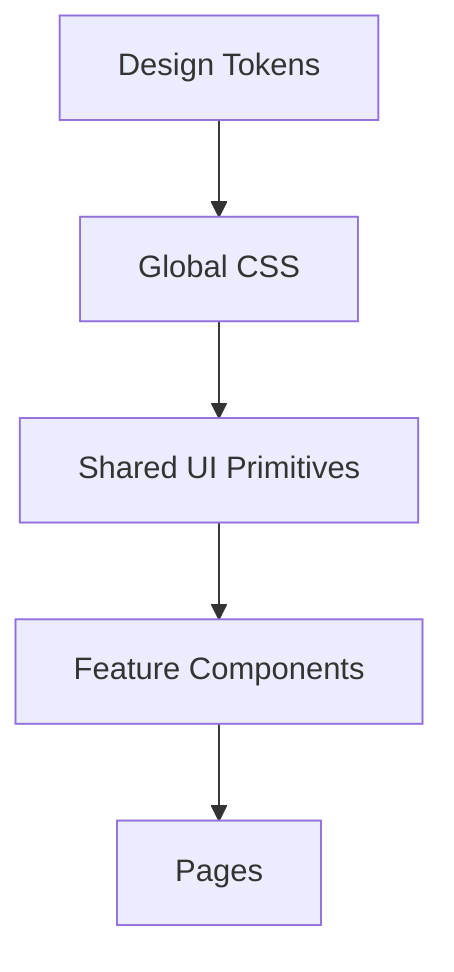

Bukan pola berikut:

- Halaman membuat local styles, warna acak, spacing acak, radius acak, dan custom override secara mandiri.
- Komponen memakai warna, spacing, dan override yang berbeda tanpa sumber kebenaran bersama.

Sistem styling **WAJIB** mengalir dari pusat ke komponen, bukan berkembang secara acak dari komponen ke seluruh aplikasi.

---

# 2. Arsitektur Styling Terpusat

Struktur styling utama **HARUS** memiliki boundary yang jelas.

Contoh:

```text
src/
├── app/
│   └── globals.css
│
├── web/
│   └── styles/
│       ├── tokens.css
│       └── utilities.css
│
└── ...
```

Atau, apabila project menggunakan struktur styling lain, prinsip yang sama tetap berlaku:

```text
styles/
├── tokens
├── base
├── utilities
├── components
└── themes
```

**DILARANG** membuat banyak file CSS global yang melakukan pekerjaan sama.

Global CSS **HARUS** sesedikit mungkin dan memiliki responsibility yang jelas.

---

# 3. Design Token sebagai Sumber Kebenaran

Semua nilai visual yang bersifat reusable **HARUS** berasal dari design tokens.

Design token mencakup:

```text
Color
Typography
Spacing
Sizing
Radius
Border
Shadow
Opacity
Z-index
Transition
Duration
Breakpoint
```

Contoh konsep:

```css
:root {
  --color-background: ...;
  --color-foreground: ...;
  --color-muted: ...;
  --color-border: ...;
  --color-primary: ...;

  --space-1: ...;
  --space-2: ...;
  --space-3: ...;
  --space-4: ...;

  --radius-sm: ...;
  --radius-md: ...;
  --radius-lg: ...;

  --shadow-sm: ...;
  --shadow-md: ...;

  --duration-fast: ...;
  --duration-normal: ...;
}
```

Nilai aktual **WAJIB** disesuaikan dengan design system aplikasi.

Komponen **DILARANG** membuat nilai baru apabila token yang setara telah tersedia.

Tata kelola token minimum:

| Keputusan | Aturan | Bukti |
|-----------|--------|-------|
| Token baru | Hanya apabila tidak terdapat token setara dan kebutuhan terdokumentasi | Proposal token dan review desain |
| Token semantik | **WAJIB** menjadi default untuk komponen | Mapping primitive ke semantik |
| Perubahan token | **WAJIB** menilai dampak theme dan seluruh konsumen | Visual review dan regression test |
| Penghapusan token | Hanya setelah migrasi konsumen selesai | Audit referensi dan changelog |

Contoh yang **TIDAK DISARANKAN**:

```css
margin: 13px;
padding: 19px;
border-radius: 7px;
color: #8f8f8f;
```

**DISARANKAN** menggunakan semantic token atau utility yang berasal dari design system.

Tujuannya bukan meniadakan seluruh custom value, melainkan mencegah keputusan visual yang tidak memiliki dasar kebutuhan.

---

# 4. Token Semantik Mengungguli Nilai Mentah

Komponen **DISARANKAN** menggunakan makna semantik, bukan detail palet secara langsung.

Contoh:

```text
--color-background
--color-foreground
--color-muted
--color-border
--color-primary
--color-destructive
--color-success
--color-warning
```

lebih baik daripada:

```text
--gray-100
--gray-200
--lime-500
--red-500
```

Palet mentah dapat dipertahankan sebagai primitive token, tetapi komponen **DISARANKAN** bergantung pada semantic token.

Contohnya:

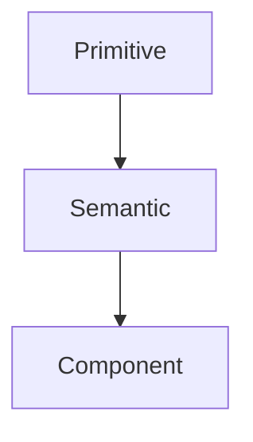

Hal ini memungkinkan theme berubah tanpa memodifikasi seluruh komponen.

---

# 5. Arsitektur Theme

Theme **WAJIB** dikelola secara terpusat.

Seluruh nilai spesifik theme **WAJIB** didefinisikan melalui sistem token.

Contohnya:

```css
:root {
  --color-background: ...;
  --color-foreground: ...;
}

.dark {
  --color-background: ...;
  --color-foreground: ...;
}
```

Komponen **DILARANG** mendefinisikan:

```css
.dark .some-component {
  ...
}
```

untuk setiap komponen secara terpisah apabila perilaku tersebut dapat ditangani oleh token.

Pola yang disarankan:

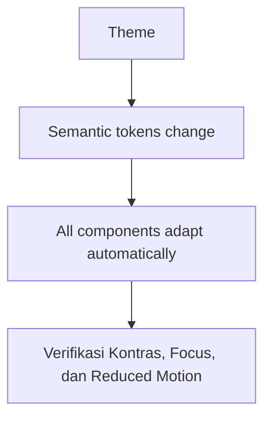

Matriks verifikasi theme minimum: mode terang dan gelap, kontras teks, focus-visible keyboard, serta reduced motion.

Theme **HARUS** dapat dikembangkan tanpa menduplikasi style komponen.

---

# 6. Larangan Warna Acak

**TIDAK DISARANKAN** penulisan nilai warna langsung pada komponen, kecuali terdapat kebutuhan khusus yang terdokumentasi dan tidak dapat dipenuhi oleh token yang tersedia.

Contoh yang **TIDAK DISARANKAN**:

```tsx
<div className="bg-[#111827] text-[#f9fafb]">
```

atau:

```css
color: #84cc16;
```

apabila warna tersebut merupakan bagian dari design system.

**DISARANKAN** menggunakan token terpusat atau framework utility yang terhubung ke token.

Hal yang sama berlaku untuk:

```text
background
text
border
ring
shadow
hover
focus
active
disabled
```

---

# 7. Tipografi Terpusat

Tipografi **WAJIB** memiliki hierarki yang konsisten.

Sistem **WAJIB** mendefinisikan:

```text
Display
Heading
Subheading
Body
Body Small
Label
Caption
Code
```

Tipografi **WAJIB** dikelola secara terpusat melalui token tipografi atau primitif tipografi bersama.

**TIDAK DISARANKAN** pola berikut:

```text
Page A:
font-size: 31px

Page B:
font-size: 30px

Page C:
font-size: 32px
```

tanpa alasan desain yang jelas.

Sistem tipografi **WAJIB** menentukan:

```text
font family
font size
font weight
line height
letter spacing
```

secara konsisten.

---

# 8. Sistem Spacing Terpusat

Spacing **WAJIB** mengikuti skala spacing.

Contoh:

```text
space-1
space-2
space-3
space-4
space-5
space-6
space-8
space-10
space-12
```

Komponen **TIDAK DISARANKAN** menggunakan nilai spacing arbitrary apabila token yang setara telah tersedia.

Spacing **HARUS** konsisten antara:

```text
Page
Section
Card
Form
List
Table
Dialog
Navigation
Toolbar
```

Dengan demikian UI dirasakan berasal dari satu sistem yang sama.

---

# 9. Primitif Layout Terpusat

Pola layout yang sering digunakan **WAJIB** dijadikan primitif yang dapat digunakan ulang.

Contoh:

```text
Container
Stack
Inline
Grid
Section
PageHeader
PageContent
Card
Panel
Toolbar
```

Daripada setiap page membuat layout sendiri.

Contoh konseptual:

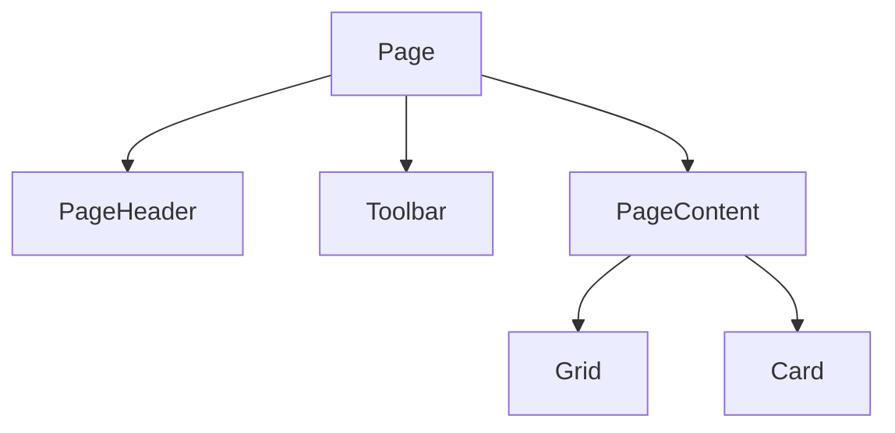

Primitif layout **WAJIB** menyelesaikan masalah layout umum tanpa abstraksi yang berlebihan.

---

# 10. Konsistensi Layout Halaman

Setiap page **HARUS** memiliki struktur visual yang konsisten.

Umumnya:

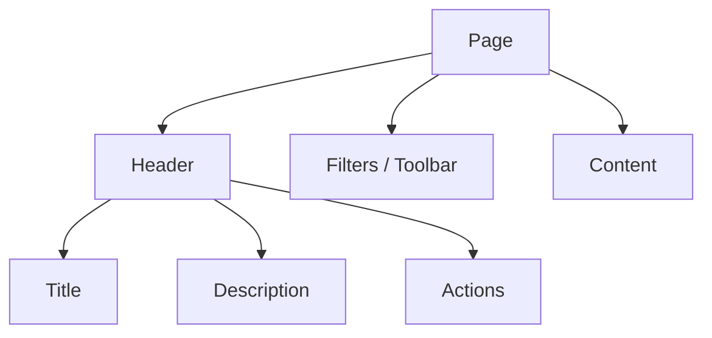

Halaman tertentu dapat memiliki struktur yang berbeda apabila kebutuhan UX memang mensyaratkannya.

Namun perbedaan tersebut **WAJIB** berasal dari kebutuhan produk, bukan akibat setiap developer membuat layout secara mandiri.

---

# 11. Komponen UI Bersama

Komponen generik **WAJIB** ditempatkan pada lapisan UI bersama.

Contoh:

```text
Button
Input
Textarea
Select
Checkbox
Radio
Switch
Dialog
Drawer
Popover
Tooltip
Tabs
Badge
Card
Table
Skeleton
Pagination
Dropdown
Breadcrumb
```

Komponen bersama **WAJIB**:

* dapat digunakan ulang
* berperilaku terprediksi
* komposabel
* aksesibel
* adaptif terhadap theme
* independen terhadap domain bisnis

UI bersama **DILARANG** mengetahui detail seperti:

```text
Project
Analytics
MCP
Library
Server
User
```

Komponen spesifik domain **WAJIB** ditempatkan pada modul fitur.

---

# 12. Styling Fitur

Komponen spesifik fitur dapat memiliki styling khusus.

Contoh:

```text
web/features/mcp/
├── components/
│   ├── mcp-server-card
│   ├── mcp-tool-list
│   └── mcp-log-viewer
```

Styling tersebut tetap **HARUS** menggunakan centralized tokens.

Komponen fitur dapat menentukan:

```text
layout
composition
component-specific visual behavior
```

tetapi **DILARANG** membuat design system baru.

---

# 13. CSS Module, Utility Class, dan Global CSS

Penggunaan mekanisme styling **WAJIB** mengikuti tanggung jawabnya.

Global CSS digunakan untuk:

```text
reset
base styles
tokens
global typography
theme definitions
global accessibility defaults
```

Utility classes digunakan untuk:

```text
small layout adjustments
spacing
flex/grid
responsive composition
```

Styling lingkup komponen digunakan apabila komponen memang membutuhkan style yang tidak dapat ditangani oleh utility atau primitif bersama.

**TIDAK DISARANKAN** ketergantungan seluruh aplikasi pada global selector, contohnya:

```css
.card {}
.button {}
.container {}
.title {}
```

karena selector generik dapat menimbulkan collision dan keterkaitan tersembunyi.

---

# 14. Larangan Polusi Selector Global

Global CSS **DILARANG** memuat styling yang spesifik terhadap komponen bisnis.

Contoh yang **TIDAK DISARANKAN**:

```css
.project-card {
  ...
}

.mcp-server-panel {
  ...
}

.analytics-widget {
  ...
}
```

apabila seluruhnya sebenarnya bersifat spesifik komponen.

Global CSS **WAJIB** dipertahankan minimal.

Style komponen bisnis **WAJIB** diisolasi melalui arsitektur komponen.

---

# 15. Hindari Nesting CSS yang Dalam

**TIDAK DISARANKAN** membuat hierarki selector yang terlalu dalam.

Contoh yang **TIDAK DISARANKAN**:

```css
.dashboard .sidebar .navigation .item .icon span {
  ...
}
```

Semakin dalam selector, semakin besar keterkaitan terhadap struktur DOM.

Utamakan kepemilikan komponen yang jelas.

Contohnya:

```text
Sidebar
Navigation
NavigationItem
Icon
```

masing-masing memiliki tanggung jawab sendiri.

---

# 16. Hindari !important

`!important` **DILARANG** digunakan sebagai solusi default.

Penggunaan `!important` **WAJIB** sangat jarang dan **WAJIB** memiliki dasar teknis.

Apabila `!important` sering muncul, kemungkinan besar arsitektur CSS atau strategi spesifisitas bermasalah.

Selesaikan masalah spesifisitas tanpa menambah masalah spesifisitas baru.

---

# 17. State Komponen Harus Terpusat

Setiap komponen interaktif **WAJIB** memiliki state yang konsisten.

Minimum:

```text
default
hover
focus-visible
active
disabled
loading
selected
error
```

State visual **HARUS** mengikuti token dan shared component behavior.

Contohnya button:

```text
default
hover
focus
active
disabled
loading
```

Setiap fitur **DILARANG** membuat interpretasi yang berbeda untuk state yang sama.

---

# 18. Aksesibilitas sebagai Bagian Arsitektur UI

Aksesibilitas merupakan bagian dari arsitektur, bukan tahap akhir.

Tingkat verifikasi minimum:

| Area | **WAJIB** Diuji | Bukti |
|------|-------------|-------|
| Keyboard | Navigasi penuh, focus-visible, dan focus trap dialog | Test keyboard saja |
| Screen reader | Alur kritis, label formulir, dan status error | Review screen reader |
| Visual | Kontras, zoom tinggi, dan text wrapping | Pengukuran kontras dan uji zoom |
| Motion | Reduced motion dan target sentuh | Uji preferensi dan ukuran target |

Seluruh UI **HARUS** mempertimbangkan:

```text
keyboard navigation
focus-visible
color contrast
reduced motion
semantic HTML
aria labels
screen-reader behavior
touch target size
form labeling
error states
```

Focus state **DILARANG** dihilangkan semata karena desain terlihat lebih bersih.

Contoh yang **TIDAK DISARANKAN**:

```css
outline: none;
```

tanpa menggantinya dengan visible focus indicator.

Gunakan:

```text
:focus-visible
```

untuk keyboard accessibility.

---

# 19. Desain Responsif Harus Sistematis

Perilaku responsif **WAJIB** mengikuti sistem breakpoint yang terpusat.

**TIDAK DISARANKAN** pendefinisian breakpoint secara acak:

```css
@media (max-width: 1377px)
@media (max-width: 1132px)
@media (max-width: 931px)
```

kecuali terdapat kebutuhan desain yang terukur.

Gunakan breakpoint yang konsisten serta komposisi responsif.

UI **HARUS** dipikirkan untuk:

```text
mobile
tablet
desktop
large desktop
```

Namun hindari sekadar mengecilkan tampilan desktop.

Layout **HARUS** mampu berubah secara struktural.

Contoh:

```text
Desktop:
Sidebar + content

Mobile:
Topbar + drawer navigation + content
```

---

# 20. Hindari Dimensi Hardcoded

**TIDAK DISARANKAN** penggunaan dimensi tetap secara berlebihan:

```css
width: 723px;
height: 412px;
```

apabila konten bersifat dinamis.

**DISARANKAN**:

```text
max-width
min-width
width: 100%
min-height
aspect-ratio
responsive grid
flex
```

Dimensi tetap hanya digunakan apabila komponen memang membutuhkan ukuran tertentu.

---

# 21. Z-Index Terpusat

Z-index **WAJIB** memiliki strategi pelapisan.

**TIDAK DISARANKAN** praktik berikut:

```css
z-index: 999999;
```

pada satu komponen.

Serta:

```css
z-index: 99999;
```

pada komponen lain.

Gunakan hierarki lapisan terpusat:

```text
base
dropdown
sticky
overlay
modal
popover
toast
critical overlay
```

Masing-masing **WAJIB** memiliki tujuan yang jelas.

---

# 22. Motion Terpusat

Animasi dan transisi **WAJIB** mengikuti sistem motion.

Kelola secara terpusat:

```text
duration
easing
distance
fade
scale
slide
```

Setiap komponen tidak perlu memiliki transisi yang berbeda.

Motion **HARUS** membantu:

```text
feedback
orientation
state transition
hierarchy
```

bukan sekadar dekorasi.

Hormati:

```css
prefers-reduced-motion
```

untuk pengguna yang meminta reduced motion.

---

# 23. Hindari Duplikasi CSS

**DILARANG** terdapat deklarasi style duplikat yang mengerjakan hal yang sama.

Contoh yang **TIDAK DISARANKAN**:

```text
feature-a:
padding: 16px

feature-b:
padding: 16px

feature-c:
padding: 16px
```

Apabila konsep tersebut memang dapat digunakan ulang, gunakan shared token atau primitif.

Namun pembuatan abstraksi semata karena dua baris CSS kebetulan identik **TIDAK DISARANKAN**.

Abstraksi **WAJIB** didasarkan pada penggunaan ulang semantik.

---

# 24. Hindari Rantai Override Style

**TIDAK DISARANKAN** pola:

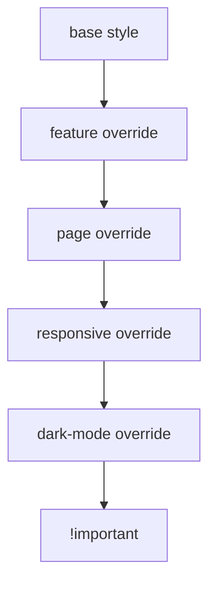

Apabila satu komponen memerlukan terlalu banyak override, arsitektur komponen tersebut **WAJIB** dievaluasi kembali.

Setiap style **WAJIB** memiliki pemilik tunggal yang jelas.

---

# 25. Larangan Dead CSS

Setiap rule CSS **WAJIB** memiliki konsumen yang valid.

Dead CSS **HARUS** dihapus.

Termasuk:

```text
unused class
unused variable
unused selector
obsolete animation
obsolete theme token
legacy responsive rule
unused component style
```

Hapus CSS yang tidak memiliki konsumen valid.

Riwayat perubahan telah tercatat pada version control.

---

# 26. Larangan Duplikasi Token

**TIDAK DISARANKAN** pola berikut:

```css
--card-radius: 12px;
--panel-radius: 12px;
--dialog-radius: 12px;
```

apabila seluruhnya memiliki peran semantik yang sama dan tidak terdapat alasan untuk membedakannya.

Namun pemisahan semantik dapat digunakan apabila perilaku pada masa depan memang perlu dibedakan.

Token **HARUS** mempunyai tujuan yang jelas.

---

# 27. Kepemilikan Komponen UI

Kepemilikan **WAJIB** didefinisikan secara jelas.

Shared:

```text
web/components/
```

Feature:

```text
web/features/<feature>/components/
```

Page-specific:

```text
di dalam feature/page composition
```

Pindahkan komponen ke lapisan shared hanya apabila terdapat kepemilikan semantik bersama yang jelas. Frekuensi penggunaan semata bukan dasar yang memadai.

Dapat digunakan ulang dan shared merupakan konsep yang berbeda.

Komponen **WAJIB** ditempatkan pada lapisan dengan kepemilikan yang paling tepat.

---

# 28. Arsitektur State UI

Visual state dan application state **WAJIB** dipisahkan.

Application state:

```text
server data
authentication
permissions
filters
selection
pagination
```

UI state:

```text
modal open
dropdown open
sidebar collapsed
hover
focus
animation state
```

Batasi state UI pada lingkup komponen apabila state tersebut hanya dibutuhkan oleh satu komponen.

State global hanya untuk data yang benar-benar bersifat global.

---

# 29. State Loading, Empty, Error, dan Success

Setiap fitur yang mengambil data **WAJIB** mendefinisikan minimal:

```text
Loading
Success
Empty
Error
```

UI **DILARANG** hanya dirancang untuk happy path.

Contohnya:

```text
Projects
├── Loading
├── Empty
├── Loaded
└── Error
```

State tersebut **HARUS** menggunakan shared visual patterns.

---

# 30. Skeleton Harus Struktural

Skeleton **WAJIB** merepresentasikan struktur konten yang sebenarnya.

**TIDAK DISARANKAN** skeleton generik apabila struktur layout aktual berbeda secara signifikan.

Contohnya:

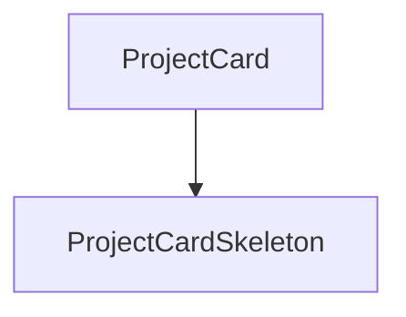

bukan seluruh halaman berubah menjadi satu persegi abu-abu.

Skeleton **WAJIB** membantu pengguna memahami layout yang akan tampil.

---

# 31. Formulir

Formulir **WAJIB** memiliki perilaku yang terstandarisasi.

Setiap formulir **WAJIB** memiliki:

```text
label
input
description
validation
error message
loading state
success state
disabled state
```

Error **WAJIB** ditempatkan berdekatan dengan field yang bermasalah.

Formulir **WAJIB** memiliki navigasi keyboard yang benar.

---

# 32. Tabel dan UI Padat Data

Dashboard sering memuat data dalam jumlah besar.

Tabel **WAJIB** mempertimbangkan:

```text
sorting
filtering
pagination
loading
empty
error
responsive behavior
column visibility
row actions
selection
```

Komponen tabel generik **WAJIB** ditempatkan pada lapisan UI bersama.

Kolom spesifik domain tetap berada pada fitur.

---

# 33. Sidebar dan Navigasi

Navigasi **WAJIB** dikelola secara terpusat.

Route information:

```text
routes
```

navigation metadata:

```text
navigation
```

permission:

```text
permissions
```

dilarang dicampurkan ke komponen secara manual.

Navigasi **WAJIB** dapat menentukan:

```text
label
href
icon
group
permission
badge
active state
```

dari konfigurasi terpusat.

---

# 34. Sistem Ikon

Penggunaan ikon **WAJIB** konsisten.

**TIDAK DISARANKAN** pencampuran beberapa pustaka ikon tanpa justifikasi teknis yang terdokumentasi.

Gunakan satu sistem ikon utama apabila memungkinkan.

Ikon **WAJIB** memiliki:

```text
consistent stroke/fill style
consistent sizing
accessible labeling
```

Ikon dekoratif **WAJIB** tidak mengganggu screen reader.

---

# 35. Lebar Konten

Dashboard tidak **HARUS** selalu full-width.

Gunakan kontainer konten dengan lebar maksimum yang wajar.

Contoh konsep:

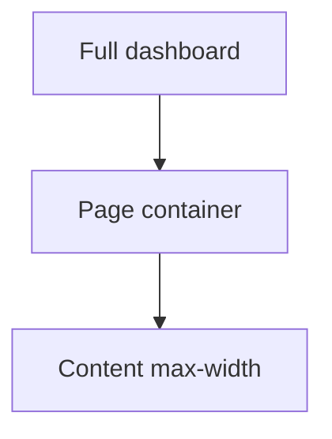

Halaman dengan data padat dapat menggunakan kontainer yang lebih lebar.

Formulir dan pengaturan dapat menggunakan kontainer yang lebih sempit.

Lebar **WAJIB** mengikuti jenis konten.

---

# 36. Hierarki Visual

Setiap halaman **WAJIB** memiliki hierarki yang dapat dipahami tanpa membaca seluruh teks.

Hierarki dapat menggunakan:

```text
size
weight
spacing
contrast
position
grouping
```

Pastikan hierarki tidak hanya disampaikan melalui warna.

---

# 37. Semantik Warna

Warna status **WAJIB** memiliki makna yang konsisten:

```text
Success
Warning
Error
Info
Neutral
```

Pertahankan konsistensi makna warna. Warna yang menandakan error pada satu konteks **DILARANG** digunakan sebagai dekorasi pada konteks lain.

Warna memiliki makna semantik.

---

# 38. Densitas

Aplikasi dashboard umumnya membutuhkan densitas informasi yang lebih tinggi daripada website marketing.

Namun densitas **WAJIB** tetap memiliki ritme.

Gunakan kombinasi:

```text
tight
normal
comfortable
```

sesuai konteks.

Misalnya:

| Konteks | Densitas |
|---------|----------|
| Data table | tight |
| Dashboard cards | normal |
| Settings forms | comfortable |

Sesuaikan densitas dengan konteks. Penyeragaman compact atau oversized pada seluruh antarmuka **TIDAK DISARANKAN**.

---

# 39. Konsistensi Visual Mengungguli Keindahan Komponen Individual

Komponen **WAJIB** dinilai dalam konteks keseluruhan produk.

Tombol yang terlihat baik secara mandiri tetapi tidak konsisten dengan tombol lain tetap merupakan kegagalan desain.

Prioritas:

```text
System consistency
    >
Component novelty
```

**TIDAK DISARANKAN** pembuatan desain baru yang semata bertujuan membedakan tampilan satu halaman.

---

# 40. CSS dan Tailwind

Apabila aplikasi menggunakan Tailwind CSS, Tailwind **WAJIB** tetap mengikuti design system terpusat.

Penggunaan Tailwind tidak meniadakan kewajiban mengikuti arsitektur design system.

**TIDAK DISARANKAN** string class yang sangat panjang dan penuh nilai arbitrary apabila komponen tersebut sebenarnya membutuhkan abstraksi.

Contoh:

```tsx
className="
  mt-[13px]
  px-[19px]
  rounded-[11px]
  bg-[#181818]
  text-[#eeeeee]
"
```

merupakan indikasi bahwa keputusan desain belum masuk ke design system.

Tailwind **WAJIB** digunakan sebagai mekanisme implementasi, bukan sebagai pengganti design system.

---

# 41. Nilai Arbitrary

Nilai arbitrary dapat digunakan apabila:

* kebutuhan visual bersifat unik
* tidak sesuai dengan sistem token
* memiliki dasar desain
* bukan merupakan pola yang dapat digunakan ulang

**TIDAK DISARANKAN** nilai arbitrary sebagai pengganti token yang telah tersedia.

---

# 42. Penamaan CSS

Nama class atau komponen **WAJIB** menggambarkan tanggung jawab semantik.

**TIDAK DISARANKAN**:

```text
.box
.wrapper
.container2
.big-card
.cool-button
.green-section
```

**DISARANKAN**:

```text
PageHeader
ContentContainer
McpServerCard
StatusBadge
Toolbar
```

Penamaan **WAJIB** merepresentasikan tujuan, bukan semata tampilan.

---

# 43. Larangan Arsitektur Berbasis Tampilan

**TIDAK DISARANKAN** arsitektur komponen berdasarkan warna atau gaya visual.

Contoh yang **TIDAK DISARANKAN**:

```text
GreenCard
DarkCard
SmallPanel
BigBox
```

**DISARANKAN**:

```text
SuccessCard
ServerStatusPanel
ResourceSummary
```

Komponen **WAJIB** mengomunikasikan tujuan semantik.

---

# 44. Layering CSS

Arsitektur CSS **WAJIB** memiliki urutan yang terprediksi.

Secara konsep:

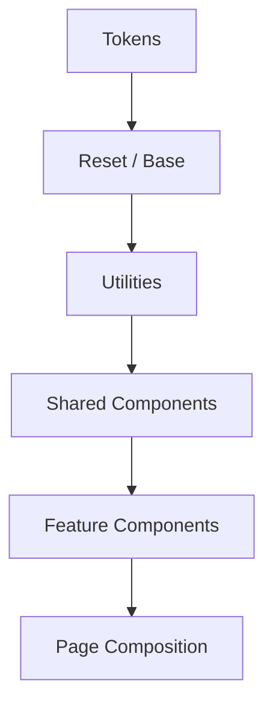

Lapisan yang lebih rendah **DILARANG** bergantung pada lapisan yang lebih tinggi.

Contohnya:

- Token tidak mengenal komponen.
- Komponen bersama tidak mengenal fitur.
- Fitur tidak mengubah primitif global secara sembarangan.

---

# 45. Larangan Global CSS Spesifik Fitur

Fitur **DILARANG** mengubah perilaku global seperti:

```css
body {}
button {}
input {}
h1 {}
```

melalui stylesheet spesifik fitur.

Perilaku global hanya boleh berada pada lapisan styling global.

---

# 46. Evolusi Design System

Design system **HARUS** mampu berkembang.

Ketika diperlukan component baru:

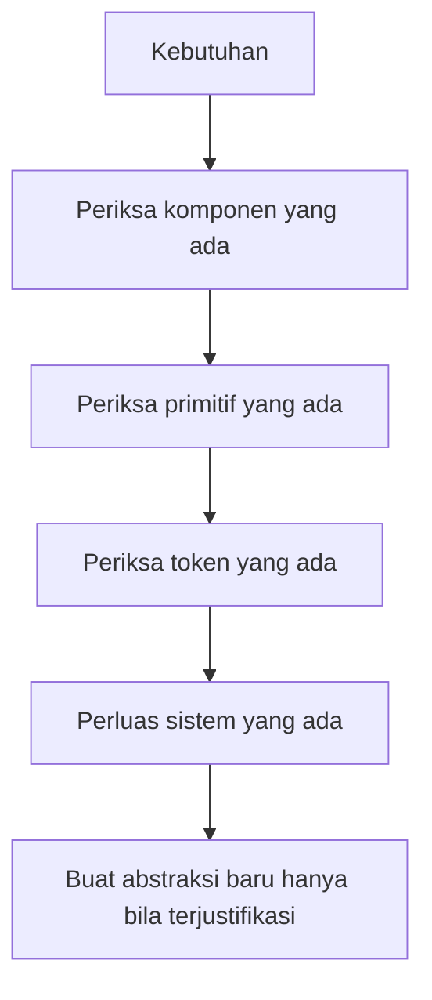

Utamakan penambahan varian pada komponen yang ada sebelum membuat komponen baru.

Misalnya:

```text
Button
```

dapat memiliki:

```text
variant
size
state
```

daripada:

```text
PrimaryButton
SecondaryButton
SmallButton
DangerButton
CompactButton
```

apabila seluruhnya sebenarnya merupakan satu komponen dengan varian.

---

# 47. Varian Harus Semantik

Varian **DISARANKAN** menggambarkan tujuan semantik:

```text
primary
secondary
destructive
ghost
outline
```

bukan:

```text
lime
gray
small-green
dark-border
```

Hal ini menjaga API komponen tetap stabil ketika theme berubah.

---

# 48. API Komponen Harus Ringkas

Komponen **DILARANG** memiliki puluhan props styling yang tidak jelas.

Contoh yang **TIDAK DISARANKAN**:

```text
color
bg
border
radius
padding
margin
font
shadow
width
height
...
```

Komponen bersama **DISARANKAN** memiliki API yang fokus.

Kompleksitas styling **WAJIB** ditangani oleh design system dan komposisi, bukan dengan penambahan props tanpa batas.

---

# 49. Maintainabilitas

Setiap perubahan UI **HARUS** dapat dijelaskan melalui satu atau beberapa layer yang jelas.

Contoh:

Jika ingin mengganti primary color:

```text
Design token
```

Jika ingin mengubah button shape:

```text
Button primitive
```

Jika ingin mengubah layout dashboard:

```text
Dashboard layout
```

Jika ingin mengubah tampilan MCP server:

```text
MCP feature component
```

Perubahan **DILARANG** membutuhkan penyuntingan puluhan file yang tidak berhubungan.

---

# 50. Aturan Final Arsitektur CSS

Sumber kebenaran **WAJIB** dapat dijelaskan sebagai berikut:

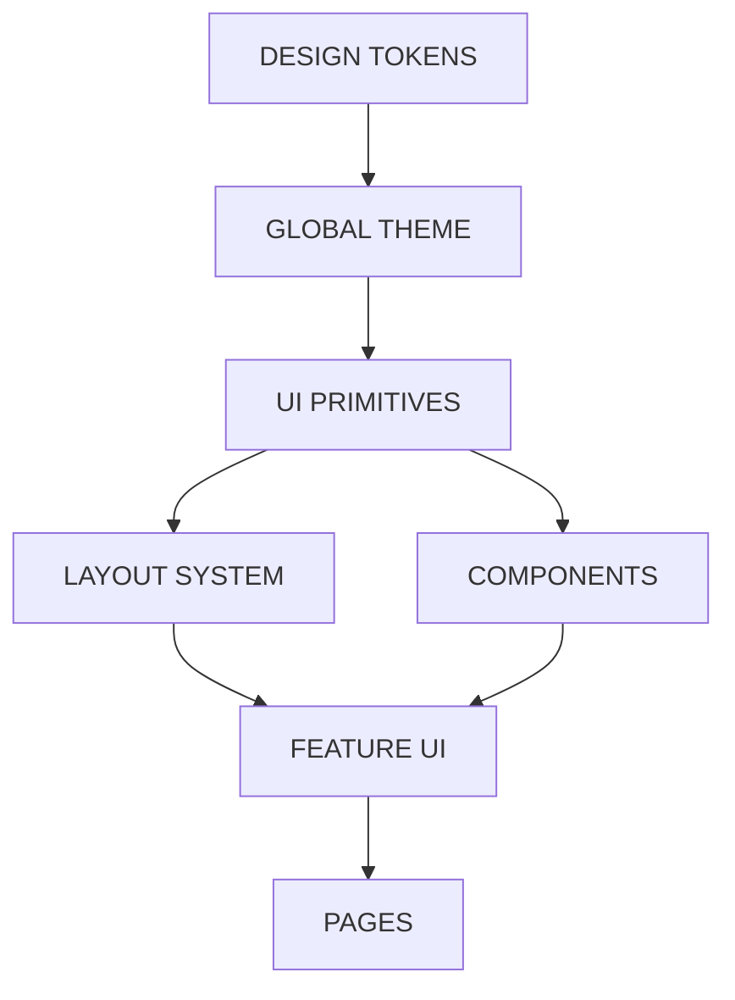

Setiap lapisan mempunyai tanggung jawab sendiri.

```text
Tokens
    = visual values

Global CSS
    = application-wide behavior

Primitives
    = reusable UI building blocks

Components
    = reusable interface components

Features
    = domain-specific UI

Pages
    = composition
```

**DILARANG** terdapat ketergantungan terbalik sebagai berikut:

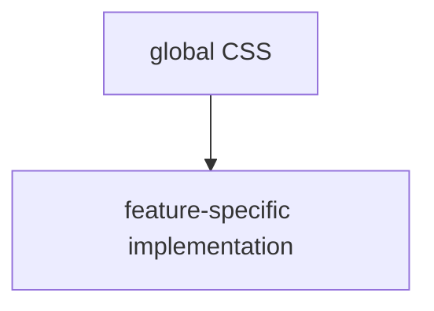

atau:

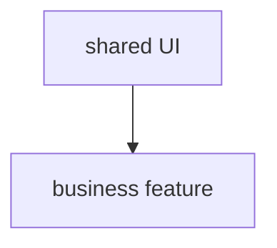

Infrastruktur shared **DILARANG** bergantung pada styling spesifik fitur.

---

# 51. Definition of Done untuk UI/UX

UI dianggap selesai apabila:

```text
[ ] Design tokens digunakan secara konsisten
[ ] Theme berasal dari centralized tokens
[ ] Tidak ada random colors
[ ] Tidak ada unnecessary arbitrary values
[ ] Tidak ada duplicate styles
[ ] Tidak ada dead CSS
[ ] Tidak ada conflicting selectors
[ ] Tidak ada excessive specificity
[ ] Tidak ada unnecessary !important
[ ] Responsive behavior konsisten
[ ] Keyboard navigation bekerja
[ ] Focus state tersedia
[ ] Loading state tersedia
[ ] Empty state tersedia
[ ] Error state tersedia
[ ] Interactive states konsisten
[ ] Shared components digunakan kembali
[ ] Feature-specific styling tetap berada pada feature
[ ] Global CSS tetap minimal
[ ] Typography konsisten
[ ] Spacing konsisten
[ ] Radius konsisten
[ ] Shadow konsisten
[ ] Motion konsisten
[ ] Z-index memiliki hierarchy
[ ] Accessibility diperhatikan
[ ] Tidak ada styling yang tidak memiliki ownership jelas
[ ] Tidak ada duplicate design system
```

---

# 52. Prinsip Utama

UI/UX **WAJIB** diperlakukan sebagai suatu sistem.

UI/UX bukan sekumpulan halaman, bukan sekumpulan komponen, bukan sekumpulan class Tailwind, dan bukan sekumpulan file CSS.

Keseluruhan aplikasi **WAJIB** dirasakan sebagai hasil satu sistem engineering dan desain yang sama, meskipun dikembangkan oleh banyak fitur dan banyak developer.

Setiap keputusan visual **WAJIB** memiliki tempat yang tepat:

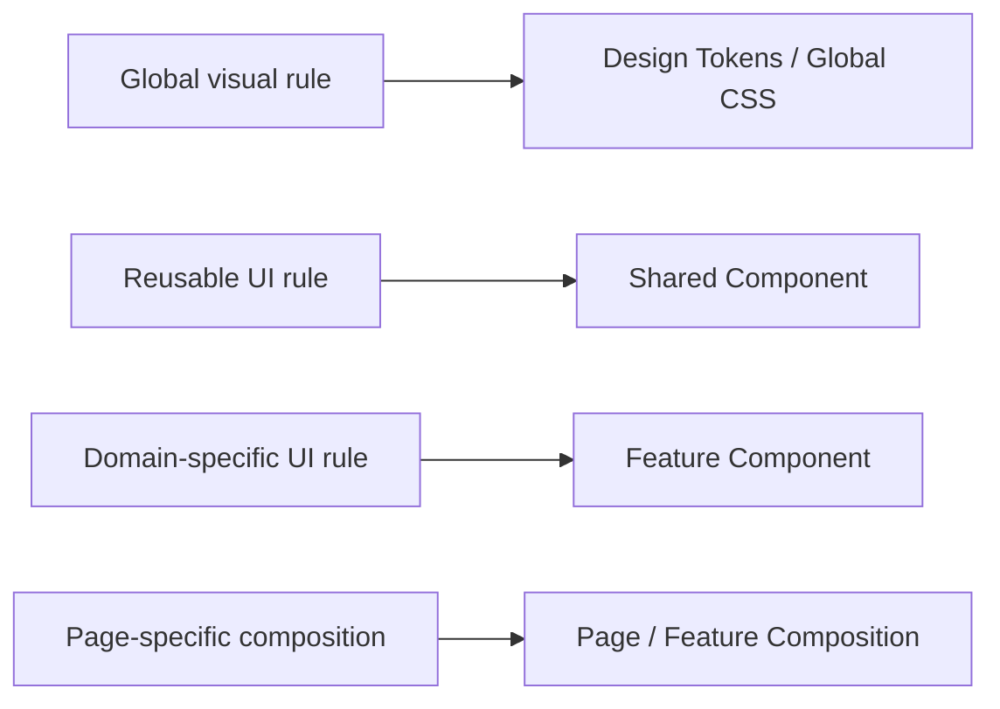

Apabila suatu style dapat dipindahkan ke lapisan yang lebih tepat tanpa kehilangan kepemilikan semantik, pindahkan.

Apabila suatu abstraksi hanya dibuat untuk menghindari beberapa baris CSS dan tidak memiliki nilai semantik, abstraksi tersebut tidak perlu dibuat.

Target akhir adalah:

```text
Consistent
Predictable
Reusable
Accessible
Responsive
Maintainable
Scalable
```

dengan satu sistem visual terpusat sebagai sumber kebenaran tunggal untuk seluruh aplikasi.

---

# 53. Konten, Keamanan, Performa, dan Pengujian

## 53.1 Content dan Interaction

Copy **WAJIB** ringkas, spesifik, mudah dipindai, dan menyebutkan tindakan berikutnya.
Label, heading, error, empty state, dan konfirmasi **WAJIB** memakai istilah yang konsisten dengan route, API, MCP, dan domain. Status penting **DILARANG** hanya disampaikan melalui warna atau ikon. Pesan error **WAJIB** menjelaskan masalah, dampak, dan langkah pemulihan tanpa membocorkan secret, stack trace, atau data pengguna lain.

## 53.2 Accessibility Operasional

Setiap perubahan UI **WAJIB** diverifikasi hanya dengan keyboard, screen reader pada alur kritis, kontras yang memadai, focus-visible, semantic HTML, label formulir, focus trap pada dialog, dan ukuran target sentuh. Komponen **WAJIB** tetap dapat digunakan pada zoom tinggi, text wrapping, dan reduced motion. ARIA hanya digunakan apabila semantic HTML tidak memadai, bukan sebagai pengganti struktur HTML yang benar.

## 53.3 Responsive Behavior

Uji mobile, tablet, desktop, dan large desktop pada konten nyata, termasuk string panjang, daftar kosong, error, dan data padat. Pertahankan konten penting secara utuh. Hindari pemotongan konten semata untuk mempertahankan tata letak satu baris. Sidebar dapat berubah menjadi topbar dan drawer pada mobile. Tabel **WAJIB** memiliki strategi kolom, scroll, atau kartu alternatif yang jelas.

## 53.4 Performance dan Security

UI **WAJIB** menghindari layout shift, fetch berulang, bundle besar yang tidak diperlukan, render ulang global, dan animasi yang mahal. Gunakan loading boundary dan skeleton struktural tanpa memalsukan data. **DILARANG** menempatkan secret, konfigurasi privileged, atau keputusan otorisasi pada browser. Seluruh data dari API **WAJIB** dianggap tidak tepercaya, di-escape sesuai konteks, dan ditampilkan melalui kontrak yang tervalidasi.

## 53.5 Testing Visual dan Perilaku

Perubahan **WAJIB** memiliki component test atau integration test untuk perilaku interaktif yang berubah, regression test untuk defect, dan E2E untuk flow kritis. Review visual **WAJIB** mencakup state default, hover, focus-visible, active, disabled, loading, selected, error, empty, dark theme apabila tersedia, serta breakpoint utama. Snapshot **DILARANG** menggantikan assertion perilaku.

## 53.6 Checklist Implementasi

- [ ] Token dan ownership style sudah ditemukan sebelum code ditulis.
- [ ] Tidak ada selector global feature-specific atau nilai arbitrary tanpa alasan.
- [ ] Semua state loading, success, empty, error, disabled, dan focus tersedia.
- [ ] Keyboard, screen reader, contrast, zoom, reduced motion, dan touch diuji.
- [ ] Layout diuji pada mobile, tablet, desktop, dan large desktop.
- [ ] Copy konsisten, actionable, dan bebas dari secret atau data sensitif.
- [ ] Tidak ada direct privileged data access dari browser.
- [ ] Tidak ada layout shift atau fetch berulang yang tidak diperlukan.
- [ ] Test behavior dan E2E kritis diperbarui.
- [ ] Scan no-em-dash dan pemeriksaan typecheck, lint, serta build selesai.

## 53.7 Definition of Done

UI selesai apabila design token menjadi sumber kebenaran tunggal, kepemilikan komponen jelas, seluruh state penting terwakili, aksesibilitas dan perilaku responsif tervalidasi, konten aman dan dapat dipahami, performa tidak mengalami regresi yang tidak dapat diterima, boundary keamanan tetap berada pada server-side, dan bukti pengujian tercatat.

---

